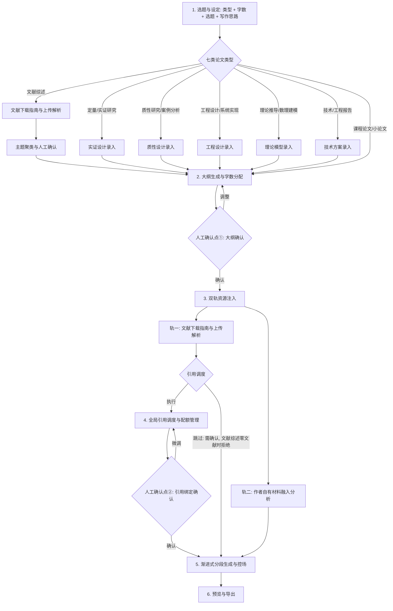

# AI 学术写作辅助系统 — 产品需求文档（PRD）

| 项目 | 内容 |
| --- | --- |
| 文档名称 | AI 学术写作辅助系统产品需求文档 |
| 产品代号 | Agent 应用（AI 学术写作辅助系统） |
| 文档版本 | v1.29 |
| 文档状态 | 待评审 |
| 目标读者 | 产品、研发、设计、测试、学术内容团队 |
| 最后更新 | 2026-09-24 |

> **关于本文的验收勾选**：正文里的 `- [ ]` 是**编写期的功能清单**，**不作为验收状态维护**——
> 全篇 136 条一条都没勾，不代表功能没做。实际是否通过以自动化测试的实时结果为准：
> 后端 `pytest`（1041 条）、前端 `node --test`（39 条），跑法见 README「快速开始」
> 与 ARCHITECTURE §八。这是刻意的选择：清单勾了就不再有人更新它，而测试每跑一次都是新的。

---

## 1. 产品概述

### 1.1 核心定位

面向**高校学生**与**科研人员**的 AI 学术写作辅助系统，覆盖理、工、文、管、医各专业的本科与硕士论文写作需求，共**七类**写作场景，**每类对应一条差异化的工序**（见 3.1）：

- 文献综述（全学科通用）
- 定量/实证研究（社科、经管、医学、部分理科）
- 质性研究/案例分析（人文社科、新闻、教育、公共管理）
- 工程设计/系统实现（计算机、电子、机械、建筑等工科）
- 理论推导/数理建模（数学、理论物理、理论经济学）
- 课程论文/小论文（全学科通用[短篇]）
- 技术/工程报告（工科、实践类项目）

类型**短名存库、长名显示**：入库与接口用短名（`定量/实证研究`、`质性研究/案例分析`、`工程设计/系统实现`、`理论推导/数理建模`、`文献综述`、`课程论文/小论文`、`技术/工程报告`），下拉框里显示带括号适用范围的长名（`定量/实证研究（社科、经管、医学、部分理科）`、`文献综述（全学科通用）`）。**七类长名一律带括号**，括号只为了帮用户在选题时一眼认出自己该选哪一类，**不是数据的一部分**——把它写进库里，将来想改措辞就得动数据，而提示词与闸门判断拿到的也会是一个为了给人看而拼出来的字符串。

七类不是同结构的换皮：**差异落在骨架、设计字段与提示词三处**——骨架决定章节，设计字段决定"作者已确定的事实"如何进入大纲（见 4.2），提示词里的**结构说明**与**写法要求**分别约束大纲与正文（见 4.6.1）。三者都挂在同一张表上（`paper_types.TYPE_CONFIG`）。

七类**全部可跳过引用调度**（`citations_required` 一律为否，见 4.5.4）：跳过是用户已被告知后果的明确选择，系统只在"跳过即属结构性退化"的唯一情形（文献综述零文献）下拒绝。

系统采用 **GUI 卡片 + 后台 Agent 工作流** 的混合交互模式，通过**可视化引导、强制约束与分步打卡**，解决生成式 AI 写作中普遍存在的九类痛点（见 1.4）。

### 1.2 目标用户与画像

| 用户类型 | 特征 | 核心诉求 |
| --- | --- | --- |
| 本科生 | 论文写作经验不足，易依赖 AI 直接生成 | 结构引导、格式规范、避免"AI 感" |
| 研究生 | 文社科需要质性研究/案例分析、理工科需要工程设计或理论推导，文献量大 | 文献管理、引用可追溯、逻辑连贯、结构符合本学科范式 |
| 科研人员 | 长文与多篇产出，对准确性与可控性要求高 | 引用零幻觉、字数精准、分阶段确认 |

### 1.3 核心价值主张

1. **0 幻觉引用**：所有引文严格基于真实上传文档与页码，杜绝虚构文献。
2. **精准字数控制**：从大纲层级锁定字数，解决长文本缩水问题。
3. **高确定性体验**：通过"大纲确认"与"引用绑定确认"两次关键人工干预，让长文生成过程完全可控。
4. **作者成果可入正文**：作者自有的研究思路、数据与成果经模型分析后按节注入正文，与文献引用分轨管理，写出来的不是"只有文献没有自己东西"的综述式文章。
5. **结构不错位**：七类论文各有自己的骨架、结构说明与写法要求。质性访谈论文不会被套上"假设检验 / 变量与数据"，数学论文不会被套上"描述性统计"——用户不必为了用上这个系统而改自己的论文范式。
6. **正文按类型写**：每节的提示词里带着选题、论文类型与该类型的写法要求。只给"节标题 + 字数"，七类论文的正文写出来彼此没有区别。
7. **上游改动不静默**：改选题 / 类型 / 目标字数会**覆盖式作废**下游产物，并在提交前列明将失去什么、提醒先导出一份。既不保留一份按旧选题写成的稿子挂在新选题下面，也不在用户不知情时删稿。
8. **回看不等于回退**：步骤条上已走过的步骤可前后自由跳转，回看这个动作**不作废任何东西**——也不会让用户误以为下游已被撤销，转头把已经生成好的内容重新生成一遍。

### 1.4 解决的核心痛点

| 痛点 | 表现 | 本系统对策 |
| --- | --- | --- |
| 字数缩水 | 生成长文时篇幅不足、虎头蛇尾 | 大纲级字数预算 + 分段生成后自动校准 |
| 文献虚构 | 引用不存在的文献或编造页码 | 全局引用调度 + 确定性标注 + 上传文档强约束 |
| 逻辑失控 | 长文中间迷失、前后脱节、断字 | 渐进式分段生成 + 上下文继承 |
| "AI 感"过强 | 语言模板化、空洞、缺乏学术严谨度 | 学术化转述 + 去 AI 痕迹润色 |
| 作者自己的东西进不去 | 非综述类论文（定量/实证研究、质性研究、工程设计、理论推导、课程论文、技术报告）需要作者自有的研究思路、数据与成果，但 AI 无从得知，只写得出泛泛而谈 | 作者自有材料上传 + 逐节融入分析（见 4.4.3） |
| **分析章节在编数据** | 大纲环节只拿到「选题 + 类型名」，作者用的什么模型、访谈了谁、证明了什么、实测到什么结果全都进不去，于是「第四章」的小节标题与要点只能由模型虚构——而用户在确认点①看到的是一份看着合理、实则编造的大纲，且这份虚构会一路带进正文 | **设计先于大纲**：按类型固定四个字段（实证设计、质性设计、工程设计、理论模型、技术方案），作为大纲生成的输入，见 4.2 与 4.3 |
| **工序一刀切** | 一套工序硬套所有类型：技术/工程报告的立身之本是技术方案与工程参数，对参考文献依赖极低，却同样被「请先上传文献」「缺少引用绑定」两道闸门挡在生成之外 | **按类型分支的工序**：七类的文献注入与引用调度均可跳过（文献综述零文献除外），见 3.1 |
| **结构错位** | 只有四类入口时，人文社科的质性研究、工科的工程设计、数理学科的理论推导都被迫塞进「实证研究」或「技术报告」，于是质性访谈论文拿到的是「假设检验 / 变量与数据」的骨架，数学论文拿到的是「描述性统计」 | 类型扩到七类；每类的**骨架、结构说明与写法要求**逐类固化，见 3.1 与 4.6.1 |
| **正文按类型写不出来** | 正文生成提示词里只有「节标题 + 字数」，既没有选题也没有论文类型——七类论文的正文写出来彼此没有区别 | 正文提示词补上**选题、类型名与类型写法要求**三个槽，见 4.6.1 |

---

## 2. 产品边界与范围

### 2.1 目标产品形态

**Web 优先（Web-first）**：以浏览器访问的 Web 应用为 MVP 交付形态，优先满足多人协作与批量文献上传需求。后续可扩展桌面端。

### 2.2 MVP 范围内（In Scope）

- 论文项目的创建、打开与删除（删除即级联清除该项目的文献、研究材料与已生成正文）
- 论文类型选择与目标字数设定（七类，类型决定后续工序）
- 写作思路与论证思路的录入（选填，选题步内）：作者写下"打算怎么论证"，进大纲第一遍与每一节正文
- AI 引导式选题推荐
- 设计录入（五类：定量·实证研究、质性研究、工程设计、理论推导、技术·工程报告）：表单填写 + 上传附件经 AI 提炼为结构化字段
- 文献综述的主题聚类：生成、逐条修改、确认（可追溯），并作为大纲主题章的输入
- 多级大纲树生成与字数智能分配（按类型骨架生成；消费已录入的设计字段、作者写作思路与已确认的主题聚类）
- 大纲人工确认与手动调整
- 文献下载建议清单（Checklist）
- 批量 PDF 文献上传与结构化解析（带页码索引）
- 文献与作者材料的逐条删除，以及删除后的绑定失效保护
- 作者自有研究材料（核心思路 / 研究数据 / 成果）的上传、粘贴与逐节融入分析
- 全局引用调度与配额管理（按相关性的确定性调度 + 兜底补足，v1.14 起取代"均匀打散"，见 4.5.1）
- 引用绑定人工确认与微调；七类均可显式跳过引用调度（无引用生成，跳过前给后果确认框）
- 引用角标样式与文末参考文献格式（GB/T 7714 / APA / MLA，按项目选定格式排版）
- 渐进式分段生成 + 字数校准 + 学术润色
- 章节/全文预览与导出

### 2.3 MVP 范围外（Out of Scope，后续迭代）

- 桌面客户端
- **公式与代码的排版（LaTeX 约定）**：本轮不做。理论推导与工程设计两类只要求"推导步骤完整""给出具体参数与接口"这类**同义表述**层面的约束，不引入公式与代码的专门渲染（用户定的取舍）
- 多用户协作实时编辑
- 全文查重（对接第三方查重服务）
- 论文投稿与期刊对接

---

## 3. 核心业务流程

### 3.1 端到端主流程



流程要点：

1. **两次人工确认点**是系统的核心控制闸门，确保长文生成可控。
2. 每个阶段均可回退到上一阶段重新调整，形成闭环。
3. 阶段间状态需持久化，支持中断后从任一阶段续写。
4. 阶段 3 是**双轨资源注入**：文献（轨一）走引用调度、进文末参考文献列表；作者自有材料（轨二）不经引用调度、不进参考文献列表，直接注入正文（详见 4.4.3）。两条轨互不干扰，可任选其一或同时使用。
5. 任一轨的资源在中途被删除时，须**同步作废依赖它的下游产物**（引用绑定或材料融入计划），不允许出现指向已删资源的悬空引用。
6. **工序随论文类型分支**——这是本系统区别于"一套流水线套所有论文"的关键。七类里 **5 类有设计步**（位于大纲之前），2 类没有：
   - **文献综述**：结构由文献决定，因此文献解析**排在选题之后、大纲之前**，并多一道**主题聚类与人工确认**（见 4.4.4）；文献是它的立身之本，因此**唯一不允许零文献跳过引用调度**的类型。
   - **定量/实证研究**：核心驱动力是作者的数据与研究设计，不是文献。**实证设计先于大纲**（见 4.2）。
   - **质性研究/案例分析**：核心是访谈/观察资料与编码过程。**质性设计先于大纲**；结构说明里明确禁止出现假设检验、回归、显著性与"变量与数据"。
   - **工程设计/系统实现**：核心是需求、架构、实现与测试。**工程设计先于大纲**；结构说明里明确禁止出现实证分析类章节。
   - **理论推导/数理建模**：核心是假设、推导与证明。**理论模型先于大纲**；结构说明里明确禁止出现问卷、样本、描述性统计与回归。
   - **技术/工程报告**：核心是技术方案与工程参数。**技术方案先于大纲**。
   - **课程论文/小论文**：短篇体量，维持"选题 → 大纲 → 双轨资源 → 引用调度 → 生成"的通用工序，且结构说明要求章节精简、不得出现超出体量的研究设计类章节。

   **为什么设计必须先于大纲**：大纲中的"分析/结果/推导/编码/实现"类章节要写的就是作者已经定下的事实——模型与结果、访谈与主题、假设与证明、参数与实测。若大纲环节只拿到「选题 + 类型名」，模型只能编——编变量、编显著性、编结论，而用户在确认点①看到的是一份看着合理、实则虚构的分析章节，且这份虚构会一路带进正文。所以设计字段作为**已知条件**进入大纲提示词，并要求模型对设计未覆盖的部分标注「需作者补充」而不是补一个看起来合理的假结果。

7. **工序表的单一事实来源在后端**（`paper_types.TYPE_CONFIG`）：前端步骤条由 `/api/meta` 下发渲染，后端闸门（谁必须先有文献、谁必须有引用绑定）从同一张表读取。二者若各写一份，就会出现"前端让点、后端 400"。七类的差异同样只写在这一张表里：`steps`（工序）、`design_label` / `design_fields`（设计步）、`structure_note`（大纲结构说明）、`writing_note`（正文写法要求）。

### 3.2 阶段状态机

每个论文项目（Project）包含以下状态流转：

```
草稿(Draft) → 选题完成(Topic Set) → 大纲待确认(Outline Pending)
→ 大纲已确认(Outline Confirmed) → 资源注入中(Resources Loading)
→ 引用待确认(Citation Pending) → 引用已确认(Citation Confirmed)
→ 生成中(Generating) → 生成完成(Completed) → 已导出(Exported)
```

其中「设计录入」（见 4.2，七类里 5 类有此步）与「主题聚类确认」（见 4.4.4，仅文献综述）是**选题与大纲之间的步骤，但不是独立状态**：设计是选题的附属产物，录与不录都停留在 `Topic Set`；聚类是文献的附属产物，确认与否同样停留在 `Topic Set`。两者各自单独存列（`design_json` / `clusters_json`），因为都有一个独立的下游消费者——大纲生成。

任意类型走「跳过引用调度」时直接落到 `Citation Confirmed`，绑定保持缺省，这与"未做完调度"在状态上无法区分，因此该动作只对 `citations_required = false` 的类型开放（当前七类皆是）。唯一例外见 4.5.4：文献综述在**零文献**时不允许跳过——那不是用户的选择，而是结构性退化，它的骨架本就由文献聚类生成。

**状态的唯一一次回退由「修改选题与设定」触发**（见 4.1）：选题、类型、目标字数（**v1.18 起还有写作思路，四者**）有任一真变时，状态退回 `Topic Set` 并作废全部下游产物。除此之外没有第二条回退路径——章节标题变化只作废绑定与材料计划、不退状态，聚类变更连产物都不作废（只回 `outline_stale`）。**原样重提不回退**：判断依据是「**四个字段**是否真的变了」，而不是「有没有调用这个接口」。

**终态 `Exported` 只有一个写入点**（v1.21）：`POST /api/projects/{id}/export`（见 4.7）。它是**回执**而不是动作——三种格式的导出全在浏览器里完成（服务端一个字节都不参与），这个接口只把「这份稿子已经导出去过」记进状态机。三条分支：`Completed` → 写 `Exported`（唯一的正常路径）；`Exported` → **原样返回成功**（幂等：同一份稿子导出两次是常事，返回 400 会把一次成功的导出报成失败）；其余一律 400（`Generating` 尤其——正文正在被逐节重写，此刻该记的不可能是这一版正文）。两道忙闲闸都要过（与「作废正文」同一个理由，见决策 31），否则一个在飞任务的收尾会把这个状态顶回 `Completed`。

---

## 4. 功能模块详述

### 4.1 模块一：选题与设定

**功能目标**：确定论文类型、研究核心方向与写作思路，锁定写作目标。

**输入**：
- 用户选择论文类型（下拉框显示七类全名，见 1.1）
- 写作语言（中文 / 英文，默认中文）：决定**产出物**的语言与参考文献格式的可选项（详见下文同名小节）
- 目标总字数（如 8000 字、15000 字）：**最少 1000 字**，低于它按「确认选题，进入下一步」会被当场说明并停住（详见下文同名小节）
- 写作思路与论证思路（选填）：作者自己写下的"打算怎么论证"，纯文本，上限 2000 字（详见下文同名小节）

**论文类型决定后续工序**：类型一旦选定，系统即按其工序表渲染步骤条并设置闸门。工序表是**后端的单一事实来源**（`paper_types.TYPE_CONFIG`），随 `/api/meta` 整包下发，前端只负责渲染——后端闸门与前端步骤若各写一份，就会出现"前端让点、后端 400"。

| 论文类型 | 设计步 | 工序 |
| --- | --- | --- |
| 文献综述（全学科通用） | — | 选题 → 文献注入 → **主题聚类确认** → 大纲 → 引用调度 → 生成 → 导出 |
| 定量/实证研究（社科、经管、医学、部分理科） | **实证设计** | 选题 → 设计 → 大纲 → 文献注入 → 引用调度 → 生成 → 导出 |
| 质性研究/案例分析（人文社科、新闻、教育、公共管理） | **质性设计** | 选题 → 设计 → 大纲 → 文献注入 → 引用调度 → 生成 → 导出 |
| 工程设计/系统实现（计算机、电子、机械、建筑等工科） | **工程设计** | 选题 → 设计 → 大纲 → 文献注入 → 引用调度 → 生成 → 导出 |
| 理论推导/数理建模（数学、理论物理、理论经济学） | **理论模型** | 选题 → 设计 → 大纲 → 文献注入 → 引用调度 → 生成 → 导出 |
| 课程论文/小论文（全学科通用[短篇]） | — | 选题 → 大纲 → 文献注入 → 引用调度 → 生成 → 导出 |
| 技术/工程报告（工科、实践类项目） | **技术方案** | 选题 → 设计 → 大纲 → 文献注入 → 引用调度 → 生成 → 导出 |

七类的「引用调度」步骤虽同形，**跳过条件不同**：文献综述在零文献时不允许跳过（见 4.5.4），其余六类可以。表中「设计步」一列即前端步骤条上该步的显示名——它取类型的 `design_label` 而不是统一写「研究设计」，否则七类里有设计步的五类在步骤条上会全都显示成同一个词，而卡片标题又是类型专属的，两处对不上。

类型下拉框下方显示该类型的**流程提示**（`flow_hint`），例如质性研究显示「选题 → 质性方法（访谈/扎根/案例）→ 编码/主题分析」。它取代了旧版硬编码的文献综述说明文案。

**写作语言：只管产出物，也决定格式的可选项**

选题步可选**中文 / 英文**（默认中文，认不出的值一律按中文处理——判据是两个值的精确命中，`en-US` 这类地区标签两边都落中文）。这条设定管的是**产出物**，不是界面：用户选了英文，界面文案、七类类型名与工序名**仍然是中文**。

| 跟随写作语言 | 不跟随 |
| --- | --- |
| 论文标题 / 摘要 / 关键词、骨架的章标题与节标题、正文与文末参考文献、导出排版 | 全部界面文案、七类类型名与工序名、流程提示 `flow_hint`、设计字段标签 |

- **骨架有中英两套，且逐位同形**：英文论文拿到的不是一副中文骨架，也不是一副"翻了一半、少一节"的骨架——中英两套的章数、每章的节数**逐位相同**（34 章 74 节），漏译一节会当场被测出来。
- **字数按语言计**：中文按**字**、英文按**词**（空白分词，角标 `[1]` 也算一个词，与 Word 的"字数（words）"口径一致）。目标字数输入框旁的**单位跟着语言变**（中文「字」、英文「words」）——不换的话，用户会看着「目标 5000 字」给英文论文填 5000，得到的其实是 5000 个**词**（约合中文 7500 字的体量）。这一处口径是全流程共用的：整篇预算、每节容差、扩写与压缩的判断、进度显示的字数，都走同一个分发点。
- **参考文献格式下拉只列该语言可用的**：中文下 GB/T 7714 / APA / MLA 三项都在、默认 GB/T 7714（选 APA/MLA 时给一句"这不是中文期刊常用格式"的**提示**，**不禁用、不拦阻**）；英文下**只有 APA / MLA**、默认 APA（英文期刊不用 GB/T 7714）。判据只有一份，落在三处（界面下拉、`POST /citations/confirm` 的写库前 400、存量脏数据的读取侧兜底），详见 4.5.3。**语言提示语本身也由后端给，前端一个字都不写（v1.27）**：`citation_format_notes_by_lang` 的**键集固定为全部三种格式**，而不是该语言能选的那几种——于是英文下也拿得到 GB/T 7714 那一条，它唯一的用途正是解释这一项**为什么不在下拉列表里**。前端渲染的就是「被本语言排除掉的格式」的说明，不另按 `writingLang === 'en'` 自己判一遍、更不手写文案（手写的那一份与后端的表迟早对不上，而它一旦判错，给出的就是一句与列表不符的解释）。
- **改语言就是改设定**：已生成过则**锁定**，要改走确认框（与改论文类型同一套），作废大纲 / 正文 / 引用绑定 / 材料融入计划 / 参考文献快照 / **主题聚类** / 生成状态——聚类也一并作废，因为它的主题名会成为文献综述的节标题，是**产物文字**。中文改英文且当前是 GB/T 7714 时**自动改为 APA**（它在英文写作下不合法）；反向**不自动改回**（APA 在中文写作下是合法的，擅自改掉等于替用户做了选择）。

**AI 引导式选题**：
- 基于用户输入的主题领域，推荐 3–5 个候选选题方向。
- 每个候选方向附带：研究问题、可行性评估、与目标字数的匹配度。
- 推荐本身是一次同步短调用：不登记后台任务、不落库。但**有后台任务在跑时该入口不可用**——界面上只有**一个**任务进度槽，此时发起推荐会把正在跑的那个任务的进度显示覆盖掉（任务还在跑，显示的却是推荐结果）。按钮置灰并说明原因，处理函数里另有一道守卫，防绕过界面的调用。
- **推荐按表单里的草稿语言走（v1.27）**：语言取**请求里带的那个值**优先，没带才回落到库里那份。原先它只读库里的 `writing_lang`，注释还写着「两者总是同源」——这句在**新建项目时是假话**：用户在选题表单里选了英文、还没确认项目就点「推荐」，库里仍是中文，于是发出去的是中文提示词、回来的也是中文选题方向。确认选题那个接口早就把 `target_words` 这样发（同一类「表单里的草稿值」）。

**论文标题：跟随研究核心方向 + 可随时改名**

项目在界面上的名字**就是论文标题**——它是导出成品的一级标题（三种格式都是），也是下载文件名。取值按优先级：

| 优先级 | 来源 | 说明 |
| --- | --- | --- |
| 1 | 用户手动改的名字 | 在页头或项目列表上点标题就地改名，回车保存、Esc 取消、失焦保存 |
| 2 | 研究核心方向（选题） | 用户没自己起名时自动跟随，列表卡片与页头显示的就是它 |
| 3 | 「未命名论文」 | 两者都没有时（新建、还没填选题）的兜底**显示**，不落库 |

- **跟随规则**：提交选题时，只有当标题**还是空的、或恰好等于上一次的选题**时才跟着改。用户一旦手动改过名，之后再改选题就**不再**覆盖它——那是他刚说过的叫法，不该被一次选题调整悄悄抹掉。判据只用「现值 vs 上游值」表达，不新增"是否手动改过"的标记列。
- **清空即回到跟随**：改名时留空保存是**合法输入**，含义是"我不自己起名"而非"把名字删掉"——标题立刻回到当前选题，并从此重新跟随。
- **改名不触碰任何产物**：不写状态、不作废大纲 / 正文 / 引用绑定 / 材料融入计划 / 参考文献快照。因此**生成进行中同样允许改名**，不像「修改选题与设定」那样受 409 守卫——它没有任何东西可以被覆盖，加一道守卫只会让用户在一个纯改名的动作上看到"正文正在生成"。
- **推导只由服务端算一份**（随项目接口以 `display_title` 字段下发，与 `citations_stale` 同型的**算出来的非列字段**），前端只渲染。这个值对**五处**负责：项目列表卡片、页头、删除确认弹窗、导出的一级标题、下载文件名——各写一遍 `|| '未命名论文'` 就是五份迟早漂移的实现（本项目已有实据：那五处里两处兜底词是"论文"、三处是"未命名论文"，导出文件名与界面显示的名字本来就不是同一个）。它同时挂在一个项目的**所有**返回值上（含新建与确认选题的响应），因为前端拿到响应就直接替换本地副本——只在详情接口上挂，"刚新建完"与"刚确认完选题"这两屏的名字会退回兜底词。
- **存量数据**：`projects.title` 这一列一直存在，但旧版本的**唯一**写入点是前端写死的一个常量，此后没有任何改名入口，所以历史项目全部显示为「未命名论文」。启动时的一次性幂等迁移把它们换成各自的选题（没有选题可置的置为 NULL），**刻意不更新 `updated_at`**——项目列表按它倒序排列，动它会把这批项目整体跳到最前，而用户什么都没做。

**写作思路与论证思路（选填）：把"打算怎么论证"交给作者**

选题那一步此前只有「确定研究核心方向」这一个输入，而**一个标题装不下"打算怎么论证"**：同一个选题下，"先辨析概念再论证互补"与"用面板数据检验替代关系"是两篇不同的论文。因此选题步内增加一个自由文本框，作者把自己已有的写作思路写进去。它与选题、类型、字数并列，同属全流程最上游。

- **它只喂两处**：大纲第一遍与每一节正文。大纲第一遍本来就在自己写核心研究问题（`core_question`）——**那一步此前等于替作者定主线**；作者写了思路之后，模型的职责退回到「把这段思路收敛成一句话」。正文侧同理：此前 `core_question` 只到大纲、**从未进过正文提示词**，写每一节的模型看不到全篇主线，只能从节标题反推，而节标题本身是被模型改写过的一句话（本轮一并将它接进正文）。
- **作者的原文优先**：思路与模型自己的推断、乃至与它据此收敛出的核心研究问题冲突时，以作者写下的为准。措辞与既有的聚类块（"作者确认的优先于你自己的归纳"）同源——这是作者说的，不是模型的推断。
- **改它就是改选题**：走与选题 / 类型 / 字数**同一套**覆盖式作废与提交前告知，不新增第二套逻辑。理由同「按旧选题算引用编号」：思路变了，库里那份正文就是按旧思路写的，而这种错配在界面上看不出来。
- **归一化后比较**：入参先 `strip()`，且**只 strip、不折叠内部空白**（它是多行文本，段落结构有意义）。这一步不是洁癖：多行输入框里敲完一段顺手回车、末尾留一个换行是常态而不是边界，裸比会让一次「只是换行」的点击作废掉六项产物。显式清空（含只填空格）落成 `NULL`，与"从没写过"同一种表示。
- **不静默截断**：超过 2000 字由**路由内 400** 拒绝（消息里带上限与实际字数），不做截断、也不在前端加 `maxLength`。截断比拒绝更坏——作者的方案被吃掉一半而永不知情，论文会照着另一条线写下去；而前端的 `maxLength` 会让这条 400 永远不触发。上限取值有现成锚点：`material_parser.EXCERPT_CHARS`（一份作者自有材料进单节提示词的字符上限）也是 2000。
- **与「研究材料」不是一条通道**：研究材料（见 4.4.3）**结构上永远进不了大纲**——材料分析的前置条件就是大纲已存在，它只经材料融入计划进正文。因此把论证思路写进「研究材料」里，大纲会**无声地忽略它**；界面文案必须说清哪条通道喂哪一步（尤其因为粘贴材料的默认标签恰好就是「粘贴的研究思路」）。
- **不按类型区分、不做独立步骤**：它不是类型属性（七类共用一个框），也不单独成步（独立成步会多出一个作废点与一处状态机锚点）。

**目标总字数：能整个删空的输入框 + 1000 字下限**

这个框此前**删不空**：它是直接绑在数字状态上的受控输入，`parseInt('')` 是 `NaN`、`|| 0` 又把它落成 0，于是框里永远至少挂着一个 "0"。用户全选删掉，框里立刻回到 "0"、光标停在它旁边——接着敲的数字要么接在 0 后面（框里显示 "03000"），要么插在 0 前面变成 "30000"：后者是个**静默的十倍错值**，界面上没有任何东西会报错。「想把 8000 改成 3000」这件最平常的事因此只剩下一条别扭的路。

- **修法是把「用户正在敲的那串字符」与「库里那个数字」分开存**：框里放草稿文本（可以是空串），数字仍由父层持有。**不能顺手把父层那个数字改成字符串**——大纲步按「各节字数之和 === 目标总字数」判断能不能确认大纲，数字与字符串相比恒为假，确认大纲的按钮会**永久禁用**，而且不报任何错。
- **回灌只在两边归一到不同数字时发生**（正常是切换项目那一路：8000 → 3000）。判据必须与输入处理用同一套归一，否则像 `1000.5` 这种敲到一半的中间态会被判成"不同"，在用户手底下把草稿改掉；而清空时草稿是空串、父层是 0，两边都归一到 0 —— 所以刚被删掉的 "0" 不会被塞回来（**那次回灌正是原来那个毛病本身**）。
- **最少 1000 字**：它是这套流程里唯一会被**按节分掉**的输入（大纲步拿它做字数预算），低到一定量级以下"按节分"本身就没有意义——每节只剩几十字，大纲退化成一串标题、正文一节一句话，用户拿到的是一份看起来完整、实际没法用的稿子。下限由后端一道**路由内 400** 拒绝（与标题、写作思路的上限同一口径，不用 pydantic：后者抛 422，前端会把 detail 数组渲染成 `[object Object]`），数字本身随 `/api/meta` 下发（`min_target_words`），前端只读它、不自己抄一份。
- **提示落在按钮正上方**：字数不足时「确认选题，进入下一步」**不禁用**（禁用一个主按钮等于什么都不说，用户只会看到一个点不动的按钮），而是按下去就地把原因说出来。提示渲染在按钮正上方，而不是顶部那条常驻横幅里——那条横幅在**步骤卡片之上**，而这张卡片很高（选题列表 + 两个大文本框），用户按的按钮在卡片最下面，横幅多半在视野之外，那就成了"按了没反应"。
- **「AI 推荐选题」在下限之下禁用并说明原因**：推荐的匹配度是拿目标字数当基准评的，把一个刚被提示"不许用"的数字喂进去，只会换回一份按 0 字评的、界面上看不出哪里不对的推荐。**推荐接口本身不设这道闸**——它不落库、只影响那份推荐的质量，而"想先看看有什么题、字数还没定"是一条正常的路。
- **上限没做**（如实记档）：界面与后端都没有字数上限，验收标准里那句「校验为合理范围（如 1000–100000 字）」只有下限是真的，本轮把它改写成本节的事实。

**修改选题与设定：覆盖式作废 + 提交前告知**

选题与设定（论文类型 / 写作语言 / 目标字数 / 选题 / 写作思路）是全流程的最上游：大纲、正文、引用绑定、材料融入计划、参考文献快照全部由它派生。因此它可改，但**改动的代价必须在点击之前就知道**，而不是在改完之后才发现稿子没了。

1. **只有真改了才作废**：逐一比对 `选题` / `论文类型` / `写作语言` / `目标字数` / `写作思路` 五个字段。五者全等时（用户只是点了一下确认、或重新提交了同一份内容）**不动任何数据、也不改状态**。这条不是优化而是纠错——无条件回退会让一次「路过点击」把已走到「大纲已确认」的项目打回「选题完成」。**唯一一段例外读法是「省去 = 不改」（v1.27）**：请求体里省去 `writing_lang` 时按「不修改这一项」处理，**不是**「回落到默认的中文」——这个字段省去的默认值带破坏性，省略即中文会把一个英文项目的语言掰回中文，并连带作废大纲 / 正文 / 引用绑定 / 材料融入计划 / 参考文献快照 / 主题聚类与生成状态，而调用方只是没发这一个键；其余四个字段不适用这条，它们省去的默认值与库里的「没写过」本来就同义。
2. **作废是覆盖式的**：任一字段真变时，作废**大纲、正文、引用绑定、材料融入计划、参考文献快照、生成状态**六项，状态退回「选题完成」。不保留、不静默降级——留着它们就是留着一份按旧选题写成的稿子挂在新选题下面，比删掉更糟。
   - **设计字段只在论文类型变化时作废**：字段名是数据的键，而字段名随类型走，改了类型旧键就不再成立；只改选题时设计仍然成立，保留。
   - **主题聚类刻意不作废**（改选题 / 类型 / 字数 / 写作思路时）：它由文献本身决定，与选题无关（见 4.4.4）。**唯一的例外是改写作语言**——聚类产出的主题名会成为文献综述的**节标题**，是产物文字，留着一份中文聚类去写英文论文正是要消灭的那类错配（见 4.1「写作语言」）。
   - **改写作语言还带一条格式级联**：中文改英文且当前格式是 GB/T 7714 时，**同一事务内自动改为 APA**（它在英文写作下不合法）；反向不自动改回——APA 在中文写作下是合法的，擅自改掉等于替用户做了选择。
   - **正文整篇覆盖、不保留草稿**，因此提交前必须提示用户先自行保存一份（见下条）。
3. **提交前必须告知，且只在真有东西可失去时才弹**：空项目改选题是常态，每次都弹确认框只会训练用户闭眼点「确定」。只有确实存在已生成内容时才弹，文案**逐项列出将失去什么**（已生成的 N 节正文 / 大纲 / 引用绑定 / 材料融入计划），并建议先到「预览导出」步复制或下载保存一份。

**并发与上游闸门**：有后台任务在跑（大纲生成、文献解析、材料融入分析、主题聚类、设计提炼）或**正文正在生成**时，修改选题与设定的请求返回 **409** 并说明是哪一项在跑——不打断正在跑的活，也不让它把新设定写进一份按旧设定生成的产物里。项目不存在时返回 **404**（原实现是 `UPDATE` 影响 0 行后返回 `null`，调用方却以为成功了）。

**输出**：
- 确定的论文类型 + 目标总字数 + 核心研究方向。
- 写作思路与论证思路（可为空）。
- 论文标题（未手动命名时即研究核心方向）。

**验收标准**：
- [ ] 支持全部七类论文类型选择，下拉框显示带适用范围的类型全名。
- [ ] 选定类型后，步骤条按该类型的工序渲染：有设计步的五类多出「设计」步（标签取类型专属的 `design_label`），文献综述的文献步与聚类步排在大纲之前。
- [ ] 选定类型后，下拉框下方的流程提示随类型变化，不残留其他类型的文案。
- [ ] 库里既有的旧类型项目（实证研究 / 课程论文 / 技术报告）已由一次性迁移改为对应的新类型名，工序与设计字段随之正确。
- [ ] 目标总字数**能整个删空**：删空后框里不再自动回填一个 "0"，直接键入即为完整的新数字；不出现 "03000"、"30000" 这类拼接结果（后者是十倍的静默错值）。输入框旁常驻显示最少字数提示。
- [ ] 低于最少字数（1000 字）时按「确认选题，进入下一步」**不提交**，并在按钮上方给出提示（同时说明下限与当前值）；后端对同一情形返回 **400**，消息含下限与实际值，被拒的请求不留痕。**恰好等于下限是合法的**（判据是"小于"而不是"小于等于"）。
- [ ] 「AI 推荐选题」在字数低于下限时不可用并说明原因；选题推荐的**接口**不受该下限约束（它不落库）。
- [ ] 选题推荐至少给出 3 个候选，且可手动编辑或自定义。
- [ ] 选题结果可保存，支持后续修改。
- [ ] 写作思路（选填）进入大纲第一遍提示词与每一节正文提示词；与模型自己的推断冲突时以作者写下的为准；**没写时这两处提示词与加此字段前逐字节一致**。
- [ ] 写作思路超过 2000 字返回 **400**（消息含上限与实际字数），且被拒的请求不留痕；清空（含只填空格）落为 `NULL`，与"从没写过"同一种表示。
- [ ] 修改选题与设定时，只有 `选题 / 论文类型 / 写作语言 / 目标字数 / 写作思路` **五者真的变了**才作废下游产物（写作思路按 `strip()` 后的值比对，仅末尾空白差异不算变）；**省去 `writing_lang` 按「不改这一项」处理（v1.27）**——不把项目掰回默认的中文、也不因此作废任何产物；原样重提不改数据、不改状态（不得把已走到「大纲已确认」的项目打回「选题完成」）。
- [ ] 作废是**覆盖式**的：大纲、正文、引用绑定、材料融入计划、参考文献快照、生成状态六项一并作废，状态退回「选题完成」；设计字段**仅在类型变化时**作废，主题聚类保留（**唯一的例外是改写作语言**——聚类产出的主题名会成为文献综述的节标题，是产物文字）。
- [ ] 确有内容可失去时，提交前必须弹确认框**逐项列明将失去什么**并提示先到「预览导出」保存一份；无内容可失去时不弹。
- [ ] 有后台任务在跑或正文正在生成时，修改选题与设定返回 **409** 并指明是哪一项在跑；项目不存在返回 **404**。
- [ ] 有后台任务在跑时「AI 推荐选题」不可用（按钮置灰并说明原因），不会覆盖正在跑的任务的进度。
- [ ] 未手动命名的项目，标题自动等于研究核心方向；提交选题后页头与列表卡片**立即**显示该选题（不能等到下次刷新）。
- [ ] 手动改过名的项目，再改选题时标题**不被覆盖**；把标题清空保存即回到跟随，随后的选题变更继续带动它。
- [ ] 改名可随时进行，**生成过程中同样成功**（不受 409 守卫）；改名不作废大纲、正文、引用绑定、材料融入计划与参考文献快照，也不改状态。
- [ ] 存量项目（旧版本一律写死的「未命名论文」）在升级后显示为各自的选题；没有选题的显示「未命名论文」，且项目在列表中的排序位置不变。

---

### 4.2 模块二：设计与方案录入

**功能目标**：在生成大纲**之前**，把作者已经确定的设计（研究设计、质性设计、工程设计、理论模型或技术方案）交给模型，使其成为大纲生成的**已知条件**而非待编内容。

**适用范围**：七类里 **5 类**有此步骤——定量/实证研究（实证设计）、质性研究/案例分析（质性设计）、工程设计/系统实现（工程设计）、理论推导/数理建模（理论模型）、技术/工程报告（技术方案）。**文献综述**的结构由文献与主题聚类决定（见 4.4.4）；**课程论文/小论文**是短篇，不录入设计，维持原工序。

**为什么必须前置**：大纲里的"分析/结果/推导/编码/实现/测试"类章节，要写的就是作者已经定下的事实。若大纲环节只拿到「选题 + 类型名」，模型只能编——编变量、编显著性、编结论。用户在确认点①看到的是一份看着合理、实则虚构的分析章节，**而这份虚构会一路带进正文**：正文生成环节虽然能拿到作者自有材料，但大纲已经定死了写作要点。所以设计必须先于大纲。

**字段定义（由论文类型决定，不可自由增删）**：

| 论文类型 | 步骤名 | 字段 |
| --- | --- | --- |
| 定量/实证研究（社科、经管、医学、部分理科） | 实证设计 | 数据源与样本、研究假设、模型与方法、主要结果 |
| 质性研究/案例分析（人文社科、新闻、教育、公共管理） | 质性设计 | 研究对象与个案、质性方法、资料来源与编码、主题与发现 |
| 工程设计/系统实现（计算机、电子、机械、建筑等工科） | 工程设计 | 需求分析、架构设计、功能实现、测试验证 |
| 理论推导/数理建模（数学、理论物理、理论经济学） | 理论模型 | 基本假设与公理、推导框架与符号、关键推导与证明、机制与结论 |
| 技术/工程报告（工科、实践类项目） | 技术方案 | 项目背景与目标、技术选型与架构、关键参数、实测结果 |

**字段名是数据的键**：改一个字段名，已存项目里那个字段的内容会静默变空。因此字段名一经发布即视为契约，调整需配套迁移。

**两种录入方式**：

| 方式 | 说明 |
| --- | --- |
| 手工填写 | 四个字段都是自由文本，逐项填写或直接粘贴 |
| 上传附件后 AI 提炼 | 上传数据表 / 实验记录 / 参数表等文件，系统读取其文本并调用一次 LLM，把内容提炼成上述四个字段，**提炼结果进入表单后可逐字手改** |

- 提炼是**一次 LLM 调用**，因此走后台任务并轮询进度（与文献解析同款机制）。
- **提炼附件与「作者自有材料」是同一份存储**：设计步上传的文件直接进入材料库，因此后文"材料融入分析 → 逐节注入正文"这条链路无需改动，用户上传的原始数据在正文生成阶段照样能拿到。设计步只负责"把附件里的东西提炼成结构化字段，喂给大纲"；上传的附件在后续「资源注入」步的材料列表中统一管理。
- **附件上下文过长时提炼会截断**：文本按上限截取，且提炼只允许读取给定字段，**字段填不出来就留空并说明原因，严禁推测或补全**。推测出来的"主要结果"比空着更危险——它会被当成作者的真实结果写进第四章。
- 提炼失败（未配置 LLM、模型输出不可解析等）时，**已填字段保持原样**，不覆盖用户的手改内容。

**未填写时的处理（告警放行）**：

- 用户未填设计就点「生成大纲」时，界面弹出确认框，明确说明后果（"大纲中的分析/结果章节可能编造数据"），**确认后照常生成**。
- 后端**不硬拦**：这是用户的明确选择，护栏该拦退化，不该拦用户已被告知后果的选择。但提示措辞必须说清代价，不得轻描淡写。

**设计如何进入下游**：

1. **大纲生成**：设计字段作为「作者已给出的研究设计」块进入大纲提示词，并附三条硬规则——分析/结果类章节**只能依据**已给出的方法、假设与结果；设计未覆盖的部分须在标题或备注里标明「需作者补充」，而不是补一个看起来合理的假结果；与设计字段冲突的既有文献结论不写进这些章节。
   - 该块在**设计为空时渲染为空串**，保证既有类型（文献综述、课程论文）的提示词逐字节不变。
   - 字数分配那一遍（第二遍 LLM 调用）**不带**这个块：那一遍只做字数拆分与标题复核，不负责内容。
2. **正文生成**：设计字段随**每一节**进入该节的生成上下文。之所以不做"按章节标题关键词匹配"：标题在字数分配那一遍会被模型改写，关键词匹配一旦失配，作者的数据就会**静默地**从正文里消失。因此改为逐节下发，并附使用规则——只在相关的地方用，不相关就不写，不要硬塞；需要作者补充的地方如实写成「此处需作者补充」，不得编造。

**验收标准**：
- [ ] 五类（定量/实证研究、质性研究、工程设计、理论推导、技术/工程报告）的工序中包含设计录入步，且排在大纲生成之前；文献综述与课程论文不含此步。
- [ ] 设计字段按类型固定为四项，步骤名取该类型的 `design_label`（实证设计 / 质性设计 / 工程设计 / 理论模型 / 技术方案），可手工填写、可上传附件后经 AI 提炼，提炼结果可逐字修改。
- [ ] 设计步上传的附件进入材料库，在后续「资源注入」步可查看、可删除，并可用于材料融入分析。
- [ ] 提炼只输出给定字段（白名单校验，模型多吐的键一律丢弃），缺失字段留空而不推测。
- [ ] 未填写设计即生成大纲时，界面给出后果明确的确认框；确认后生成不被后端拦截。
- [ ] 设计非空时，大纲提示词中包含该设计块与"严禁编造"规则；设计为空时，提示词与不含此功能时逐字节一致。

---

### 4.3 模块三：大纲生成与字数智能分配

**功能目标**：生成多级大纲树，并按论文规范精准分配字数预算。

**输入**：已确定的选题与目标总字数；有设计步的五类还包含已录入的设计字段（见 4.2）；文献综述在已确认主题聚类时包含聚类结果（见 4.4.4）。

**大纲生成**：
- 自动生成多级大纲树（章节 → 小节 → 段落级）。
- **结构来自类型的骨架**（`paper_types.PAPER_TEMPLATES`），不由模型自由发挥：骨架定死章数与每章节数，模型只负责**把通用占位标题改写成贴题的标题**。骨架的结构永远赢、标题允许改写（按「章序号, 节序号」对齐），因此模型不会给自己加一章。
- 不同论文类型对应不同的骨架：定量/实证研究含"引言—文献综述—研究设计—实证分析—结论"，质性研究含"研究方法与策略—资料分析与发现（编码与主题）"，工程设计含"需求分析—系统设计—系统实现—测试与验证"，理论推导含"基本假设与模型设定—推导与证明—机制分析"，技术/工程报告含"技术方案—实现—测试与验证"。**每类的结构说明还明令禁止混入其他类型的章节**（质性研究不得出现假设检验/回归/显著性；理论推导不得出现问卷/样本/描述性统计；工程设计不得出现实证分析；文献综述不得出现研究设计）。
- **大纲分两遍 LLM 调用**：第一遍生成结构骨架，第二遍只做字数分配与标题复核。骨架的结构始终优先——保证大纲层级不会被字数那一遍改乱；设计块、聚类块与作者写作思路块**只进入第一遍**（v1.18）——第一遍要写核心研究问题，而作者写了思路时，那句话就不再由模型自己定；第二遍依据的 `core_question` 已在第一遍吸收了它。**输出语言的宣告两遍都要给（v1.27）**：第二遍虽然不动结构，但它产出**复核后的节标题**，而节标题会原样印进论文——只在第一遍宣告，被这一遍改写过的标题就会退回中文。第二遍模板里这个占位符紧贴在文献块之后、**不加分隔符**：它在中文下返回空串，于是中文提示词逐字节不变（另起一行会多出一个尾部换行）。
- **主线约束**：为避免长文"核心主题割裂"，先由模型声明一个核心研究问题，全篇各节围绕它展开，标题也须服务于这条主线。**作者写下了写作思路时（见 4.1），这件事的职责从"替你定主线"退回到"把你的思路收敛成一句话"**：不得另立一条与作者写出的话无关的主线，有出入以作者原文为准，且作者点到的论证角度要落到节标题上（骨架的章数节数仍然不许动）。

**字数智能分配**：
- 将总字数按论文规范拆解到各章节，例如：

| 章节 | 建议字数 |
| --- | --- |
| 背景介绍 | 600 字 |
| 文献综述 | 2000 字 |
| 方法论 | 1500 字 |
| 实证分析 | 2000 字 |
| 结论与展望 | 900 字 |

- 分配遵循学术论文各部分的惯例权重，可配置模板。

**人工确认点①（关键控制）**：
- 用户在界面上手动调整大纲结构与字数预算。
- 支持拖拽调整章节顺序、增删章节、修改每章字数。**这两个字数输入框与「目标总字数」走同一个读数入口（v1.27）**：`wordsNumber`（`Number`，不是 `parseInt`）——`1e3` 读成 1000 而不是 1，删空仍表示「未分配」（`0` 是一个合法值，两者必须区分）。同一条约定由「剥掉注释后的 `App.jsx` 里不出现 `parseInt(`」钉住。
- 系统实时校验：各章节字数之和 = 目标总字数（偏差需为零或提示）。
- 用户确认后进入下一阶段，确认动作需显式记录。
- **本步卡片里任何时刻恰好一个主按钮，且它一定是「你现在该点的那一个」（v1.23）**：这张卡片上并排着**前后两个阶段的出口**——文献综述多出的「确认主题聚类」（见 4.4.4），以及「确认大纲（人工确认点①）」——外加一个「生成大纲」。三个按钮各自都有变蓝的理由，而前后两个确认的**后果差一个量级**：聚类确认只是一次盖章（非破坏性，已存在的大纲只回 `outline_stale`），大纲确认会作废引用绑定与材料计划并把流程推进一步。因此按流程前沿排，由**一处**判据分成互斥的三支：**① 聚类已生成但还没确认 → 「确认主题聚类」为主；② 已确认（或本来没有聚类）而大纲还没生成 → 「生成大纲」为主；③ 其余 → 「确认大纲」为主**。三个按钮各按这同一个判据取样式，所以既不会出现两个主按钮（此前聚类确认无条件写死了主按钮样式，综述的卡片上并排两个蓝的），也不会出现一个都没有（此前"还没生成大纲"时卡片里一个蓝按钮都没有，与「文献注入」步 v1.12 修掉的是同一个缺口）。判据**只读服务端事实**（`clusters_json` / `outline_json`），与「文献注入」步、「引用调度」步同一条口径，不看聚类草稿；代价是一处如实记档的边界：「已确认、又手改了簇标题但没点确认」时蓝按钮留在「确认大纲」上——那次编辑本来就没提交（旁边的「改动未确认」标签已说明），且没有任何一个动作会把它悄悄吃掉。

**验收标准**：
- [ ] 大纲支持至少三级层级。
- [ ] 字数分配总和严格等于目标总字数（或提示可接受的误差范围）。
- [ ] 人工调整后自动重算字数总和。
- [ ] 大纲确认动作有明确的可追溯记录。

---

### 4.4 模块四：下载指南与双轨资源注入

**功能目标**：引导用户获取真实文献，并注入个人研究材料。

**4.4.1 文献下载建议清单（Checklist）**

- 系统依据大纲自动输出精准的文献下载建议清单。
- 清单条目包含：推荐关键词、检索建议平台（知网 CNKI、谷歌学术 Google Scholar 等）、建议下载数量。
- 引导用户前往平台下载**真实文献**（而非由 AI 虚构）。

**4.4.2 文献解析（轨一：进参考文献列表）**

- 用户上传批量 PDF 文献。
- 系统自动提取结构化信息，生成**带页码的索引卡片**。

**上传容错机制**：

- 批量上传时，单个文件解析失败不得影响其他文件的上传。
- 解析采用**后台任务**执行、逐篇落库：每解析完一篇立即入库，因此整批中断或超时**不会丢失已解析的文献**。
- 对每个失败文件给出明确失败原因（非 PDF、解析异常、扫描版无文本层等），并在返回结果中以失败列表（failed）呈现，供用户查看与补传。单篇失败不中断整批。
- **"解析成功"必须真的成功**：文献元数据提炼是**逐篇**一次 LLM 调用，因此**逐篇**兜错——某一篇的提炼失败（密钥无效、超时、返回不是合法 JSON）只把**那一篇**计入失败列表并继续下一篇，不影响整批。
- **失败不得被吞成成功**：提炼环节原先把所有异常兜成一个与"未配置大模型"**逐字相同**的返回值，于是密钥无效、请求超时、JSON 解析失败全都会被报成"解析成功、AI 没找到内容"。现在失败即抛、逐篇计入 `failed`，而"本来就没配模型"仍走既有的兜底（那是"没有这个能力"，不是失败）。任务终态的 `status` 表示**这一批有没有跑起来**，成功落库的篇数另由 `saved` 承载；`failed` 为空以外的任何情况都不得显示成"解析完成"。
- **逐页失败是第三种结果（v1.22）**：整篇解析此前只有"成功"与"没文本"两种。**一页坏掉**（PDF 那几页的文本层损坏）过去被静默吞掉——一页留空、其余照常，而调用方拿不到任何"有几页没读到"的痕迹，于是「10 页里 3 页失败」与「完全成功」长得一模一样，缺的那几页要到引用调度那步才露马脚、那时已查不回原因。现在解析层把每一页的失败**逐页标出来并记一条带页码与异常类型的日志**，任务里多出第三类上报 `partial`（"3 篇有页面未提取到"，前端逐条列「文件名（第 2、5 页文本提取失败）」）。它**不阻断入库**（能读的页照样能用），也**不算失败**——但绝不能说成完全成功。
- **整篇没文本要分清是哪一种**：此前一律提示"未提取到文本（可能为扫描版）"，而这句话只对其中一种成立。现在分开：**每一页都抛异常** → "每一页的文本提取都失败"（是文件坏了，重传/换一份）；**每页都成功但都是空** → "未提取到文本（可能为扫描版）"（要用户自己去找带文本层的版本）。用错原因会把人引到错误的动作上。
- **空页不是坏页**：章节之间的隔页文本本来就是空串，把它记成解析失败会在每一份带隔页的文献上报一条**假警告**——而假警告会让人学会忽略真警告。

**重复上传的判重（v1.15）**：

- 同一篇文献重复上传**不再变成两篇**：命中已有的就跳过，并在结果里**点名是哪几篇**（`skipped` 列表：文件名 + "与《…》内容相同"），任务文案给出计数（"已解析 N/M 篇文献，跳过 K 篇重复"），前端提示条再把文件名逐条列出——**计数与点名分开写**：任务文案一行放不下，且"跳过 K 篇"这句在前端提示条里会与逐条列表重复一遍。没有这道判重时，同一份 PDF 会占两个 doc_id——正文里两个角标指向**同一篇**文献、文末列表出现两条内容相同却编号不同的著录，而删掉其中一条另一条还在。
- **判据是内容，不是文件名，更不是解析出来的题名**：同一份 PDF 换个文件名重传照样判得出来；而两篇**不同**文件解析出同一个题名（实测真有：某项目里 2023 与 2024 两份 Annual Report 都解析成「Annual Report」）**绝不能**判成同一篇——判错一次等于凭空丢一篇文献，"多一条重复"远比"少一篇文献"好收拾。
- **跳过而不是拒绝**：一次传 10 篇、其中 1 篇是旧的，另外 9 篇照常入库；整批 400 会让用户为了 1 篇重传 10 篇。若一批**全部**是重复，任务照常报成功（库里本来就有这些文献，用户想要的状态已经在了），"一篇都没新进"由 `已解析 0/1 篇` 这一句如实交代——用红字报错会让人以为上传挂了。
- **判重限同一项目内**：两篇不同的论文引用同一篇文献是正常的，跨项目判重会让第二个项目"传不上文献"且看不出原因。
- 判重发生在**调模型取元数据之前**（指纹只由刚抽出的正文决定、与元数据无关），重复的那一篇不会白花一次 LLM 调用。
- **存量文献一并纳入**：判据打在**落库的内容形态**（每页页码 + 该页前 300 字）上，而不是原始 PDF 字节——字节在上传结束时就丢了，只有落库的那份还在，于是启动时的迁移能把改动之前就传过的老文献**反算出同一个指纹**，用户重传一篇老文献照样会被跳过。代价是判据弱于字节级哈希（两篇不同文献要撞上，得页数相同且每页前 300 字逐字相同），真撞上的后果是**多跳过一篇**、并如实报出文件名与"与《…》内容相同"，用户看得见。
- 判重**挡不住并发上传的竞态**：查库与入库之间隔着一次 `await`，"先查后写"本身不是原子的。那条路径仍由「同一项目同时只允许一个解析任务」的忙闲互斥守护——别把这段判重当成刀枪不入。

**文献删除**：

- 用户可逐条删除已上传文献，删除动作需二次确认。
- 删除一篇**未被任何章节引用**的文献：直接移除，已有引用绑定不受影响。
- 删除一篇**已被引用绑定**的文献：现有绑定中会出现指向不存在文献的悬空条目，模型拿不到原文片段，只能凭空编造——这将直接击穿"0 幻觉引用"。因此系统须**作废整份引用绑定**并把项目退回「资源注入中」，要求用户重新执行引用调度；界面须给出明确提示，不得静默处理。
- 生成进行中不允许删除文献，返回冲突错误。
- 删除按**项目**定位：接口路径带项目 id（`DELETE /api/projects/{id}/documents/{docId}`），文献不属于该项目时一律按「文献不存在」返回 404。这不是多余的装饰——界面手上那个 doc id 可能来自**上一个项目**的列表（换项目时文献列表不是无条件重拉），不带项目 id 的删除会让后端从文献行反推项目，于是「在 Y 的界面上点删除」会真删掉 X 的文献并把 X 的引用绑定作废（v1.19）。

**文献元数据可编辑（v1.25）**

元数据由一次 LLM 调用抽取，**抽错是常态**，而此前改正的唯一办法是删掉重传——重传会被内容指纹判重**静默跳过**（同一份 PDF 的正文一个字没变，见 4.4.2「重复上传的判重」），也就是说抽错的作者**改不掉**。现在文献列表里每条带一个「编辑」，可改八个字段（题名 / 作者 / 年份 / 来源 / 卷 / 期 / 页码 / 文献类型），详情与语义见 4.5.3 末节。

**抽取侧的英文兼容性（v1.25）**

英文期刊 PDF 的元数据形态与中文文献差别很大——作者是"名 姓"、姓名之间有 `and`/`&`、刊名带缩写点、卷期页排版各异、页码用 en dash，而**首页是"大标题 + 长摘要 + 版权/投稿信息"，作者与刊名行常落在正文很靠后的位置**。此前两个直接后果：① 只喂**第一页前 2000 字**、且不做任何断行合并（pypdf 一行一个断句，作者列表跨行全靠模型自己接）；② 提示词只索取 5 个字段，卷、期、页码、类型从源头就不存在。真实库的只读统计佐证了这一点：全库 17 篇文献里作者为空 15 篇（88%），其中标题非中文的 9 篇里作者为空 7 篇（77%）。本版把输入扩到**前两页 + 8000 字符**、抽取前先**合并硬换行**（`字母-\n字母` 去掉连字符直接接上，`\n` 后紧跟小写字母换成空格），提示词加索卷 / 期 / 页码 / 类型四项。**这一步只作用于元数据抽取**：落库与内容指纹走的仍是原始页码文本，已入库文献的判重行为不变。

**索引卡片字段**（v1.25 起为九项：后四项随 GB/T 7714 著录一起补齐）：

| 字段 | 说明 |
| --- | --- |
| 文献标题 | 提取自 PDF 元数据或首屏 |
| 作者 | 提取作者信息 |
| 来源/年份 | 期刊、会议、年份 |
| 卷 / 期 | 期刊的卷号与期号（英文期刊首页常见 `Vol. 32, No. 1`） |
| 起止页码 | 该文的页码范围（去前缀、连接号归一） |
| 文献类型 | 单字母标识 `J/M/D/C/N/R/S/P/G/Z`，进题名后的方括号 |
| 页码索引 | 内容段落与页码的映射 |
| 关键片段摘要 | 核心观点提取 |

**4.4.3 作者自有研究材料（轨二：不进参考文献列表）**

**目的**：文献综述之外的六类论文，一般需要作者自己确定写作的核心思路，并提供研究数据与成果。这类内容 AI 无从得知，若不注入，正文只能写成泛泛而谈。本功能让作者上传或粘贴自己的材料，由模型分析"怎样融入正文"。

**材料录入两种方式**：

| 方式 | 说明 |
| --- | --- |
| 上传文件 | 支持 PDF、Word（.docx）、Excel（.xlsx）、TXT、Markdown、CSV、JSON、LOG |
| 直接粘贴 | 无文件时直接粘文本，可自取标题（缺省自动命名） |

- 文件解析为**纯本地文本提取**（PDF 走文本层，docx / xlsx 直接读 OOXML），不调用 LLM，毫秒级完成，因此**同步返回**，无需轮询进度。扫描版 PDF 与旧版 `.doc` 不支持，给出明确提示。
- 单份材料超长时截断保留前若干字，并在材料中标明已截断。
- 不支持的文件类型、空内容（如无文本层 PDF）一律拒绝并说明原因，单个文件失败不影响同批其他文件。

**材料列表**：

- 展示每份材料的名称、来源方式、字数、是否已归入章节。
- 支持逐条删除；删除材料会作废材料融入计划（见下）。

**融入分析（人工触发，后台任务）**：

- 用户点击「分析如何融入正文」，模型**通览全部材料与全部大纲节标题**，一次性统一分配，而非逐份材料孤立判断。
- 约束：**只能从现有大纲节标题中选择**去向，不得自造章节；每份材料可归入一个或多个节，也可判为不适用。
- 每份材料的归属须给出：用于哪些节、怎样用（usage）、该节必须体现的要点（key_points）。
- 未被任何节使用的材料须单独列出并说明原因（如与本文主题无关、证据强度不足）。
- 分析结果**按章节标题为键**，与引用绑定同一套失效机制：
  - 材料发生增删后，已有分析结果作废，须重新分析；
  - 大纲确认时若章节标题有变更，已有分析结果作废，界面须提示"请重新分析材料"。

**证据边界（学术伦理要求）**：

- 材料是作者自有的数据与成果，可**融入正文**，但**不得作为引用来源**：不给角标、不进入文末参考文献列表。
- 分析结果须如实说明材料的证据强度与缺口（例如只有描述统计与相关系数、不足以支撑中介效应检验；访谈样本量小、只能作解释性佐证），并提示哪些部分需要作者补充数据后成文。
- 正文引用作者自有材料时，须以作者自己的研究口径表述（"本文提出""预期"），不得把尚待检验的设想写成已验证结论。

**验收标准**：
- [ ] 支持批量上传 PDF（单次 ≥ 20 篇）。
- [ ] 文献下载清单与大纲章节关联。
- [ ] 索引卡片带页码，且页码可点击定位到原文。
- [ ] 解析失败有明确提示与人工修正入口。
- [ ] 单文件失败不影响其他文件，失败文件在结果中单独列出并说明原因。
- [ ] 文献解析过程中刷新页面，进度不丢且能自动续上。
- [ ] 可逐条删除文献；删除被引用文献时绑定被作废、项目退回资源注入中，并有明确提示。
- [ ] 支持上传与粘贴作者自有材料，支持格式清单内的文件均可提取出文本。
- [ ] 材料分析结果只落在真实存在的大纲节标题上，不出现自造章节。
- [ ] 材料与大纲变更后，材料分析结果被作废并有提示。
- [ ] 作者材料不进入文末参考文献列表、不产生角标。
- [ ] 材料分析结果中如实标明证据强度与待补充的数据缺口。
- [ ] 「文献注入」步的主按钮随状态转移：有材料尚未分析时，「分析材料如何融入正文」是主按钮、前进按钮降为次级；材料已分析（或本来没有材料、或分析进行中）时反过来。任何时刻卡片内**恰好一个**主按钮。
- [ ] 有材料尚未分析时点前进，弹确认框说明"N 份材料不会写进正文"，取消则留在本步；无材料或已分析时静默通过（不做硬闸）。
- [ ] 材料分析进行中，前进按钮禁用。
- [ ] 用户已越过本步、停在引用调度步时，材料尚未分析这件事**在那一步也说**，且写明补救的地点与按钮名（回到「文献注入」步点「分析材料如何融入正文」），不写成"回上一步"这种没有地址的指路（v1.13）。

**步骤内的操作顺序：主按钮永远是你现在该点的那一个**

本步是全流程**唯一有两条资源线**的步骤（轨一文献、轨二作者材料），两条线各有一个"现在该点了"的动作；文献综述不显示材料面板（见 4.4.3 开头的例外说明）。界面据此安排按钮：

1. **前进按钮排在卡片末尾**（与其余各步一致），不再夹在两条资源线中间。它原先排在中部，于是上传完材料的人眼睛落在一个蓝色按钮上、点一下就跳过材料，材料被静默丢下——既不进正文，界面上也不再有提示。
2. **主按钮随状态转移，同一时刻只有一个**：由**一处**判定驱动（有材料 + 还没有融入计划 + 分析未在跑 → 材料分析按钮为主），两个按钮各按它取样式。判定写在两者共同的父层，界面上不会出现两个主按钮或一个都没有。
3. **未分析就前进要给一次告知**：确认框写明有 N 份材料不会写进正文，取消则留在本步。**不做硬闸**——材料是作者自己的一手内容，不是流程的必要条件，硬拦会把只想用文献的用户堵死；与"设计未填""未确认聚类"同一把尺子：**告知后果，然后放行**。
4. **分析进行中前进按钮禁用**：与分析中的文献解析同一条理由——不是防错，而是别让用户在结果出来之前走掉、从而错过"这份材料没写进正文"这件事。
5. **主按钮判定的转移条件必须排除文献综述**：它的材料集合**可能非空**（先按别的类型建项目、加了材料、再把类型改成文献综述；改类型只作废设计字段，不动材料），而它又不渲染材料面板——照搬判定会得到一张一个主按钮都没有的卡片，外加一个点了也无法补救的确认框。
6. **越过去之后仍要说一句（v1.13）**：用户完全可能已经离开本步、停在引用调度步，此时本步的主按钮再蓝他也看不见。材料集合的每一次变动（上传 / 粘贴 / 删除）都会立刻把融入计划置空，这个"有材料、没计划"的事实因此同时下发到**两处**：本步（主按钮迁移 + 前进时的确认框，见上）与引用调度步的卡片横幅（说明材料尚未分析、并写明回到本步点哪个按钮）。两处用的是**同一份判定**（前端只算一次再往下传），不是两份各自的推断——一条判定留两份实现，迟早会漂成两种说法。

**4.4.4 文献综述的主题聚类（显式产物 + 人工确认，仅文献综述）**

**目的**：文献综述的结构**由文献决定**——它的主题章就是文献之间的对话。若这一层只写在提示词里（"请从中归纳出 2–4 个主题维度"），用户既看不见模型据以定结构的依据，也无法在结构定死之前纠正它：等看到大纲时，主题已经变成章节了，改章节等于重排全篇。

**产物**（`projects.clusters_json`）：

```json
{"clusters": [{"id": "c1", "title": "…", "summary": "…",
               "doc_ids": ["…"], "doc_titles": ["…"], "key_points": ["…"]}],
 "generated_at": "ISO", "confirmed_at": "ISO | null", "notes": "…",
 "unassigned": [{"doc_id": "…", "title": "…", "reason": "…"}]}
```

**生成规则**：

- 输入是**已解析的全部文献** + 选题（+ 已生成大纲时的核心研究问题），复用文献上下文的既有格式化，不另写一份。
- 簇数 2–6；簇标题 ≤ 60 字（与大纲标题同一把尺子）。
- **`doc_ids` 必须落在实际文献集合内**：模型编出来的 id 一律丢弃。这不是格式校验——聚类里出现一篇不存在的文献，就是一次引用幻觉的种子。
- **未归入任何簇的文献由服务端算出并逐条列出**，不采信模型自述；超过单次分析上限（30 篇）的文献也在此列明原因。
- 生成走**后台任务**（kind `clusters`），复用既有进度轮询。

**确认点**：

- 界面上簇标题**可逐条改写**、可查看每簇包含哪些文献；确认后才写入 `confirmed_at`。
- 确认是**非破坏性**的：若已存在大纲，返回 `outline_stale: true`，界面提示"聚类已变更，建议重新生成大纲"，**不自动作废或重写既有大纲**——已经写过的东西不该被一个次级产物悄悄改掉。
- 确认时按传入内容**重新做一次白名单校验**（标题非空且 ≤60 字、簇数 2–6、`doc_ids` 仍在库内）。若所引文献都已被删除，返回 400 要求重新生成聚类。
- 文献发生增删时，`clusters_json` 被清空（与引用绑定、材料计划同一套失效机制），界面提示需重新生成。
- **不给硬闸**：未确认聚类就点「生成大纲」时弹确认框——"尚未确认主题聚类，大纲将由模型自行从文献中归纳主题。仍要生成？"——与"设计未填"同款告警放行。
- **聚类确认按钮不是无条件的主按钮（v1.23）**：它只有在大纲**还没生成**、且这组聚类**还没被确认**时才是本步的主按钮；一旦大纲已存在，本步的前沿就落到「确认大纲」上，聚类确认退为次级（它此后是"回头重做一次聚类"的动作，不是前进）。这与"不给硬闸"不矛盾：放宽的是**能不能往下走**，收紧的只是**哪一个是蓝的**——两个不加区分地蓝着，用户既看不出先后，又容易把"回头改"当成"下一步"（见 4.3 人工确认点①那条）。

**进大纲提示词**：聚类块（含每簇标题、概述、要点与所属文献）只进入**第一遍**（结构那一遍），第二遍字数分配**不带**它，与设计字段同一规则。块内写明优先级：这些维度**已由作者逐条确认**，优先于模型自己的归纳，每一簇对应骨架中一个主题类章节，**不要另立一个不在其中的主题**；簇数与骨架中主题章可容纳的节数不一致时须**显式说明该怎么处理**（多了合并成一个最接近的节、少了一起放进同一节），而不是擅自增删结构。该块**在无聚类时渲染为空串**，保证其余类型与未用聚类的文献综述的提示词逐字节不变；有聚类时它**取代**"自己归纳出 2–4 个主题维度"那句指令——两句并存只会让模型挑省事的那句执行。

**验收标准**：
- [ ] 文献综述可生成主题聚类；未归入任何簇的文献由服务端算出并逐条列明原因。
- [ ] 聚类中不出现库里不存在的文献。
- [ ] 簇标题可逐条改写，确认动作有可追溯记录（`confirmed_at`）。
- [ ] 已确认的聚类进入第一遍大纲提示词，且明确优先于模型自身的归纳。
- [ ] 无聚类时大纲提示词与不含此功能时逐字节一致。
- [ ] 文献增删后聚类被清空并提示重新生成。
- [ ] 未确认聚类即生成大纲时给出确认框，确认后不被后端拦截。
- [ ] 非文献综述类型调用聚类接口返回 400。

---

### 4.5 模块五：全局引用调度与配额管理

**功能目标**：把上传文献按**主题相关性**逐篇归属到大纲章节，且无遗漏、无同章重复，杜绝遗漏与重复引用。

**4.5.1 相关性调度（附确定性兜底，v1.14 起取代"均匀打散"）**

- 解决传统 RAG（检索增强生成）中"遗漏文献"或"重复引用"的问题。
- **归属由一次模型判断给出**：把大纲的**叶子章节标题**与每篇文献的 `id / 标题 / 作者 / 年份 / 来源 / 摘要`（摘要截断、超过 50 篇只发前 50 篇并如实告知模型还有多少篇未列出）一次交给模型，要求它**给每一篇文献一个归属**，并说明依据（`reason`，≤40 字）。
- **白名单校验**：模型选中的章节标题必须**逐字命中大纲叶子**、`doc_id` 必须在文献库内、同一篇只取第一条——编出来的标题与文献一律丢弃（与主题聚类同一把尺子，同源底线是"0 幻觉引用"）。
- **代码保证的四条承诺，模型一条都不负责**：无遗漏（库里没有出现在绑定里的文献由代码补位）、无同章重复、**每节都有引用**（空章节由代码覆盖）、页码确定（`_pick_page` 给出，模型看不到页内容）。补缺口由 `fill_gaps` 完成，它只补不推翻：模型说这篇属于第 3 节，就留在第 3 节。
- **为什么"无遗漏"不能交给模型**：本步**没有绑定编辑器**——模型判定"这篇与本大纲无关"之后，界面上没有任何地方能把文献加回来，那篇文献用户就再也用不上了。保留无遗漏，等于不让模型拥有一个**用户无法挽回**的决定权（决策 24）。
- **兜底 = 按上传顺序均匀铺开**（原 `uniform_distribute`，一行未改）：模型不可用 / 超时（120 秒）/ 输出不可解析 / 一条有效条目都没有时整条流程照常跑完，只是归属由兜底给出。响应里的 `method`（`relevance` / `uniform`）如实区分两者，界面在兜底时给出提示**请人工核对**——走的是哪条路只有这一句话能告诉用户。
- 调度**只处理文献（轨一）**，作者自有材料不参与该算法；材料由 4.4.3 的融入分析直接下发，二者编号体系互不混用。
- **这一次调用不做后台任务化，但必须登记（v1.20）**：结果被同一步立即消费、失败必然退回确定性兜底，用户永远拿到一份可确认的绑定，所以保持同步路由（按钮的 loading 与 120 秒上限已够）——它不需要"进度落库 + 重启可恢复"那套机器。**但那段等待同样占用这个项目**：它登记进 `tasks._TASKS`（键 `citations:<id>`，与其余五个任务同一张表），于是所有查 `_busy_task` 的入口（改选题、点火生成、上传文献、重生成大纲、删除项目、重置正文……）在调度期间一律 **409「该项目的引用正在调度中」**，并且**写库前重取项目行、重过一遍闸**，写状态用的是新取的那一行。漏登记的现场是：调度收尾用等待**之前**的快照把这段期间别人写下的状态顶回去（决策 31）。

**4.5.2 确定性标注与引用机制**

- 确保正文中所有引用均可追溯至上传文献的**具体段落与页码**，从根本上杜绝文献幻觉。
- **角标引用**：正文不内嵌文献标题或原文，只在引用处使用角标（上标序号）标注。
- **学术化转述**：引用内容基于文献对应页码的真实原文片段进行**学术化转述（paraphrase）**后融入正文，而非直接粘贴标题或原文，兼顾降重与可追溯。
- **文末参考文献列表**：全文末尾单独列出参考文献列表，按正文出现顺序编号，含作者、标题、来源、年份、页码等信息。
- 角标编号与文献绑定关系可追溯、可点击溯源。

**4.5.3 角标样式与参考文献格式（用户可选项）**

系统在引用调度阶段提供两项**相互独立**的可配置项：

**(1) 角标样式**（两种任选其一）：

| 样式 | 正文角标示例 |
| --- | --- |
| 方括号角标 | `[1]`、`[2]` |
| 纯数字上标 | `¹`、`²` |

**(2) 参考文献列表格式**（三种任选其一，严格排版）：

| 格式 | 文末参考文献条目示例 |
| --- | --- |
| GB/T 7714（默认） | `[1] 张三, 李四. 题名[J]. 教育研究, 2023, 32(1): 56-75.` |
| APA | `作者. (年份). 题名. 来源, 卷(期), 页码.` |
| MLA | `作者. "题名." 来源, 卷, 期, 年份, 页码.` |

- 所选角标样式与文献格式随引用绑定确认一并保存，并一致应用于全文生成与导出。
- **元数据缺失时的降级（v1.8 修复）**：模型在文献里找不到作者/年份/来源时不会留空，而是写「未提及」「未知」「Not specified」这类**占位词**——它们是普通字符串，`setdefault` 一类的兜底拦不住，此前会被当成真实作者名印进文末列表（如 `[1] 未提及. 题名[J]. 来源, 未提及.`）。现在判缺失的清单在 `backend/app/metadata.py` 单一维护，并在三处统一生效：① **解析与落库**时归一化为空串（提示词也明确要求缺失即输出空串，但**不只靠提示词**）；② **文末列表**按各标准的规范降级——GB/T 7714 与 MLA 无责任者时题名打头，APA 无作者时题名顶上作者位、无年份写 `(n.d.)`；③ **存量数据**由启动迁移就地清除占位词并重算已生成的参考文献快照。**真实值一个字节都不改**：`佚名`（GB/T 7714 的正式写法）不算缺失，判定为显式列举而非模式匹配。年份的**合法性**（如 `2030`）不在本次范围内。

**GB/T 7714-2015 顺序编码制的合规范围（v1.25）**

v1.25 之前，这一项只是**骨架**：每条都是 `[n] 作者. 题名[J]. 来源, 年份.`，而标准要求的四件事一件都没有——**卷、期、起止页码整段缺失**（`_gb7714` 连这两个字段都不读），类型标识**恒为 `[J]`**（`source_type` 这个键在生产上从不赋值），著者姓名**零处理**（原样印出），人数**从不截断**（8 位作者列 8 位）。这不是"格式不完美"，而是**按这份列表投出去的稿子会被要求重排参考文献**。本版补齐按标准逐条对齐的四块：

**(1) 期刊著录模板**：`[序号] 主要责任者. 题名[J]. 刊名, 年, 卷(期): 起止页码.`。缺项**逐级降级**（缺页 → 到刊名年卷期为止；缺卷有期 → 期直接贴在年后面不加逗号，`教育研究, 2023(1): 56-75.`；全缺 → 只剩 `刊名, 年.`），且**降级结果与改动前逐字节相同**——库里绝大多数老条目没有卷期页，它们不该被这次改动改写（`tests/test_db.py` 里三条逐字节断言就是这条约束的哨兵）。页码进列表前归一化：去 `p.`/`pp.` 前缀、各种连接号统一成半角 `-`（英文 PDF 常印 en dash），**认不出的形态原样保留、不猜**。

**(2) 著者姓名规范化**（**只在 GB/T 7714 分支内做**，见决策 37）：姓前名后（不因语言而变）、姓**全大写**、名缩为首字母且**缩写点不加**、多个首字母之间**空格**分隔；著者之间用逗号，**不用** `and`/`&`/`和`；**≤3 人全部列出，>3 人只列前 3 位**，后接 `, 等`（中文条目）或 `, et al.`（英文条目，正体）。`等`/`et al.` 按**该条文献的语言**选（含 CJK 即中文），不是按界面语言。**刻意不处理的边界**：单 token 且非 CJK 的输入原样保留——它既可能是机构著者（`World Health Organization`，标准要求保持原形），也可能是只写了姓的个人，后者印成 `Smith` 而非 `SMITH` 是这条启发式的代价；宁可如此也不要把机构名整个大写。

**(3) 文献类型标识**：题名后的方括号按抽取到的类型打印，取值限定在 `J M D C N R S P G Z` 内，**越界一律回落 `J`**。这是一份**白名单而不是说明书**：该值由模型抽取产出、会被直接拼进正文文本，不收敛等于让模型往稿子里写任意字符。**非期刊类型（`[M]`/`[D]`/`[C]`/`[N]`…）本轮没有各自的完整著录模板**——那需要出版地 / 出版者 / 版本项 / 学位授予单位 / URL / 引用日期等字段，不在本版范围内；它们与期刊**共用同一条兜底路径**，但印**自己**的类型字母（在一本专著上印 `[J]` 是明知而印错）。`[J/OL]` 这类电子双标识同样不做：按标准它必须与 URL 及引用日期配对，而那两个字段本版不做，印一个没有 URL 的 `[J/OL]` 比 `[J]` 更不合规。

> **v1.28 收窄**：上面那段的第一句**本轮作废了**——`[M]` / `[D]` / `[C]` / `[N]` 现在**各有完整模板**（`app/citation_gb_types.py`），新增三项著录字段 `place`（出版地）/ `edition`（版本项）/ `publish_date`（报纸出版日期），出版者 / 学位授予单位 / 论文集名 / 报纸名**一律复用 `source`**（提示词里它就是「期刊/会议/来源」、前端标签里就是「刊名 / 出版社 / 报纸名」，再加两列会让模型把出版社抽进 `source`、新列恒空，功能上线等于没上线）。**触发条件只读本类型专属的新列，绝不读 `source`**：存量条目这三列都是空的，因此输出逐字节不变。`[J/OL]` 与 `[EB/OL]` **仍然不做**（后半段照旧成立），**两处已知偏离如实记档**：`[N]` 不印版次（标准作 `报纸名, 出版日期(版次)`）、`[C]` 不印论文集主要责任者——与"不做 `[J/OL]`"同一体例，宁可少印也不印一个没有依据的东西。

**(4) 斜体只有 docx 做，且斜体范围由服务端算好下发（v1.28）**：APA 的刊名与卷号、MLA 的容器名本该斜体，而 txt / md 是纯文本、斜体在那里没有意义——这一半是有意取舍、照旧不变；变的是 docx 那一半：`format_reference` 现在同时产出**片段**（`reference_runs`），而 `formatted` **定义为**这些片段文本的拼接，因此 6 条逐字节哨兵、`_refs_key`、`_refs_diff`、快照比对一个字都不用改。片段**只在下发响应时现算、不落库**（`references_json` 里仍然只有 `formatted` 与那些元字段）。**APA 7 §9.34 的边界要一起看**：刊名与卷号斜体、**刊名与卷号之间那个逗号跟着斜体走**（`*Journal Name, 32*(1), 56-75.`），期号与页码正体；没有刊名时卷号自己斜体、不留前导逗号。**MLA 的规则不同且刻意不统一**：只斜容器名，`, ` 分隔符正体。**GB/T 7714 一律正体**——该标准用类型标识方括号区分文献类型，不存在"漏做"。前端只认 `italic` 这个布尔值，不自己判哪一段该斜（那等于把 APA/MLA 的规则抄成第二份，后端改格式时它不会跟着改）。

**(4) 顺序编码制**：正文角标与文末序号是同一套编号、按正文首次引用顺序分配（不是作者字母序）——这一条改动前后一致，本就符合。中英各自标点（标准本身用半角），也本就是对的。

**同时补齐抽取侧（否则规则再准也没有数据可格式化）**：元数据全部由一次 LLM 调用产出，此前提示词**只索取 5 个字段**（题名 / 作者 / 年份 / 来源 / 摘要），卷、期、页码、文献类型**一个字都没提**，所以它们从源头就不存在。现在提示词加索这四项（并保留"确实没有就输出空字符串，不要写占位词"那段），输入从**第一页**扩到**前两页**且总长上限放宽到 8000 字符，并在抽取前先做 **PDF 硬换行合并**（英文 PDF 一行一个断句，作者列表跨行原本只能靠模型自己接）：`字母-\n字母` 去掉连字符直接接上（英文断词），`\n` 后紧跟小写字母换成空格（续行）。**这一步只作用于元数据抽取**——落库与内容指纹走的仍是原始页码文本，因此**已入库文献的判重行为不发生任何变化**（实测过的坑：真正卡住英文文献的是抽取侧那个 2000 字上限，不是别处）。

**文献元数据可编辑（v1.25）**：`PATCH /api/projects/{id}/documents/{docId}`，八个字段（题名 / 作者 / 年份 / 来源 / 卷 / 期 / 页码 / 类型标识），界面在「文献注入」步的文献列表里每条加一个「编辑」。**为什么必须有它**：元数据由模型抽取，抽错是常态，而此前改正的唯一办法是删掉重传——重传会被内容指纹判重**静默跳过**（同一份 PDF 的正文一个字没变），也就是说抽错的作者其实改不掉。语义照项目既有惯例：**字段缺席 = 不修改这一项，空串 = 清空**；长度越界与类型越界走**路由内 400**（不用 pydantic，那会 422 并把 detail 数组渲染成 `[object Object]`）；前端提交时**只发改动过的字段**。**改完不自动重排文末列表、更不动正文与编号**：这里是元数据的写入点，不是引用的重排点——改动的效果由既有的 `citations_stale` 提示链承载（元数据一变，目标快照与已落盘的 `references_json` 就不再相等，`_refs_diff` 判为 `render`，用户按现成的「重排文末列表」零成本刷新，**正文逐字节不动**）。**唯一例外是题名**：引用绑定里冻着一份 `doc_title`，而生成时取的是绑定里那份、不是文献行上的，不跟着刷新的话改题名连 `render` 级的差异都产生不了（判 `none`、界面一声不吭、用户以为保存失败）——所以题名真变了且该文献已被绑定引用时，把绑定里那份一并改掉（编号、顺序、章节归属、页码、依据一个字不动，这也是它能被判定为 `render` 的前提）。聚类里那份 `doc_titles`**刻意不刷新**：它只作为拟大纲的上下文，重新确认一次聚类即可，而绑定是文末列表的直接来源。

**文末条目的收尾标点（v1.27）**：题名以 `?` / `!` 收尾时不再冒出双标点——`Is AI Creative?` 此前印成 `Is AI Creative?.`（APA 两条分支与 MLA 都**无条件**在题名后补句点，而那时这两种格式还是「作者串原样印出」的占位实现，没人走到过这条路；v1.26 把它们做成真身之后才露出来）。判据收敛成**一处** `_terminated(text)`：结尾已是 `.` / `?` / `!` 就原样返回，否则补一个 `.`；APA 的两条分支与 MLA 都读它，MLA 的终止符落在引号内（`"题名."`，符合 MLA 的写法）。**GB/T 7714 分支刻意不用它**：它的形状是 `题名[J].`，方括号夹在题名与句点之间，任何收尾字符都不与句点冲突——顺手「统一」会把中文这条路径改动，那是本版不允许的。带英译方括号时结尾是 `]`，仍补句点（方括号是插入成分、不是句末），所以 `_terminated` 不需要知道方括号的存在。

**4.5.4 跳过引用调度（七类均可，一条窄守卫）**

- **七类的 `citations_required` 一律为否**，因此未上传文献时，该步对任何类型都提供「跳过引用调度」入口，跳过后的项目直接进入生成。
- **跳过必须给后果明确的确认框**（不是一键静默跳过）："跳过 = 全文不产生参考文献列表、正文不出现引用角标。学位论文通常需要参考文献。确定跳过？"护栏拦的是退化，不是用户已被告知后果的明确选择。
- 保留 `citations_required` 这个**策略位**（而非删掉它）：将来若要收紧某一类，改一个字即可，不必把"哪类必须引用"散进代码。
- **一条窄守卫**：文献综述在**文献数为 0** 时调用跳过返回 400——"文献综述的引用调度不能跳过：它的结构与论证都建立在这些文献上"。这不是用户的选择而是结构性退化：它的骨架本就由文献聚类生成。零文献的文献综述在大纲步已被「请先上传文献」闸门拦住，这条守卫覆盖的是"生成大纲后把文献全删光"这条可达路径。
- 「无引用」用**引用绑定缺省**表示，不引入哨兵值。生成环节对缺省绑定天然跳过，参考文献列表为空。
- 跳过不改变"两次人工确认点必选"的原则——它是对**确认点②**的显式豁免。
- 跳过后正文的生成约束随之切换：**不得出现角标、不得提及参考文献、不得编造文献观点**，需要佐证时用一般性的学术论述表达。这条约束由提示词按"该节有无文献"自动切换，而非由用户在界面上勾选。

**4.5.5 引用/绑定变动后的自洽与重排提示（三条出口，不靠用户自觉）**

- 正文里的角标是**生成时烘死的字符串**，文末列表是按当次编号算出的快照，二者只在**生成的那一刻**彼此对齐。生成之后再去删文献、或重做一次调度，绑定与编号会变，而正文里那串 `[n]` 不会自己跟着变——一旦放行，`[3]` 与列表第 3 条就指向了不同的文献，"0 幻觉引用"当场失效（这正是"删被引文献要作废整份绑定"那条规则要防的事，只是它没覆盖"绑定已改、正文没重生成"这条路径）。
- 系统**不猜测、也不静默重写正文**，而是给两条出口：
  - **① 常驻告警条（看得见）**：绑定与当前正文不一致时，界面上挂一条**不可关闭**的告警条（服务端的算出来的非列字段 `citations_stale`，与论文标题的 `display_title` 同型）。**故意不给关闭按钮**——它是"此刻仍然成立的事实"，不是某次操作的后果；把绑定改回原样，它自己就消失。它在**每次读取项目时现算**，不落库、不加脏标志。
  - **② 生成前拒绝（拦得住）**：点「生成正文」时比对"已落盘的正文是按哪一版编号写的"与"现在这一版"，不一致就返回 **400** 并说明原因。比对放在**路由层而非任务内**，因此拒绝是一次干净的拒绝、零写入，界面上不会出现"启动了一下又失败"。
- **拒绝是非破坏性的**：旧正文本是自洽的完整一篇，不会被清掉。出路是**按改动的那一类做相称的补救**（见 4.5.6），或把引用设置改回原样。**"回「选题与设定」重做一趟"不是这里的出路**（v1.14 前它是唯一的说法）：那条路会把大纲、引用绑定、设计、材料计划一起覆盖式作废，为改一个下拉框付这些不值。
- **基线只在真的写出正文时才落**：`references_json` 既是文末列表，也是"这版正文按哪一版编号写的"的基线，但它**只在生成的第一节落盘那一次**写入——每轮生成开头都写一遍，等于当场把"生成完之后改过引用设置"洗白。
- **「这一轮会写出的文末列表」与「启动时重算出来的」必须是同一个字符串（v1.27）**：落盘快照有两个产出点——运行期那个 `ref` 构造点与启动时的一次性重算（`db._migrate_reference_snapshots`）——两边的**元数据字段清单必须逐项相等**（以后者那份清单 `db._SNAPSHOT_META_FIELDS` 为准）。此前构造点少了一项英译题名（`title_en`），于是同一份绑定在**运行期印不出** APA 7 §9.38 的方括号、在**启动重算时印得出**：`citations_stale` 亮不亮，取决于后端重启过没有，而用户按多少次「重排文末列表」都修不好（重排走的正是那个构造点）。修法是把清单对齐，不是再加一层兜底。**同源的一处**：重算里那个 `proj["citation_format"] or "gb7714"` 的默认值删除——语言与格式的解析只在 `effective_format` 一处做，重算与运行期共用同一份映射。**修好之后的一次性效果要如实看**：存量里那些「文献有英译题名、快照是修复前生成的」项目，会在下次启动被**正确地**重写一次（补上方括号），此后幂等；这是修好的表现，不是回归。
- **「从未写过」与「写过但零引用」必须区分**：前者是历史数据、无从验证，后者是"跳过引用调度"的合法产物。两者混同会让"跳过引用 → 后来补了文献 → 续写"这条路径静默漏判（一个不存在的列表与一个空列表在比较时结果相同）。
- **已完成的稿子允许再改引用绑定**（用户可能就是想补一篇文献进去）：改动不会把状态打回上游，不一致交由告警条如实说明。**上游被改动这件事由告警条承载，而不是靠改状态**——把已完成的稿子退回上一步，只会让用户以为正文被撤销。
- **③ 绑定落后于文献库（看得见，并指出该点哪个按钮）v1.13 新增**：角标与文末列表是**生成时**按当次绑定写成的，而绑定只在「执行引用调度」那一刻定格。用户返回上一步增删文献之后，绑定还是上一版的——**新加进来的文献从未进入任何章节，因此不会出现在正文角标与文末列表里**（用户以为传进去了，实际它在正文中不存在）；删掉的若曾被绑定，绑定按 4.4.2 整份作废。判据是 `unbound_documents`：**文献库中不在当前绑定里的篇数**，与 `citations_stale` 同类（服务端每次读取项目时现算的非列字段），但回答的是**另一个问题**：
  - **为什么不能并进 `citations_stale`**：两者讲两件事、补救动作也不同——`citations_stale` 是「正文 vs 编号」（补救＝重新生成正文），`unbound_documents` 是「文献 vs 绑定」（补救＝重新调度）。合成一句，用户会照着错的那条去修。
  - **为什么它必须单独存在——`citations_stale` 结构上看不见它**：后者按"绑定里的 doc_id × 当前文献库"重算文末列表、再与落盘快照比对，未进绑定的新文献对这份快照**零影响**，标志恒为假。尤其在「跳过引用调度 → 补上文献 → 续写」这条路上，落盘快照是空列表、重算结果也是空列表，`[] == []` 使它**永远为假**——那个状态此前完全不可见。
  - **为什么是计数而非布尔、也不是库里的列**：文案要说"有 N 篇"，而 N 只有算的人知道（前端的文献列表在解析中途是滞后的，且它不知道绑定里有什么）。它是**当下算出来的事实**，与 `citations_stale`、论文标题的 `display_title` 同型；落成列就要在每个会改文献/改绑定的地方记得跟着写，而"**漏写一处**"正是这类字段已经栽过的坑（`citations_stale` 当年就漏挂了三个写接口，`display_title` 的五个消费点也各写了一遍兜底词，见决策 21）。
  - **为什么算得准（无需哨兵值、无需迁移）**：无论归属是模型判的还是兜底铺的，**"无遗漏"都由代码保证**（见 4.5.1），而调度时传进去的正是**当时库里的全部文献**——所以调度完成的那一刻，"绑定里的 id 集合"与"文献库的 id 集合"必然相等；此后出现差集，只可能是文献集合动过。绑定缺省（`NULL`）与空绑定（`{}`）都按"什么都没绑"处理。
  - **只算一个方向**：看不见"绑定里有一篇库里已不存在的文献"。悬空 `doc_id` 只会来自手工构造的确认请求体（界面从不自己编绑定），这是有意留下的盲区，真要管应管在写入口。
  - **没有叶子章节时一律不提示**：此时调度本身就返回空绑定，重排一次也修不好；不短路就会变成一个永远清不掉的提示，指着一个按了也没用的按钮。

**4.5.6 引用改动的精确诊断与两个相称的补救（v1.14 新增）**

用户原话："【课程论文】类别，我完成了分段生成之后，回到引用调度板块改了一下，提示我要我从选题板块重新走一遍流程。我认为这个提示不好，最好确定到我改动了哪里，然后让我更明确地从哪里重新走一遍流程。"

- **问题不在提示的措辞，而在它只有一个答案**：全仓唯一能清掉正文的写入点此前是「修改选题与设定」，于是"不一致"的两句话（常驻条与生成前的 400）都只能把用户赶回「选题与设定」——为改一个下拉框赔上大纲、引用绑定、设计、材料计划。
- **判据本来就能分辨两类，此前只是没人分开说**：比对一直是 `(编号, doc_id, 渲染文本)` 三元组，其中**编号与指向**才是后果所在。现在把"不相等"拆成两类，**两类各配一个相称的出路**（新接口见下）：
  - **`numbering`（编号/成员变了）**：正文里的 `[3]` 与列表第 3 条不再是同一篇文献——"引用可溯源"这条底线被静默破坏，**只能重写正文**。
  - **`render`（只有渲染文本变了）**：两侧 `(编号, doc_id)` 一一对应，角标指的还是原来那篇文献，变的只是文末列表的排版（列表格式 / 角标样式）——**重排一次列表即可，正文一个字都不用动**。
- **两个动作，与改动相称**：
  - **① `POST /references/rerender`「按当前设置重排文末列表」**：零模型调用、不碰正文。**准入门槛就是安全性本身**——只有 `render` 才放行；编号变过时重排等于亲手做出"正文角标指着 A、列表第 3 条写着 B"这种静默错配，那正是生成入口那条拒绝守着的底线，不能从按钮这边绕过去。写下去的值与护栏比对用的是**同一个函数**，所以动作完成即一致，不是碰巧。
  - **② `POST /sections/reset`「作废正文并重写」**：清正文、文末列表基线与生成进度，**保留大纲 / 引用绑定 / 设计 / 材料计划 / 文献与材料**，状态取「已过引用确认点、还没有正文」（与服务重启造成的"正文不在了"同一状态）。它同时补上一个此前**完全不可达**的诉求：想重写一版正文，此前只能靠改选题绕路。
- **常驻告警条按类分版**，措辞**不猜原因、只讲事实与出路**，并按 v1.13 的既有做法**点名「哪一步 + 哪个按钮」**：`render` 版说"编号与指向都没变、正文不必重写"，`numbering` 版说清少了/多了几篇（有标题就带标题）或"还是那几篇、但章节归属或编号顺序变了"，再指向「作废正文并重写」。这两句话的**判据与措辞都由服务端算一份**（`refs_change` 的 `kind` 与 `summary`），前端只渲染——它有两个消费点（常驻条与 400），各拼一遍就是两份迟早漂移的实现。
- **`refs_change` 是第三个现算事实**，与 `citations_stale` / `unbound_documents` 同型（服务端每次读取项目时算，不落库、不加列），三者回答**三个不同的问题**，不能合成一句：`citations_stale` 讲「正文 vs 编号」、`unbound_documents` 讲「文献 vs 绑定」、`refs_change` 讲「**到底哪一样变了、该用哪个补救**」。三者走**同一组挂载点**（详情 + 调度/确认/跳过三个写接口）。
- **`render` 里还有一条重排修不掉的残留，如实说出来**：改的是**角标样式**时，重排会把文末列表换成新样式，但**正文里的角标字形仍是生成时那一种**（角标在正文里，只有重写正文才会变）。不说这句，用户重排完会以为样式没生效。判据从**基线自己的渲染文本**反推（前缀是 `[` 即方括号），因此不必新增一列去记"生成时用的是哪种样式"。
- **一条既有行为只记档、本轮不暗改**：启动时的参考文献快照迁移会按项目*当前*设置就地重算 `formatted`，于是"只改了列表格式"这类不一致会随重启被静默修好——提示出现与否取决于后端重启过没有。新做的显式重排与它结果一致，只是**立刻且可见**。

**本步的界面安排（主按钮永远是你现在该点的那一个）**：

- **主按钮随状态转移，任何时刻卡片内恰好一个**，靠**结构**而非顺序保证：「绑定落后于文献库」→ **「执行引用调度」是主按钮**，「确认引用绑定」与前进按钮同时降为次级；否则有绑定 → 「确认引用绑定」为主；否则 → 前进按钮为主。顺带补上一个既有缺口：刚上传完文献、第一次进入本步时（绑定假、无文献假，因此"跳过"与"已跳过"都不成立），本卡片**原先一个主按钮都没有**。
- **材料未分析不提升这个按钮**：重新调度对材料一行都不改，点亮它等于指错地方（材料那条提示的补救动作在 4.4 的文献注入步）。
- **确认点②弹一次告知后放行**：绑定落后或有材料未分析时，点「确认引用绑定」弹一次确认框写明各自会丢什么，承重的一句是"**「确认引用绑定」只是把当前这份绑定盖章，不会把它们补进来**"（照抄材料那句是错的：材料是丢下不管，绑定是盖章固化）。**不做硬闸**——跳过引用、故意只绑一部分文献，都是用户有权做的选择，与"设计未填""未确认聚类"同一把尺子：告知后果，然后放行。
- **卡片横幅不可关闭**：与 ① 的告警条同为"此刻仍然生效的事实"，条件消失时自己就没了，因此**没有关闭按钮**。措辞**不猜原因**——跳过引用、从没调度过、删掉一篇被绑文献都会落到这里，而"文献有改动"在第一种情况下就是假话，数字自己会说话。**v1.23 修掉一处自相矛盾**：这条口径写在文档与代码注释里，而横幅的文案却写着「绑定是在上一次调度时定下的，此后加进来的文献不在其中」——**从没调度过、跳过过引用**的项目根本没有"上一次调度"，两句话都是假的，用户会拿它去解释自己项目的状态。现在改成**并列穷举、不指认是哪一种**（照同卡片材料那条的写法：「没调度过、跳过过引用、调度之后又增删过文献或改过章节标题，都会落到这里」），每一句在每一种会落到这里的情形下都成立；**补救动作仍无条件给出**——"不猜原因"不等于"什么都不说"。
- **不做成全局常驻条**：`unbound_documents > 0` 在"刚上传完文献、还没轮到调度"和"文献综述正在批量上传"时都为真，那是一个**完全正常的中间态**；一条琥珀色警告挂在每一个步骤上，只会变成用户学会无视的噪声。补救动作就在本步，提示就摆在补救所在的那一步。代价是"不刷新页面、从步骤条直接跳到生成步"这条窄路看不到它——与 `citations_stale` 一直以来的暴露面同级，接受。
- **不给生成入口加第二条拒绝**：生成前已有 `citations_stale` 那条 400；再为"有未绑定文献"加一条，会让一个**故意跳过引用**的项目每次点生成都被拦——那正是训练用户闭眼点确认的那种拦。
- **绑定列表是只读展示，且要把 `reason` 显示出来（v1.14）**：确认按钮按下去就固化了这份绑定，而此前界面上只有一串标题——用户看不见"为什么这篇绑在这里"，等于闭着眼盖章。现在逐条显示模型给的那句判断依据（兜底铺开时没有这个字段，不显示）。**本轮不做可编辑的绑定编辑器**：只读展示解决的是"看得见自己在确认什么"，能改是另一件事。

**验收标准**：
- [ ] 上传的每篇文献均被分配（无遗漏）。
- [ ] 同一文献在同一章节不重复绑定（均匀性）。
- [ ] 每处引用可追溯到上传文献的具体页码。
- [ ] 引用绑定确认动作有可追溯记录。
- [ ] 正文仅使用角标引用，文末单独列出参考文献列表。
- [ ] 引用内容基于文献原文转述，非原文直接粘贴。
- [ ] 角标样式可切换（方括号 / 纯数字上标），并一致应用于全文与导出。
- [ ] 参考文献格式可切换（GB/T 7714 / APA / MLA），并严格按所选标准排版。
- [ ] 七类在无文献时均可跳过引用调度并完成生成，生成结果的参考文献列表为空，且正文中不出现角标。
- [ ] 跳过前弹出后果明确的确认框，取消则不跳过。
- [ ] 文献综述在**零文献**时调用「跳过引用调度」被拒绝（400）；有文献时可以跳过。
- [ ] 无引用绑定且未跳过时，生成被拒绝。
- [ ] 正文生成完成后改动文献或重做调度，界面出现**不可关闭**的引用一致性告警条；把绑定改回原样后告警条自动消失。
- [ ] 绑定与正文编号不一致时点「生成正文」被拒绝（400）并说明原因，且**旧正文不被清除**；把绑定改回原样后可以正常生成。
- [ ] 已完成的稿子仍可改引用绑定，不会被状态守卫拦下；不一致由告警条说明，状态不回退。
- [ ] 「跳过引用调度」的项目随后补上文献并续写时，不被误判成"绑定与正文一致"。
- [ ] 返回上一步增删文献后回到引用调度步：「执行引用调度」是主按钮，「确认引用绑定」与前进按钮同时降为次级，卡片内说明"有 N 篇文献还没有绑定到任何章节"；重新调度一次、或把这几篇删掉之后，说明消失、主按钮回到「确认引用绑定」（标志不粘人）（v1.13）。
- [ ] 绑定落后或材料未分析时，点「确认引用绑定」弹一次确认框写明后果，确认后**放行**（后端不拒绝）；两者都不成立时静默通过。
- [ ] 点过「跳过引用调度」的项目此后补上文献，同样出现该提示与主按钮转移。
- [ ] 没有叶子章节时不出现该提示（重排修不好，不该指着按了也没用的按钮）。
- [ ] `unbound_documents` 与 `citations_stale` **互相独立**：还没写出正文时前者可以为 1、后者仍为假，且引用调度的三个写接口与项目详情回报的取值一致。
- [ ] 归属按**相关性**给出：模型可用时逐篇归属并附一句依据（列表里显示得出来），模型不可用/超时/输出不可解析时退回按上传顺序均匀铺开，且回执里的 `method` 如实区分两者、界面在兜底时提示人工核对（v1.14）。
- [ ] 模型编造的 `doc_id` 与大纲外的章节标题一律丢弃；丢掉之后仍满足无遗漏、无同章重复、每节都有引用、每项都有页码（四条承诺由代码守住，不由模型守住）。
- [ ] 只改参考文献列表格式 / 角标样式 → 诊断报 `render`；重排文末列表后告警条消失、**正文逐字节不变**（v1.14）。
- [ ] 编号或成员变过（改绑定、删并重排、换归属）→ 诊断报 `numbering`；此时点重排被**拒绝**（400，且不留下任何痕迹），必须走「作废正文并重写」。
- [ ] 「作废正文并重写」只作废正文（连带文末列表基线与生成进度），**大纲 / 引用绑定 / 设计 / 材料计划 / 文献与材料一字不动**；此后能直接重写，不被生成入口拒绝（v1.14）。
- [ ] 生成步的那一个蓝按钮按诊断转移：`render` → 「按当前设置重排文末列表」，`numbering` → 「作废正文并重写」，其余 → 原来的生成按钮；正文已生成时**始终**另有一个次级「重写正文」入口（v1.14）。**（v1.29 追加）正文"已完整生成"时这个蓝按钮位站的是「查看导出结果 →」**、那个生成按钮收起来——原来的「开始分段生成」在这个状态下点下去，后端会一路走完循环、发现一节都不用写，只把 `status` 原样写回 `completed`（项目已经导出过时还会把 `exported` 顶回 `completed`），一次纯空转；而「重写正文」就在旁边，同一个状态并排两个按钮、其中一个还是空的。判据与理由见 §4.6 的界面安排。

---

### 4.6 模块六：渐进式分段生成与控场

**功能目标**：按章节分段生成，保证全局逻辑连贯与字数精准。

**4.6.1 循环分段撰写**

- 按大纲章节逐段推进推演。
- 自动继承上一段上下文，保证全局逻辑连贯。
- 解决长文生成"中间迷失"与断字问题。
- **双轨资源同时下发**：该节绑定的文献原文片段（用于转述 + 角标）、该节归属的作者自有材料（用于融入，不加角标）与**全篇的设计字段**一并进入该节的生成上下文；材料、文献与设计在提示词中分列，不得混淆用途。
- **设计逐节下发**（而非按标题关键词匹配）：标题可能已被字数分配那一遍改写，关键词失配会让作者的数据**静默地**从正文消失。
- **全篇主线与作者写作思路也逐节下发**（v1.18）：大纲第一遍声明的**核心研究问题**与作者写下的**写作思路**一并进入每一节的提示词，并写明**作者原文优先于模型自己的推断，也优先于那句核心研究问题**（后者是把它收敛成的摘要，两者不该平权）。这两条此前**一条都到不了正文**：写每一节的模型看不到全篇主线，只能从节标题反推，而节标题本身是被模型改写过的一句话。两者都没值时整块渲染为空串——存量项目全部走这条路，提示词与加此功能前逐字节一致。
- **正文提示词携带选题、类型名与类型写法要求**：只给"节标题 + 字数"，七类论文的正文写出来彼此没有区别。因此每节的提示词里明确是**哪一类论文**、写的是**什么选题**，并附该类型的**写法要求**（`writing_note`）：质性研究以研究者口吻呈现访谈原话与编码过程、不使用统计显著性措辞；理论推导先声明假设再逐步推导、不省略关键步骤；工程设计给出具体参数与接口而非泛泛描述；文献综述按主题脉络组织而非逐篇罗列。类型写法与章节结构说明同源同表（`paper_types.TYPE_CONFIG`），改一处即两处生效。
- **无文献的节按无引用规则生成**：不出现角标、不提及参考文献、不编造文献观点。这条规则在**该节没有绑定文献时**自动生效（任一类型跳过引用调度后，全篇如此），不是用户可选项。
- 选题与类型名缺失时（老项目数据不全）以「（未指定）」占位，不得让提示词出现空洞或报错。

**4.6.2 字数精准校准**

- **字数定义**：目标总字数指「含引用的正文字数」，即正文（含角标）字数，不含文末参考文献列表与章节标题。**口径按写作语言分**（v1.26）：中文按**字**、英文按**词**（空白分词，角标 `[1]` 也算一个词，与 Word 的"字数（words）"一致），全流程只此一处分发——英文正文若按字符计会**永远"字数不足"**，触发扩写、撞满重试上限、最终落在占位文本上，而症状看上去像模型坏了（详见 4.1「写作语言」）。
- 每段生成后自动校验字数。
- 偏差阈值固定为 **±5%**，偏差过大时自动重试、扩充或精简。
- 确保严格达标（各章字数 ≈ 预算字数，偏差 ≤ ±5%）。
- **失败不得静默**：推理模型偶发地把全部输出额度耗在思考上、正文一字未吐（返回被截断且内容为空）。此时须保留此前重试中已取得的可用稿；确实三次都没拿到正文才退占位文本，并在该节上标记为"未生成成功"，**占位文本不得进入润色环节**（润色会把它改写成读起来像正文的句子，把失败伪装成正常段落），也不得作为下一节的上下文。

**4.6.3 引用转述与学术润色**

- **引用转述**：生成时基于绑定文献的真实原文片段进行学术化转述，将文献观点融入正文论证，并在引用处标注角标。
- **学术化转述（paraphrase）**：进一步降低重复率，提升语言严谨度。
- 去除"AI 痕迹"的润色机制，避免模板化、空洞表达。
- **润色不得动引用角标，这条要有代码级核对**：只靠提示词要求"保持角标不变"是拦不住改标记的，而代码侧的兜底若只判"变空或短于原文 50% 就退回原文"，改几个序号根本触发不了。因此在润色返回后**逐个核对这一节的角标集合**——按**多重集**比较（允许同一节内调换次序），掉号、改号、凭空多号、换样式（方括号 ↔ 上标）一律不通过，不通过就交回**未润色**的原文，并如实标明这一节没有被润色过。角标错位属于"引用指向了别的文献"，与 4.5.5 是同一类问题，不能靠运气。
- **润色与降重强度固定，不可调**，采用统一学术风格。
- 输出风格符合学术规范（客观、准确、逻辑清晰）。

**本步的界面安排（引用改过时先补救、再生成，v1.14）**

- **任何时刻恰好一个蓝按钮，且它一定是"你现在该点的那一个"**：诊断报 `render` 时蓝按钮是**「按当前设置重排文末列表」**、报 `numbering` 时是**「作废正文并重写」**、其余情况是原来的生成按钮。前两种情况下那个生成按钮**收起来**——`numbering` 时它必然被后端 400，`render` 时点它等于跳过该做的补救，两种都是"看着能点、点了没反应或者点错"。**（v1.29 追加第三段）正文已完整生成时，这一格站「查看导出结果 →」**：上面那条判据只分"诊断报什么"，于是**正文写完之后**（没有诊断）这一格仍然是「开始分段生成」——而它点下去后端会一路走完循环、发现一节都不用写，**只把 `status` 原样写回 `completed`（项目已经导出过时还会把 `exported` 顶回 `completed`）**，是一次不报错、也不改变任何东西的空转；真正该做的「重写正文」就并排在旁边那个白按钮上。同一个状态并排两个按钮、其中一个按了等于没按，正是决策 22 要消灭的那种"看着能点、点了没用"。所以判据从三段扩到四段：`render` → 重排，`numbering` → 作废并重写，**没有诊断且正文已完整落库** → 「查看导出结果 →」（它才是这个状态下**该点的那一个**：前进，不是重做一遍），其余 → 生成按钮。**"已完整落库"的判据不是"节数够了"**：有正文 **且** 生成进度里没有"还没写完"（`error` / `interrupted` 是既有的两种「可续写」终态，刻意不在此列——那时点一次「继续生成」正好把状态修回来，按节数判会把这两种状态也跳成"已写完"，与那条设计打架）；生成中同样不算（那会把"正在写"误判成"已写完"，蓝按钮在写到一半时跳成「查看导出结果」）。
- **任何时候都能重写正文**：正文已生成时始终另有一个次级「重写正文」（`numbering` 时蓝按钮就是它，不重复给两个名字做同一件事的按钮），确认框里列出"已生成的 N 节正文（约 M 字）"与保留项，确认后**一次点击连起来做**：先作废、再立刻按当前设置重写一版。**（v1.29 追加）反过来也成立**：正文已完整生成时「查看导出结果 →」站上蓝位（见上一条），「重写正文」退到次级；而蓝位被 `render` / `numbering` 那两个补救占着时，**两个次要出口同时都在**（重写正文 + 查看导出结果）——那时"补救"才是该点的那一个，而"往前走去看结果"并没有消失。
- **按钮下面说明为什么换了**：一句话讲清两种情形各自的道理（`render`："角标指的仍是原来那篇文献，不必重写"；`numbering`："角标会指向错的文献，必须先作废再重写，其余产物都保留"）。


**验收标准**：
- [ ] 每段生成后显示实际字数与预算字数的偏差。
- [ ] 字数偏差超过 ±5% 时自动触发校准重试。
- [ ] 字数统计口径为「含角标的正文字数」，不含文末参考文献与标题。
- [ ] 相邻段落上下文连贯，无明显割裂。
- [ ] 引用以角标形式正确落位，且可追溯至文末参考文献列表对应条目。
- [ ] 模型返回空正文时不丢弃此前已取得的可用稿；确实无可用正文的节带有明确标记，占位文本不被润色、不被当作上下文，且措辞不把生成失败说成"未配置大模型"。
- [ ] 正文提示词中包含选题、论文类型与该类型的写法要求；三者缺失时以「（未指定）」占位，提示词不出现空洞。
- [ ] 正文提示词中包含核心研究问题与作者写作思路（有值时），并写明作者原文的优先级；两者都为空时提示词**逐字节**与加此功能前一致（v1.18）。
- [ ] 润色前后每一节的角标集合（按多重集比对）完全一致；被润色改动了角标的节不被采用，交回未润色原文并如实标明。
- [ ] 引用样式设为方括号或纯数字上标时，润色都不会把角标改成另一种样式。
- [ ] 引用改动之后进入本步：蓝按钮就是这次该做的补救（重排列表 / 作废重写），原来的生成按钮收起来，并有一句话说明为什么；`numbering` 时点生成被 400 拦住（v1.14）。
- [ ] 正文已生成时「重写正文」始终可用，确认框列明会作废多少节、保留哪些产物，确认后一次连接完成"作废 + 重写"（v1.14）。

---

### 4.7 模块七：预览与导出

**功能目标**：全文预览与格式导出。

**输入**：生成完成的全文。

**功能**：
- 分章节预览，支持跳转。
- 预览时正文只显示角标，文末单独展示参考文献列表。
- **预览页顶部显示论文标题**（见 4.1，未手动命名时即研究核心方向），它是导出成品的第一行。
- **导出入口是一个下拉菜单**（v1.16）：按钮文案是**「导出全文」**（v1.17 由「导出」改来的——导出的确实是全文：标题 + 各节正文 + 文末参考文献，而这一页还显示着「全文总计 N 字」这类局部信息，只写「导出」会让人不确定导出的是不是当前这一屏看到的东西）。点一下按钮列出三种格式，选哪一种就下载哪一种——Word（`.docx`）、纯文本（`.txt`）、Markdown（`.md`）。原先是单个「导出 Markdown」按钮，而 Word 导出从 §2.2 起就在范围内、一直没做（§4.7 那句「至少支持 Markdown 与 Word」长期只兑现了一半）。
- 导出时保留角标引用，并在文末完整输出参考文献列表（含作者、标题、来源、年份）——**三种格式都是**。
- **要求 Markdown（`.md`）**：标题作为一级标题（`# 标题`）、各节二级标题、文末参考文献列表；与改动前的导出**逐字一致**（这轮只是把它挪进独立模块，不趁机改它的样子）。
- **要求 Word（`.docx`）**：是一份**真的 .docx**（Word / WPS 双击即开、无「文件格式与扩展名不匹配」提示），排版按中文论文惯例——标题居中加粗 16 磅、章节标题加粗 14 磅、正文 12 磅（西文 Times New Roman / 中文宋体）、首行缩进 2 字符、1.5 倍行距、A4 与常用页边距。**实现方式（决策 27）**：前端手写 OOXML 并以**不压缩（store）**方式打包成 zip，不引入任何第三方库。
- **要求纯文本（`.txt`）**：同样的顺序与内容，但没有层级标记（不出现 `#`），换行用 **CRLF**（这份文件的主要去处是 Windows 记事本与 Word）。
- **排版按写作语言切换（v1.26）**：英文论文导出的是**英文论文的排版惯例**——正文 Times New Roman 12 磅、**双倍行距**、**段首不缩进**、四边 1 英寸页边距、文末那一节叫 `References`（标题与节标题**同样 12 磅**，靠加粗与居中区分层级，不照搬中文那套 16/14 磅的落差）；中文论文导出的是上面那套中文惯例，**逐字节未变**——已交付的 `.docx` 形态由 sha256 哨兵与"对**已交付产物**逐字面量核对"两条一起盯着（后者是上一轮就固化在 zip 里的，改不了）。三种格式一致：`.md` / `.txt` 的文末标题同样按语言给「参考文献」或 `References`。语言取自**项目设定**（后端下发），前端不推导、不猜，认不出的语言一律按中文渲染（与后端同一判据）。**预览区那句文末标题与三种导出走同一个函数（v1.27）**：两种语言各给「参考文献」或 `References` 这件事只在 `exporters.js` 的 `referencesHeading` 里做一次，预览与导出都读它。少一个导入**不是**「退回中文」——是渲染期的 `ReferenceError`，整个 root 卸载、界面变成一片空白（触发条件是「已生成正文且有文献」，也就是正常走完一轮的常态）。因此约定断言落在**使用处**：这段代码用到了它，**且本文件的 import 行里有它**。
- 文件名沿用同一套清洗（Windows 非法字符 `\ / : * ? " < > |` 替换为下划线、去掉结尾的点与空格、超长截断，清洗后为空时回退为「论文」），只是扩展名随格式变。**正文里的一级标题不做这层清洗**（冒号等字符在 Markdown 中完全合法），预览页显示、一级标题、文件名三者取的是**同一个**标题值。
- **下载即回执（v1.21）**：每下载一次，前端顺手调一次 `POST /api/projects/{id}/export` 把项目记成「已导出」——这是终态 `Exported` **唯一的写入点**（见 3.2）。**下载与回执必须分开对待**：文件此刻已经在用户的下载目录里了，回执失败只在提示条上说一句「文件已导出，但这次的导出没有记入项目状态（原因）」，**绝不写成「导出失败」**——那会让用户以为文件是坏的或根本没下来，转头再导一遍。回执失败时也**不动界面上已有的项目数据**（合并而不是替换服务端返回的那份，因为它不带 `citations_stale` / `unbound_documents` 这类现算字段）。
- **有任务在飞时导出按钮禁用**：导出本身是回执动作、读的是当前这一版正文，但回执那一步会被后端拒绝（400/409），所以按钮在有后台任务或正文生成中时禁用并写明原因「有任务正在进行，等它结束后再导出」——不是拦住用户，而是**不让他点一个必然被拒的按钮**（同一条判据见 7.5）。

**验收标准**：
- [ ] 支持章节级跳转预览。
- [ ] 预览与导出均含文末参考文献列表。
- [ ] 导出文件保留全部角标引用，且与参考文献条目一一对应。
- [ ] 导出格式无乱码、结构完整。
- [ ] 预览页顶部、导出文件的一级标题、下载文件名三者是同一个标题。
- [ ] 标题含 `:` `?` 等字符时，文件名中的非法字符被替换且能正常下载；正文里的一级标题保持原标题不变。
- [ ] 英文论文导出的 `.docx` 是**英文排版**（Times New Roman 12 磅 / 双倍行距 / 无首行缩进 / 四边 1 英寸 / 文末 `References`），且能被 Word 正常打开；同一份内容的中文导出与改动前**逐字节相同**（v1.26）。
- [ ] 下拉菜单能列出三种格式，各下载出一个文件；点击菜单外部或按 Esc 能收起菜单（v1.16）。
- [ ] `.docx` 能被 Word / WPS 直接打开，**没有「文件已损坏」或「格式与扩展名不匹配」提示**，且排版（字号、居中、首行缩进、行距、A4）与正文文字无一处丢失（v1.16）。
- [ ] `.txt` 用 CRLF 换行、不出现 `#` 之类的 Markdown 标记；`.md` 与 v1.15 的导出逐字一致（v1.16）。
- [ ] **正文生成完成后「预览与导出」这一步是可以走进去的**——此前它会被显示成锁住的（「完成前面的步骤后即可查看」），而前面的每一步其实都已完成（v1.21）。
- [ ] 下载一次后项目状态变成「已导出」；再下载一次（同一种或另一种格式）仍然成功、不报错；正文生成中或有任务在跑时导出按钮不可点并说明原因（v1.21）。

---

## 5. 后台 Agent 工作流设计

### 5.1 架构概览

系统由 GUI 卡片层（前端）与后台 Agent 工作流层（后端）协同构成：

```
┌─────────────────────────────────────────────┐
│              GUI 卡片层（前端）              │
│  选题卡片 │ 大纲卡片 │ 文献卡片 │ 生成卡片    │
└──────────────────────┬──────────────────────┘
                       │ 状态同步 / 人工确认点
┌──────────────────────┴──────────────────────┐
│           后台 Agent 工作流层（后端）        │
│  ┌─────────┐ ┌─────────┐ ┌─────────┐        │
│  │选题 Agent│ │设计 Agent│ │大纲 Agent│        │
│  └─────────┘ └─────────┘ └─────────┘        │
│  ┌─────────┐ ┌─────────┐ ┌─────────┐        │
│  │解析 Agent│ │调度 Agent│ │材料 Agent│        │
│  └─────────┘ └─────────┘ └─────────┘        │
│  ┌─────────┐ ┌─────────┐ ┌─────────┐        │
│  │聚类 Agent│ │生成 Agent│ │润色 Agent│       │
│  └─────────┘ └─────────┘ └─────────┘        │
│   文献库 / 材料库 / 索引库 / 状态持久化        │
└─────────────────────────────────────────────┘
```

### 5.2 Agent 职责划分

| Agent | 职责 |
| --- | --- |
| 选题 Agent | 生成候选选题与可行性评估。候选条目**逐条校验**后才下发（`title` 是唯一的硬要求），读不懂的丢弃、一个都不剩时退回兜底模板——对调用方来说"这一刻的推荐不可用"与"调用失败"是同一件事 |
| 大纲 Agent | 按类型的骨架生成多级大纲与字数分配；消费设计字段（五类）与已确认的主题聚类（文献综述）作为已知条件 |
| 设计提炼 Agent | 读取设计步上传的附件文本，提炼为结构化字段（白名单校验、缺失留空、严禁推测）；后台任务 |
| 解析 Agent | 解析 PDF 文献、提取结构化信息与页码索引（后台任务，逐篇落库） |
| 聚类 Agent | 通览全部文献与选题，归纳 2–6 个主题维度并给出每簇的标题、概述、要点与所属文献；`doc_ids` 按库内实际文献做白名单校验，未归入的文献由服务端列明原因；后台任务 |
| 相关性 Agent | 通览大纲叶子章节与每篇文献的摘要，逐篇判定"这篇属于哪一节"并给出一句依据；`doc_id` 与章节标题都按白名单校验，拿不到判断时返回「不可用」而不是半份结果（降级产物绝不送进下一步）。同步调用（120 秒上限），失败即退回确定性兜底 |
| 调度 Agent | 归属的落地与兜底：收下相关性判断、补缺口（无遗漏 / 每节有引用 / 同章不重复）、分配页码与全局引用编号。**全仓唯一不调用模型的模块**——它保证的四条承诺由代码负责 |
| 材料 Agent | 通览作者自有材料与大纲节标题，统一分配材料的章节归属、用法与要点，标明证据强度与缺口 |
| 生成 Agent | 渐进式分段生成、上下文继承、基于文献原文的学术化转述与角标标注、作者自有材料与设计字段的融入、按类型的写法要求写作；无文献的节切换为无引用规则 |
| 润色 Agent | 学术化转述、降重、去 AI 痕迹、字数校准 |

### 5.3 关键算法说明

**相关性调度 + 确定性兜底**（v1.14 起，取代原「均匀打散」）：
- 输入：文献集合 L（`id / 标题 / 作者 / 年份 / 来源 / 摘要`，摘要截断、超过 50 篇截断并告知）、大纲叶子章节集合 S。
- 三步走：① **兜底先算好**（`uniform_distribute`，按上传顺序均匀铺开）——它是基线，也是模型不可用时的成品；② **一次模型判断**给出「哪篇文献属于哪一节 + 一句依据」，逐条过白名单（标题逐字命中叶子、`doc_id` 在库内、同一篇只取第一条），**任何异常 / 超时 / 不可解析 / 0 条有效 → 判为不可用，整批退回 ①**（降级产物绝不往下一步送）；③ `fill_gaps` 补缺口：库里没出现在绑定里的文献按引用负担最轻归位、仍空着的章节复用被铺得最少的那篇、同节重复只留第一次。**模型只给判断，四条承诺由代码保证**。
- 目标：满足「无遗漏、无同章重复、覆盖所有章节、页码确定」，且归属**按主题相关性**而不是按上传顺序。
- 输出：章节—文献绑定关系（含 `reason`，供人工确认点②核对）与 `method`（`relevance` / `uniform`）。
- **与材料融入分配机制同构**：都以**章节标题**为 join key，因此两者的失效条件也一致——标题变更即作废。

**字数校准机制**：
- 每段生成后，计算实际字数与预算字数的偏差 δ。
- 若 |δ| > 阈值，触发重试/扩充/精简，直至达标。

**材料融入分配机制**：
- 输入：材料集合 M、大纲节标题集合 S。
- 一次调用统一分配（而非逐份材料孤立判断），避免同一节被重复分配、或材料之间相互重复。
- 目标：将 M 映射到 S 的子集，满足「去向合法（∈ S）、键不重复、未被使用的一律有说明」。
- 输出：节 → 材料清单 + 用法说明 + 要点；以及未使用材料及其原因。
- 与引用调度同构之处：都以**章节标题**为 join key，因此两者的失效条件也一致——标题变更即作废。

**设计字段注入机制**：
- 输入：设计字段集合 D（四字段，按类型固定）、大纲骨架、选题。
- 只在**大纲第一遍**（结构生成）注入，第二遍（字数分配与标题复核）不带——那一遍只拆字数，不负责内容。
- 与材料/文献的注入方式刻意不同：材料按章节标题精确投递（只进被分配到的那一节），设计**逐节全量下发**。原因是设计字段不做关键词匹配——标题在第二遍可能被改写，一旦匹配失配，作者的数据会从正文里**静默消失**，而这正是本功能要解决的问题。
- 注入内容为**纯文本块**，设计为空时渲染为空串，保证既有类型的提示词逐字节不变（提示词的无变化是回归测试的护栏：新功能不得改变旧行为的输入）。
- 配套三条硬规则：只能依据已给出的方法/假设/结果；未覆盖部分标注「需作者补充」；与设计冲突的既有文献结论不写进这些章节。

**作者写作思路注入机制**（v1.18）：
- 输入：作者写下的写作思路与论证思路（项目级、跨类型、选填，上限 2000 字，见 4.1）。
- 注入**两处**：大纲第一遍（与设计、聚类块同一位置、同一纪律），以及**每一节正文**（与核心研究问题同处）。
- 大纲侧的职责是**约束主线**：第一步声明的核心研究问题必须收敛这段思路、不得另立主线，作者点到的论证角度与主题偏向要在节标题上体现；骨架的章数节数不动。
- 正文侧的职责是**约束每一节的写法**：提示词里带作者原文，并写明它**优先于模型自己的推断，也优先于上面的核心研究问题**（后者是把这段思路收敛成的摘要，两者不该平权）。
- 与设计字段同一纪律：**空串时整段渲染为空串**，没填思路的项目两处提示词均逐字节不变（提示词的无变化是回归测试的护栏）。
- 只有**两个**注入点，且两处各自持有一份措辞骨架（跨模块不共享提示词块是本项目既有惯例），因此两边各有一条测试锁住同一句锚点话术，防漂移。

---

## 6. 人工确认点（关键控制设计）

系统在两个关键节点设置强制人工干预，这是「高确定性体验」的核心：

| 确认点 | 触发时机 | 用户可操作 | 记录内容 |
| --- | --- | --- | --- |
| 确认点① 大纲确认 | 大纲与字数分配完成后 | 调整大纲结构、修改字数预算 | 确认时间、调整记录、最终大纲快照 |
| 确认点② 引用绑定确认 | 文献调度绑定完成后 | 微调章节文献绑定、增减引用、选择角标样式 | 确认时间、调整记录、最终绑定关系与角标样式 |

**确认点②的可见性（v1.14）**：确认按钮按下去就固化了这份绑定，因此本步必须让用户**看得见自己在确认什么**——绑定列表逐条显示章节 → 文献（含页码），并显示模型给的那句归属依据（`reason`；兜底铺开时没有），这是唯一能说明"为什么这篇绑在这里"的信息。**只读**：本轮不做可编辑的绑定编辑器（能改是另一件事，见 4.5.6）。

**设计原则**：
- 两次确认均为**必选操作**，未确认则无法进入下一阶段。唯一的例外是确认点②可由用户**显式跳过**（七类均可，见 4.5.4；文献综述零文献时除外）——跳过同样是一个显式动作，不是"未确认也能过"。
- 确认动作需**显式**（用户主动点击"确认"），不可自动跳过。
- 确认结果**可追溯**，支持审计与回退。
- **两道确认点各有一道后端闸门（v1.20）**，内容同一套四件事：项目不存在 **404**、两套忙闲登记（通用任务 / 正文生成）**都查**、本阶段的上游产物必须在、**状态白名单**——判据是"这个状态有没有走到过这一步"，而不是"某个产物字段存不存在"（下游产物在，恰恰不能说明上游的确认点已经过；决策 20 立的规则）。**确认点①此前一句校验都没有**，三条路径都真实可达：项目不存在时 500（`p["target_words"]` 直接取键）；大纲生成中点确认，几秒后被 `_run_outline` 的收尾无条件写回 `outline_pending`，用户刚盖的章与那次确认作废掉的绑定、材料计划一起白作废一次；正文生成中点确认，把 `generating` 写成 `outline_confirmed`，在飞的生成任务还在写正文而界面按 status 渲染的那一步已经跳回大纲。因此 `generating` **明确不在**确认点①的白名单里（白名单为 `outline_pending` / `outline_confirmed` / `resources_loading` / `citation_pending` / `citation_confirmed` / `completed` / `exported`）。**同一个教训反向也成立**：「生成大纲」此前只查了通用任务那一套，正文生成中点它会把 `outline_pending` 顶掉 `generating`，并且让新大纲的章节标题与生成任务正要用的引用绑定全部失配——现在两套都查。「上传文献」还补了项目存在性检查（此前上传先返回 200，随后整批在外键约束上失败，而失败状态写不进一个不存在的项目）。
- **确认点①的下游连带效应**：确认点①是引用绑定与材料融入计划的共同上游。用户在此处修改章节标题，会使二者的 join key 失效，因此确认大纲时系统须检查既有绑定与计划是否仍然成立，不成立的一律作废并提示用户重新执行（重新调度引用 / 重新分析材料）。这一检查发生在**确认动作内**，不依赖用户自觉。
- 与「设计录入」的关系：**设计录入不是确认点**。它排在大纲之前，是确认点①的**输入**而非需要用户签字的产物——用户对设计的确认，体现为"我填了就是我的意思；我没填就是我要自己承担大纲里分析章节的空缺"。因此系统在缺设计时不设闸门，只给后果明确的告警。七类里有设计步的五类同理。
- 与「主题聚类确认」的关系：**聚类确认也不是确认点**，它是文献综述**在确认点①之前**的一道产物确认（见 4.4.4）。它同样不设硬闸（未确认仍可生成大纲，只给告警），区别在于它确有一份可追溯的确认记录（`confirmed_at`）与一个下游动作（重新生成大纲建议）。聚类变更**不自动作废既有大纲**：已确认过的大纲属于用户，改它要由用户点头。
- 与「修改选题与设定」的关系：那是**一次破坏性操作的确认框**，不是确认点。确认点拦的是"流程能不能往下走"，它拦的是"这一步会不会毁掉已有产物"，因此判断条件也不同——**只在确有内容可失去时才出现**（空项目改选题不该被弹窗骚扰，否则用户会被训练成闭眼点确定）。
- 与「项目改名」的关系：**改名连确认框都不是，也不受任何守卫**（连"任务进行中"也不拦，见 4.1）。判据仍是上面那把尺子：它不写状态、不作废任何产物，**没有可失去的东西**——没有后果要告知，也就没有理由打断。同理，「文献注入」步在"有材料尚未分析"时点前进的那次弹窗（见 4.4.4）也属于"告知后果"，不是确认点。
- **确认点②的告知（v1.13）**：绑定落后于文献库、或有材料尚未分析时，按「确认引用绑定」会弹一次确认框写明后果——它同样是"告知后果后放行"，**不是硬闸**：后端不拒绝，因为"只绑一部分文献""本次不用材料"都是用户有权做的选择。判据与上面那把尺子一致：**只在确有内容会失去时才出现**，两者都不成立（绝大多数情况）时静默通过。参见 4.5.5。
- **确认点②确认的是什么，必须看得见（v1.14）**：本步的绑定列表逐条显示章节 → 文献 → 页码，以及模型给的归属依据（`reason`）。一个只看得到一串标题的确认按钮，等于让用户闭着眼盖章。参见 4.5.6 与 §6 表格下的说明。

---

## 7. 非功能需求

### 7.1 性能

- [ ] 单段生成响应时间：目标 ≤ 30 秒（视段落长度与模型）。
- [ ] 批量 PDF 解析：20 篇文献解析 ≤ 5 分钟。
- [ ] 系统支持长文（≥ 30000 字）项目的稳定生成。

### 7.2 准确性

- [ ] 引用可追溯率：100%（所有引用必须能定位到上传文献页码）。
- [ ] 字数达标率：各章字数偏差 ≤ ±5%。
- [ ] 引用零虚构：生成结果中不得出现未上传的文献。

### 7.3 安全与隐私

- [ ] 用户上传的文献与个人数据隔离存储，未经授权不得共享。
- [ ] 支持项目删除与数据导出。

### 7.4 学术伦理与合规

- [ ] 明确产品定位为"辅助写作"而非"代写"，提供学术诚信提示。
- [ ] 引用可溯源，杜绝 AI 虚构文献，符合学术规范。
- [ ] 生成内容需提示用户进行查重与人工复核。
- [ ] 作者自有材料只融入正文、不充当引用来源：不加角标、不进入参考文献列表，避免"把自己的数据伪装成文献证据"。
- [ ] 材料分析结果须如实暴露证据缺口（样本量、是否含推断统计、抽样代表性等），并明确指出哪些节在补齐数据前无法成文；不得用作者设想冒充实证结论，也不得用相关关系冒称因果或中介效应。
- [ ] 删除文献后不得留下悬空引用，宁可作废绑定要求重做，也不允许模型在缺少原文的情况下"补全"引用。
- [ ] **不得编造分析内容**：分析/结果/推导/编码/实现/测试类章节只能依据作者已给出的设计字段展开——实证的数据源、假设、模型与结果；质性的对象、方法、编码与主题；工程的需求、架构、实现与测试；理论的假设、符号、推导与结论；技术方案的选型、参数与实测。设计未覆盖之处须标注「需作者补充」，不得补一个看起来合理的假结果。用户未填设计时，系统须**明确告知后果**后再生成，不得为了"跑通流程"而在用户不知情的情况下让模型把分析章节编满。
- [ ] **类型不得串味**：每类论文的骨架与结构说明逐类固化，质性研究不得出现假设检验/回归/显著性，理论推导不得出现问卷/样本/描述性统计，工程设计不得出现实证分析，文献综述不得出现研究设计。判定标准是**产出的章节标题里不出现该类被禁的章节用语**。
- [ ] 无文献的内容不得伪造文献支撑：不出现角标、不提参考文献、不编造文献观点，需要佐证时改用一般性的学术论述表达。

### 7.5 可靠性与可观测性

长流程的可信度取决于**失败时说了什么**——把失败说成成功，比失败本身伤害更大。

- [ ] **失败不静默**：任务的成功、部分失败、失败、中断四种终态必须在界面上如实区分，不得统一显示成「完成」。文献批量解析中有文件失败时，须逐条列出「文件名（原因）」；**全部失败不得报成成功**——一篇都没落库却显示「解析完成」，用户会以为文献已在库里并据此往下走。
- [ ] **中断如实告知**：服务重启后被标记为 `interrupted` 的死任务须在界面上明确说明「因服务重启而中断，可重新发起」。这条对**刷新页面后才发现的那个中断**同样成立（它是从项目快照里读出来的，不经过轮询），不得继续转圈，也不得静默消失。
- [ ] **进度不串台**：界面上的任务进度是**一个**共享的槽。任何会写它的动作——包括「AI 推荐选题」这类不登记后台任务的同步短调用——都须在任务进行中让位，不得覆盖正在跑的任务的进度。
- [ ] **回看不等于回退**：步骤条允许在已走过的步骤之间**前后自由跳转**。回看下游步骤不得作废任何产物，也不得让用户产生"后面的内容已被撤销"的误解——误解的代价是用户把已经生成好的内容重新生成一遍。
- [ ] **轮询自己会恢复**：进度轮询一次请求失败不得等于该任务**永久失联**（表现是进度条一直转、按钮一直禁用，用户只能刷新页面自救，而后端其实还在正常推进）。失败后必须重新排下一次轮询并按**指数退避**放长间隔（封顶 30 秒），累计失败次数写进进度提示语，恢复时**只撤掉自己那一条错误**（按内容比对，不误伤用户刚触发的别的报错）。**刻意不做"失败 N 次就放弃"**——那会重新造出"永久失联"这件事。两条轮询（通用任务与正文生成）必须都具备该行为，只修其中一条等于没修。
- [ ] **上游闸门在后端也把守**：两道人工确认点与"有任务在跑时不许改上游"这些守卫不能只由界面把守（界面按顺序走，所以问题只在第二个客户端或脚本上暴露，但一旦暴露就是"用一个下游按钮绕过人工确认点"）。凡写上游状态的入口，一律做**状态白名单**校验，而不是只检查"某个产物字段存不存在"——下游的产物在，恰恰不能说明上游的确认点已经过。
- [ ] **两套忙闲登记都要查，有等待就必须登记**：通用后台任务（大纲、解析、聚类、材料分析、设计提炼、**引用调度**）与正文生成各有一套在跑登记，而它们**都会写项目状态**。任何"要不要拦"的判断（上传文献、启动生成、删除项目、改上游设定）必须**两套都查**——只查一套的后果是：一个在飞的任务在收尾时把上游刚写下的状态顶掉，界面显示的是任务进度、库里是另一回事。
  - 反向同样成立，且各站点不能只有一半：**「生成大纲」此前只查了通用那一套**（正文生成中点它会把 `generating` 顶成 `outline_pending`），**「确认大纲」两套都没查**（正文生成中点它会把 `generating` 顶成 `outline_confirmed`）。
  - **登记不等于"落进度"**：引用调度的相关性判断是同步等待、没有进度可言、不写 `task_state_json`，但它占用项目，所以照样登记进同一张表（键 `citations:<id>`）——这样其余入口一行都不用改就都看得见它。**判据是"有没有别的写操作在飞"，不是"有没有进度条"**（决策 31）。**（v1.29 追加）这条判据一个字没动，而"没有进度可言"这半句不再是事实**：执行引用调度那 120 秒里的真实阶段现在写进**同一个共享进度槽**（`kind="citations"`，决策 51）——登记表仍是唯一那一张、其余入口仍是一行都不用改，变的只是它**同时也落了进度**，于是界面上第一次有进度条、`kind` 也第一次出现在轮询结果里。**"不用有没有进度条当判据"照旧成立**（两件事本来就不是一回事）：将来若有别的同步等待仍然不落进度，它照样要登记。
  - 收尾时**不许用等待之前取的项目快照写状态**：写之前重取项目行、重过一遍同一道闸（这是同一个错误的另一半：登记挡住了应用内的其它入口，快照陈旧则是另一个入口）。
  - 闸门不能变成锁：任何 409 用例都必须跟一条"任务清空后同一个请求必须能通过"。
- [ ] **界面上的忙闲判据必须对着后端那道闸**（v1.21）：每个会写后端状态的按钮，禁用判据都必须落在"**这个项目上有没有别的写操作在飞**"（两套登记都算）上，而不是"我自己这一类任务在不在跑"。按自己那一类判，稳定地做成**灯亮着、点下去必被拒**——用户点几次就学会无视提示。每种任务自己的 running 标记（大纲 / 解析 / 分析材料 / 设计提炼 / 聚类）此后只留给**它自己那一条进度条**用，不再兼作按钮的禁用判据。
  - **一处如实记档的盲区**：引用调度的登记键（`citations:<id>`）前端看不见——它不写 `task_state_json`、界面上没有进度条、`kind` 永远不会出现在轮询结果里。所以它那 120 秒里按钮仍可能是亮的、点下去会拿到 409。这条盲区**不靠再加一个字段去消**（等于为一件事多造一处真相），而是靠下一条兜住：**那句 409 的原因必须能到用户眼前**。**（v1.29 追加）这条盲区已经关掉，而且是按当初写下的那句路径关掉的——"不加一个字段"这一条没有被破**：执行引用调度的四个阶段改写成进**既有的**共享进度槽（`kind="citations"`），于是它进了轮询结果、前端的"这个项目上有没有别的写操作在飞"在这 120 秒里为真 ⇒ **按钮是灰的**，而不是"点了才被 409 拒"。押在同一个槽上有两个好处，恰好就是这条当初不肯加字段的两个理由：不新增第二处真相，也不动"登记 ≠ 落进度"这条判据（见上一条的追加）。**"那句 409 的原因必须能到用户眼前"仍然保留**——它挡的是另外几类来源（别的前端路径、脚本、两个客户端之间的竞态），不是这条盲区没了就可以省掉。**代价如实记档**：从此同一个"在飞"有**两处**记录（`tasks._TASKS` 与进度槽），进程被杀在两次写入之间时两者可能不一致，而没有任何读取方同时看两者 ⇒ 退化成旧盲区（条在转、按钮亮的、点下去 409）。可接受，但写下来。
- [ ] **失败原因不许在客户端被吃掉**（v1.21）：后端所有非 2xx 都带 `{detail: "中文原因"}`（400 的校验、404 的不存在、409 的「正文正在生成中」都走这条路），而**那句 detail 是唯一能说明白"为什么失败"的东西**。上传文献与上传材料两个入口此前把整个响应体丢掉、各抛一句写死的「上传失败」/「材料上传失败」——于是"正文正在生成中，现在不能改文献"被显示成一句等于没说、还容易让人以为文件坏了的话。现在三处共用同一个取 `detail` 的函数（取不到才退回通用文案），消息口径不会再各写各的。上传失败后输入框要清空（否则用户想改文件重试时，选同一个文件不会有任何反应）。
- [ ] **设置面板保存不得清空密钥**：密钥下发到界面时是脱敏的，前端永远拿不回原文。因此"保存设置"必须解释为**只应用调用方这次真正传了的字段**，其余字段保持磁盘上的原值——否则打开设置面板什么都不改、点一下保存，就会用界面上的空串覆盖掉真实密钥，项目当场退化成演示模式，且**重启也救不回来**（文件里本来就没有）。显式传空串仍然是"清空"，那是用户的明确动作。
- [ ] **推荐选题不编造匹配度**：兜底选题模板不得携带一个写死的"匹配度 90"——那个数字没跟任何东西比对过，而界面上照印，用户无从分辨它与真实推荐的区别。有则显示、无则不显示。
- [ ] **不受本系统控制的输入先校验再消费**（v1.22）：模型的输出与**请求体里的绑定**都是外来的数据，凡"读它"的地方一律形状完备——读得懂的照收、读不懂的**跳过**，一个都读不懂时按**调用失败**处理。**只修一半比不修更坏**：同一份数据若有三个读取点而只加固了其中一个，另外两个仍是原来的现场，却已经"看起来修过了"——因此同一份数据只留**一处读入口**（后端 `_binding_entries`、前端 `bindingRefs`）。三处具体现场：选题候选回了字符串数组 → 一排**空白卡片**；绑定里混进 `null` → 前端整页白屏；而绑定读取跑在每一次 GET 详情上，暴露面比只在删除路径上大一个数量级。
- [ ] **"用了 `with` 就等于管好了"是错觉**（v1.22）：`sqlite3` 连接的 `with` 只做提交 / 回滚、**不关闭连接**。此前数据库连接只提交不关闭，每个请求都多留一个连接直到 GC 才回收，表现是 Windows 上临时库文件删不掉（`[WinError 32]`）、测试每跑一轮就留下上百个删不掉的临时库。现在连接生命周期收敛到一处：退出即提交 + 关闭，异常时回滚后再关——**调用方一行未改**。凡"用了某个上下文管理器就算管好了"的判断，都要回到那个类型自己的 `__exit__` 上核实一遍。
- [ ] **「两处必须同名」的约定要断言在**使用处**（v1.27）**：`frontend/src` 全树**没有 error boundary**，因此任何渲染期异常——一次 `ReferenceError` 就够——会让整个 root 卸载、界面变成一片空白，而触发它的路径可能只是"某处少了一行 import"。本轮实测到的现场：预览区那句文末标题与三种导出共用 `referencesHeading`，而 `App.jsx` 的 import 行里漏了它——导出侧那条断言只盯了"这个模块**导出**了这个名字"，于是它照样全绿。凡"两处必须同名"的约定（导出 ↔ 导入、常量 ↔ 使用），断言都要落在使用处："这段代码用到了它，**且本文件的 import 行里有它**"——只断言定义存在，等于什么都没断言。**error boundary 本身本轮不做**（如实记档）：加了它，白屏会变成一张写明原因的卡片，那是该做的事，但属于另一件事，不该顺手夹带。**v1.28 起这句作废**：那"另一件事"被用户点名放进同一轮做了（两层 `ErrorBoundary`，见 §8.1 第 56 条与决策 48），而**上面这条断言不因此放宽**——兜底是给用户看的，断言是给下一个人看的；有了兜底就不再要求"两处同名要断言在使用处"，等于把少写一行 import 的成本又退回去。上面那句"`frontend/src` 全树没有 error boundary"是**写这条时的实情**，逐字留着，不当历史改。

---

## 8. 验收标准与成功指标

### 8.1 核心验收标准（汇总）

1. 支持**七类**论文类型（文献综述 / 定量·实证研究 / 质性研究·案例分析 / 工程设计·系统实现 / 理论推导·数理建模 / 课程论文·小论文 / 技术·工程报告）与自定义总字数（字数定义：含引用的正文字数）。
2. 大纲三级层级 + 字数分配总和 = 目标字数；章与节由类型的骨架定死，模型只改写标题。
3. 两次人工确认点均为必选、显式、可追溯。
4. 文献均匀绑定，无遗漏、无同章重复。
5. 100% 引用可追溯到上传文献页码。
6. 正文采用角标引用，文末单独列出参考文献列表。
7. 引用基于文献原文转述，非原文粘贴。
8. 角标样式可选（方括号 / 纯数字上标），参考文献格式可选（GB/T 7714 / APA / MLA），一致应用于全文与导出。
9. 分段生成字数偏差 ≤ ±5%，自动校准。
10. 生成结果经润色（强度固定），无明显"AI 感"。
11. 批量上传单文件失败不影响其他文件。
12. 文献与材料均可逐条删除；删除被引用的文献时引用绑定被作废、项目退回资源注入中，并给出明确提示。
13. 作者自有材料可上传或粘贴（PDF / docx / xlsx / txt / md / csv / json / log），分析结果只落在真实大纲节上，并在材料或大纲变更后作废。
14. 作者自有材料不进入参考文献列表、不产生角标，其证据强度与数据缺口在分析结果中如实标明。
15. **工序随论文类型变化**：类型选定后步骤条按该类型工序渲染；**五类**（定量·实证研究、质性研究、工程设计、理论推导、技术·工程报告）含「设计」步且位于大纲之前，步骤名取该类型的 `design_label`；文献综述的文献注入与主题聚类位于大纲之前。
16. **设计进入大纲提示词**：设计非空时，大纲环节收到设计字段与"只能依据已给出的设计展开、未覆盖处标注需作者补充"的硬规则；设计为空时，提示词与不含此功能时逐字节一致。
17. **设计缺失不硬拦**：未填设计即生成大纲时给出后果明确的确认框，确认后照常生成（后端不拦），不在用户背后悄悄编数据、也不替用户决定。
18. **七类均可跳过引用调度**：不传文献即可完成生成，参考文献列表为空、正文无角标；跳过前给出后果明确的确认框；**文献综述在零文献时调用跳过被拒绝（400）**。
19. **类型不得串味**：每类的骨架、结构说明与写法要求逐类固化，产出的大纲章节标题中不出现该类被明令禁止的章节用语（质性研究不出现假设检验/回归/显著性；理论推导不出现问卷/样本/描述性统计；工程设计不出现实证分析；文献综述不出现研究设计）。
20. **文献综述主题聚类**：可生成 2–6 个主题维度，每簇标题可改、可确认（记 `confirmed_at`）；聚类中的文献必须真实存在，未归入的文献由服务端列明原因；已确认的聚类进入第一遍大纲提示词并**优先于**模型自身的归纳；文献增删后聚类作废；无聚类时提示词与不含此功能时逐字节一致；非文献综述类型调用聚类接口一律 400。
21. **正文按类型写作**：每节提示词携带选题、论文类型与该类型的写法要求；三者缺失时以「（未指定）」占位。
22. **修改上游设定走覆盖式作废、且事先告知**：`选题 / 论文类型 / 目标字数 / 写作思路`（**四项**，写作思路自 v1.18 起纳入）有任一真变时，作废大纲、正文、引用绑定、材料融入计划、参考文献快照与生成状态六项并把状态退回「选题完成」；设计字段**仅在类型变化时**作废，主题聚类保留；确有内容可失去时提交前弹确认框逐项列明并提示先导出保存。**原样重提不作废、不改状态**；有任务在跑或正文生成中返回 409，项目不存在返回 404。
23. **失败与中断如实告知**：文献批量解析的部分失败逐条列出「文件名（原因）」；**全部失败不得报成完成**；服务重启后中断的任务在刷新页面后仍如实说明原因并可重新发起。
24. **步骤条可前后双向跳转**：回看任一已走过的步骤不作废任何产物，也不会被误解为下游已撤销。
25. **上游不可在任务进行中被改**：有后台任务在跑或正文生成中时，修改选题与设定返回 409、「AI 推荐选题」入口不可用；两者都不覆盖正在跑的任务的进度。
26. **引用与正文自洽（三条出口）**：正文生成完成后改动文献或重做调度，界面必须出现**不可关闭**的引用一致性告警条（绑定改回原样后自动消失）；绑定与正文编号不一致时点「生成正文」被拒绝（**400**，路由层、零写入）并说明原因，**旧正文不被清除**。已完成的稿子允许再改绑定，不一致交由告警条说明、状态不回退。「从未写过绑定」与「写过但零引用」必须区别对待，避免"跳过引用 → 补文献 → 续写"漏判。**第三条出口是「文献 vs 绑定」**（`unbound_documents`）：绑定落后于文献库时，引用调度步高亮「执行引用调度」并说明有几篇未绑定（见 4.5.5）。它与前两条**互相独立**——在"跳过引用 → 补文献 → 续写"这条路上，前两条永远为假（空列表与空列表相等），只有它看得见。
27. **润色不得改动引用角标**：以代码级核对为准（按多重集比对每节的角标集合，允许同节内调换次序），提示词约束只是第二道。掉号、改号、凭空多号、换样式一律不采用该节的润色稿，交回未润色原文并如实标明。
28. **轮询自愈**：进度轮询单次失败后自动重排下一次（指数退避、封顶 30 秒），累计失败次数写进提示语；恢复时只撤掉自己那条错误。通用任务与正文生成两条轮询都必须具备，不得出现"一次抖动 = 永久转圈"。
29. **守卫不能只在前端**：所有写上游状态的入口做**状态白名单**校验（不是只查产物字段是否存在），两套忙闲登记（通用任务 / 正文生成）必须都查；"设置保存"只应用调用方本次真正传了的字段，绝不用界面上的空串覆盖磁盘上的真实密钥。
30. **论文标题跟随研究核心方向且可随时改名**：标题即项目显示名与导出 md 的一级标题/文件名；取值 = 用户改的名字 → 研究核心方向 → 「未命名论文」（仅显示兜底，不落库）。提交选题时标题仅在"还空着或恰等于上一次的选题"时跟随，用户改过名后不再被覆盖；**清空标题即回到跟随**。改名不写状态、不作废任何产物、**不受忙闲守卫拦截**。存量项目由一次性幂等迁移换成各自选题，且**不更新 `updated_at`**。
31. **「文献注入」步的主按钮随状态转移**：有待分析材料时高亮「分析材料如何融入正文」、前进按钮降为次要；其余情况反之——**任何时刻卡片里恰好一个主按钮**。有材料但未分析就点前进时给出后果明确的确认框（材料不会写进正文），材料为空或已分析时静默通过。文献综述不渲染材料面板，故该转移不适用于它。
32. **引用调度步的主按钮与告知（v1.13）**：绑定落后于文献库时，「执行引用调度」是本步主按钮、「确认引用绑定」与前进按钮同时降为次级，卡片内说明"有 N 篇文献还没有绑定到任何章节"；重排一次或删掉这几篇后说明消失、主按钮回落。**任何时刻卡片里恰好一个主按钮**（材料未分析不提升这个按钮——重排对材料一行都不改）。绑定落后或有材料未分析时，按「确认引用绑定」弹一次确认框写明后果，确认后**放行**（后端不拒绝；两者都不成立时静默通过）。点过「跳过引用调度」的项目此后补上文献，同样提示。**没有叶子章节时不提示**（重排修不好，不该指着按了也没用的按钮）。
33. **材料未分析的跨步提示（v1.13）**：材料集合变动（上传 / 粘贴 / 删除）会立刻作废融入计划；用户已越过「文献注入」步时，引用调度步也要说明"有 N 份材料还没有分析"，并**写明补救的地点与按钮名**（回到「文献注入」步点「分析材料如何融入正文」），不得写成没有地址的"回上一步"，也不得让用户以为在本页重排引用能修好它。两处用的是同一份判定。
34. **引用改动给出精确诊断与相称的补救（v1.14）**：正文与当前引用设置不一致时，**先说清是哪一类**（`refs_change.kind`）再给出路——`render`（只有渲染文本变了）→「按当前设置重排文末列表」（零模型调用、**正文逐字节不变**）；`numbering`（编号或成员变了）→「作废正文并重写」（只作废正文/列表基线/生成进度，**大纲、绑定、设计、材料计划全保留**）。诊断、措辞与两个动作的准入判据都由服务端算（前端只渲染），重排的准入就是安全性本身（编号变过时重排必须先被 400 拒）。`refs_change` 是第三个现算事实，与 `citations_stale`、`unbound_documents` 回答三个不同的问题、走同一组挂载点。**任何时刻都能重写正文**——此前只能靠改选题绕路，代价是把四份下游产物一起作废。
35. **调度按相关性归属（v1.14）**：文献归属由一次模型判断给出（逐篇判定 + 一句依据），并**保留"无遗漏"**：模型只给判断，代码保证"库里每篇都有归属、每节都有引用、同节不重复、页码确定"。模型不可用 / 超时 / 输出不可解析时退回按上传顺序均匀铺开，回执里的 `method` 如实区分，界面在兜底时提示人工核对。绑定列表**只读**展示归属与依据，让确认点②看得见自己在确认什么（不做可编辑的绑定编辑器）。
36. **重复上传自动判重（v1.15）**：按**内容**判重（不是文件名、不是题名），限同一项目内，命中即**跳过并点名是哪几篇**（`skipped`），不是整批拒绝；一批全是重复也报成功。判重发生在调模型取元数据之前。判据打在**落库形态**上，因此改动之前传过的老文献同样能被认出来（启动迁移反算指纹）。**同批内**重复（一次多选选了两遍）也要判出来。真正不同的文献不得被误伤。**它挡不住并发上传的竞态**——那条路径由「同一项目同时只允许一个解析任务」的忙闲互斥守护。

37. **导出三种格式（v1.16，按钮文案 v1.17 起为「导出全文」）**：导出按钮是一个下拉菜单，Word（`.docx`）/ 纯文本（`.txt`）/ Markdown（`.md`）任选，三者内容一致（标题、各节正文、文末参考文献列表、角标一个不少）。`.docx` 必须能被 Word 与 WPS **直接打开且无任何格式提示**，排版按中文论文惯例（标题居中加粗、章节标题加粗、正文宋体 12 磅、首行缩进 2 字符、1.5 倍行距、A4）；不引任何第三方库（手写 OOXML + 不压缩 zip）。`.txt` 用 CRLF 且不含 Markdown 标记。`.md` 与改动前逐字一致。三种格式**共用同一份「导出文档」形状**，格式表只有 `exporters.js` 的 `EXPORT_FORMATS` 一处。文件名清洗三格式一视同仁（扩展名随格式变）。
38. **选题步的写作思路（v1.18）**：选题步新增一个自由文本框「写作思路与论证思路」（选填、上限 2000 字、项目级、七类共用一个框），承载"作者打算怎么论证"——**一个标题装不下这件事**，同一个选题下"先辨析概念再论证互补"与"用面板数据检验替代关系"是两篇不同的论文。它进**两处**：**大纲第一遍**（第一步声明的核心研究问题必须收敛到作者写下的这段思路、不得另立主线，作者点到的论证角度与主题偏向要落到节标题上，骨架的章数节数不动）与**每一节正文**（与核心研究问题同处，并写明作者原文**优先于模型自己的推断、也优先于那句核心研究问题**）。**顺带补上一个洞**：核心研究问题此前**只到大纲、从未进过正文提示词**，写每一节的模型看不到全篇主线，只能从节标题反推，而节标题本身是被模型改写过的一句话。**与选题同一口径**：按 `strip()` 后的值参与"四者全等才不动"的比对（仅末尾空白差异不算变——多行输入框里敲完一段顺手回车是常态而不是边界），真变了就走既有那套覆盖式作废与提交前告知，不新增第二套逻辑；显式清空（含只填空格）落为 `NULL`，与"从没写过"同一种表示。**不静默截断**：超过上限由**路由内 400** 拒绝（消息含上限与实际字数），不做截断、前端也不加 `maxLength`（前者让作者的方案被吃掉一半而永不知情，后者会让这条 400 永远不触发）。**空值时两处提示词逐字节不变**（提示词的无变化是回归测试的护栏，存量项目全都走这条路）。**与「研究材料」不是一条通道**：材料分析的前置条件是大纲已存在，所以它结构上永远进不了大纲——把论证思路写进材料里，大纲会无声地忽略它（界面文案已写明这一条）。**不做**：不给四个下游 agent 加这个参数（其中三个已拿到核心研究问题）、不按类型区分、不做独立步骤（会多出一个作废点与一处状态机锚点）、不做版本历史。

39. **闸门与忙闲登记的判据（v1.20）**：判断"要不要拦"的依据是**这个项目上有没有别的写操作在飞**，不是"界面上有没有进度条"。**引用调度的相关性判断不做后台任务化、不落进度，但照样登记**（键 `citations:<id>`），于是其余十来个入口**一行都不用改**就都看得见它；代价是 `tasks.spawn` 此前把协程的返回值丢掉，改成由 `_guard` 原样传出（`None` = 协程抛了），等待方靠它拿结果——一个机制用两次，不新增第三张登记表。**两处该查两套登记表的地方此前各缺一半**：「生成大纲」只查通用表（正文生成中点它把 `generating` 顶成 `outline_pending`），「确认大纲」**两套都没查**（正文生成中点它把 `generating` 顶成 `outline_confirmed`）；现在**每个写上游状态的入口都两套都查**。确认点①的准入改为**状态白名单**（7 个状态，**刻意不含 `generating`**——"正在生成正文"与"大纲可以确认"互斥）：状态不对 400「请先生成大纲，再确认」、有任务在飞 409、项目不存在 404（此前 500）。**等待之后不许用等待之前的项目快照写库**：重取项目行、重过同一道闸、并检查大纲是否在等待期间被换过（换了则 409 且**一个字节都不写**）——登记挡住的是应用内的其它入口，快照陈旧挡的是"我等的这段时间里别人写了什么"，只做前者仍会丢数据。**上传文献第一句就查项目是否存在**（此前 200 + 解析中，随后每一个 PDF 都死在 `documents.project_id` 的外键上，且出错时想写回的状态本身也无处可写）。所有 409/400 都跟一条"条件消除后同一个请求必须能通过"——**闸门不能变成锁**。**（v1.29 追加）"不落进度"这半句已被改掉，判据本身没动**：执行引用调度的真实阶段现在写进同一个共享进度槽（四笔写入：闸门与"零文献"那道 400 **之后**一笔、进模型调用之前一笔、绑定落库一笔终态、以及唯一那个错误写者），于是它既登记、也落进度，界面有进度条、`kind` 进轮询结果，"按钮亮着、点了才 409"那条盲区随之关闭（**不加任何字段**，仍是同一张登记表）。判据仍是"有没有别的写操作在飞"。

40. **前端按钮的忙闲判据对着后端那道闸（v1.21）**：每个会写后端状态的按钮，禁用判据都必须落在「**这个项目上有没有别的写操作在飞**」（通用任务 + 正文生成两套登记都算）上，而不是"我自己这一类任务在不在跑"——按自己那一类判，稳定地做出**灯亮着、点下去必被 409**（决策 31 那套闸门是 v1.20 才补全的，而按钮的判据没跟着改，于是十几个入口在这一版里集体对不上）。各任务自己的 running 标记（大纲 / 解析 / 分析材料 / 设计提炼 / 聚类）此后只留给**它自己那一条进度条**。**两条如实记档**：① 引用调度的登记键前端**看不见**（不写 `task_state_json`、没有进度条），它那 120 秒里按钮仍可能是亮的，此时靠"那句 409 的原因要能到用户眼前"兜住；② `/materials/files`、`/materials/text`、删材料、保存设计这几处后端**本来就无闸**，它们的按钮按原样保留、不放宽也不收紧。**失败原因不许在客户端被吃掉**：非 2xx 响应里的 `{detail}` 是唯一能说明白"为什么失败"的东西，必须原样呈现——上传文献与上传材料两个入口此前把整个响应体丢掉、各抛一句写死的「上传失败」/「材料上传失败」，"正文正在生成中，现在不能改文献"于是被显示成一句等于没说、还容易让人以为文件坏了的话；现在三处共用同一个取 `detail` 的函数，上传失败后输入框一并清空（否则选同一个文件重试不会有任何反应）。**终态 `Exported` 补上唯一的写入点**：`POST /projects/{id}/export`，幂等（导第二次原样返回成功）、非 `Completed` 一律 400、两道忙闲闸都过；前端把**下载与回执分开对待**——回执失败只在提示条上说"这次的导出没有记入项目状态（原因）"，**绝不写成「导出失败」**（文件此刻已经在用户的下载目录里，那句话会让用户以为文件是坏的、转头再导一遍），且合并而不是替换服务端返回的项目对象（回执响应不带那两个现算字段）；导出按钮在有任务在飞时禁用并写明原因，菜单已经开着时一并收起。**顺带修掉步骤前沿停在倒数第二步**：`Completed` 此前不在「走完这一步就可以往下」的集合里，于是正文写完之后「预览与导出」这一步仍显示「完成前面的步骤后即可查看」，而每一步其实都已完成——终态没有下一个状态可写，这一步的入口只能是"正文已生成完"，集合里补上它，最后一步才亮。**（v1.29 追加）上面这条如实记档的盲区已关闭**：执行引用调度的阶段写进了同一个共享进度槽（决策 51），`kind="citations"` 于是进了轮询结果，那 120 秒里按钮是灰的、不必再靠 409 那句 detail 兜。**"那句 409 的原因要能到用户眼前"仍然保留**——它挡的是别的来源：两个客户端之间、脚本、以及下面那条"同一个在飞有两处记录、极端情况下会退化回旧盲区"的窄缝。

41. **逐页失败如实上报，且不误报原因（v1.22）**：整篇 PDF 的解析有三种结果而不是两种——**成功**、**部分页失败**（新上报 `partial`："N 篇有页面未提取到"，前端逐条列出「文件名（第 2、5 页文本提取失败）」）、**整篇没文本**。部分页失败**不阻断入库、不计入失败**（能读的页照样能用），但绝不能说成完全成功——「10 页里 3 页失败」与「完全成功」此前长得一模一样，缺的那几页要到引用调度那步才露马脚，那时已经查不回原因。**整篇没文本要分清两种原因**：每一页都抛异常 → "每一页的文本提取都失败"（文件坏了）；每页都成功但都是空 → "未提取到文本（可能为扫描版）"（得用户自己找带文本层的版本）。用错原因会把用户引到错误的动作上。**空页不是坏页**（章节之间的隔页文本本来就是空串），把它记成失败会让每一份带隔页的文献都报一条**假警告**，而假警告会让人学会忽略真警告。解析层对每一页的失败另记一条带**页码与异常类型**的日志——只说"某篇 PDF 出过问题"，拿到手也没法定位。

42. **不受本系统控制的输入，一律先校验再消费（v1.22）**：模型的输出与**请求体里的绑定**都要形状完备地读——读得懂的照收、读不懂的**跳过**（跳过是安全的退化方向：少一条内容，好过整条链路崩掉），一个都读不懂时按**调用失败**处理（选题退回兜底模板、绑定退回空绑定），因为对调用方来说"这一刻的数据不可用"与"调用失败"是同一件事。三处具体现场：选题候选回了一串字符串会让界面渲染出一排**空白卡片**（点了也没反应）；绑定里混进 `null`、数字或缺 `doc_id` 的条目会让前端对 `null` 调 `.map` 而**整页白屏**；而绑定的读取跑在**每一次 GET 详情**上，暴露面比只在删除路径上大一个数量级。**只修一半比不修更坏**——同一份数据三个读取点只加固其中一个，另外两个还是原来的现场，却已经"看起来修过了"，所以同一份数据只留**一处读入口**（前端同样只留一处）。另外记下一条同类错觉：**"用了 `with` 就等于管好了"不成立**——`sqlite3` 连接的 `with` 只做提交 / 回滚、**不关闭连接**，此前每个请求都多留一个连接在进程里直到 GC 才回收，表现是 Windows 上临时数据库文件删不掉（`[WinError 32]`）、测试每跑一轮就留下上百个删不掉的临时库；现在连接的生命周期收敛到一处（退出即提交并关闭，异常时回滚后再关），**调用方一行未改**。同理，全仓零命中的死代码（一个从未被调用的参考文献收集函数、一个从未被调用的索引卡片构造函数）一并删除，且顺带修掉一个"留着比删掉更坏"的形参——兜底大纲函数上那个从未被使用的 `topic` 形参，会让人以为兜底大纲反映了用户填的选题。

43. **每张卡片上「恰好一个主按钮」，且它一定是现在该点的那一个（v1.23）**：这是决策 22 立下的约定（"主按钮 = 你现在该点的那一个"），本版把**大纲步**那张卡片补齐。它上面并排着**前后两个阶段的出口**——文献综述多出「确认主题聚类」，以及全类型都有的「生成大纲 / 确认大纲（人工确认点①）」——而此前聚类确认按钮是**无条件的主按钮**（确认之后文案变了、颜色还是蓝的），于是综述的大纲页**同时亮着两个蓝按钮**，用户无法从界面判断先后，而这两个动作的后果差一个量级：聚类确认只是盖章（非破坏性），大纲确认会作废引用绑定与材料计划、并把流程推进一步。改法是**父层算一处判据**（`clustersNeedConfirm` = 本步是综述 && 这个项目有文献 && 已有聚类 && 聚类还没被确认），三个按钮各按它取样式：有待确认的聚类 → 聚类确认是主按钮；否则大纲还没生成 → 「生成大纲」是主按钮；否则 → 「确认大纲」是主按钮。**三段互斥且穷尽**，因此任何状态下恰好一个蓝按钮（顺带补上了此前"刚建项目、还没生成大纲"时一个蓝按钮都没有的状态）。判据只看**已存的字段**（`documentCount > 0` 镜像后端那条"零文献的综述在结构上不能跳过引用"的守卫），不去猜用户的下一步意图；**已知残留照实记档**：聚类确认后又手改簇标题，本步仍会显示"已确认"（改标题不作废确认，见决策 16），而下次重新生成聚类会把 `confirmed_at` 清成 `None`、于是聚类确认重新成为主按钮——这正是它该有的样子（新的一簇用户还没看过）。这与"未确认聚类不设硬闸"（决策 16）**不矛盾**：放宽的是**能不能往下走**，收紧的只是**哪一个是蓝的**。
44. **界面文案不许断言自己不知道的原因（v1.23）**：拿一个数字或一个状态去**指认原因**，比不说原因更坏——用户会拿它去解释自己的项目，并按一条假前提去选动作。规范是**并列穷举**：把"会落到这里的情形"逐条说出来，并且**每一句在每一种情形下都成立**，同时**补救动作仍无条件给出**（"不猜原因"不等于"什么都不说"）。两处现场：引用调度步那条琥珀横幅此前写着「绑定是在上一次调度时定下的，此后加进来的文献不在其中」，而**从没调度过、跳过过引用**的项目根本没有"上一次调度"（跳过引用 → 补传文献这条路上两句都是假的），用户会以为之前那份绑定丢了；同卡片里材料那条横幅早就是正确写法（并列穷举 + 写明目的地与按钮名），这次把它对齐。措辞与补救的**地点与按钮名**必须一起给（v1.13 起的口径）：没有地址的"回上一步"对用户不是地址。**这条同时是给主按钮判据兜底的**：前端看不见的忙（引用调度那 120 秒不落进度、按钮可能仍亮着，见决策 31）撞上 409 时，唯一能救场的就是那句原因原样到达用户眼前。**（v1.29 追加）那条 120 秒的忙已被补上进度、也进了轮询结果，按钮在那段时间里是灰的**（决策 51），所以这条兜底不再需要为它服务——但**不能撤**：`/materials/*` 与保存设计那几处后端本来无闸、两个客户端之间也有窗口，而"不猜原因"是文案口径，与"按钮灰不灰"本来就是两件事。

45. **能清空的数字输入 + 1000 字下限（v1.24）**：「目标总字数」这个受控输入此前直接绑在数字状态上，`parseInt('') || 0` 让框里**永远至少挂着一个 "0"**——全选删掉后立刻回填、光标停在旁边，接着敲的数字要么接在 0 后面（"03000"）、要么插在 0 前面变成 "30000"（一个**静默的十倍错值**：目标字数从 3000 变成 3 万，界面上没有任何东西会报错）。改法是把**草稿文本（可以为空串）与那个数字分开存**，而**父层那个数字不许改成字符串**——大纲步的「各节字数之和 === 目标总字数」会恒为假，确认大纲的按钮永久禁用且不报错；回灌只在两边归一到不同数字时发生，且**归一只留一处**（`Math.trunc(Number(v)) || 0`：`type="number"` 交回的本就是浮点字面量，`parseInt` 会把 `1e3` 读成 1，拒绝语就会说出一句与框里不符的假话）。同时新增**最少 1000 字**：它是这套流程里唯一会被**按节分掉**的输入，低于它"按节分"本身就没有意义；下限由后端**路由内 400** 拒绝（不用 pydantic——那会 422 并把 detail 数组渲染成 `[object Object]`），数字随 `/api/meta` 下发、前端只读不抄（抄一份就会让界面说出一个后端并不认的数字）。前端在下限之下**不提交**并把话写在**按钮正上方**（`disabled` 刻意不参与：禁用一个主按钮等于什么都不说；顶部那条常驻横幅在卡片之上、这张卡片又很高，用户按的按钮在卡片最下面，横幅多半在视野之外）；「AI 推荐选题」同时禁用并在按钮上说明原因（推荐的匹配度拿这个字数当基准），而**推荐接口本身不设闸**——它不落库，"想先看看有什么题、字数还没定"是正常的一条路。**上限没做**（如实记档）。

46. **GB/T 7714 条目按标准逐条对齐（v1.25）**：期刊条目的文末著录形如 `[1] 张三, 李四. 题名[J]. 教育研究, 2023, 32(1): 56-75.`，具体到每一条硬性要求——**姓前名后、姓全大写、名缩写不加点且以空格分隔**（`BARTHLOTT W` / `YAO B Y`），著者之间用**逗号**（不出现 `and`/`&`/`和`），**≤3 人全列 / >3 人只列前 3 位 + `, 等`（中文）或 `, et al.`（英文，正体）**，`等`/`et al.` 按**该条文献的语言**选；题名后按抽取结果印**自己的**类型字母（专著 `[M]`、学位论文 `[D]`、会议录 `[C]` ……白名单外一律回落 `J`）；卷 / 期 / 起止页码齐全时进列表，缺项**逐级降级**且**降级结果与改动前逐字节相同**（库里没有卷期页的老条目一条都不许被改写——`tests/test_db.py` 里三条逐字节断言是这条的哨兵）。英文文献的上传不再被劣化：作者非空、卷期页抽得到，输出形如 `[1] SMITH J K, DOE A. Title[J]. Journal Name, 2023, 32(1): 56-75.`。

47. **文献元数据可改，且改完不无声无息（v1.25）**：文献列表每条有「编辑」，八个字段可改；类型是**白名单下拉框**（选项由类型白名单派生，不许手写第二份字母表）。后端语义是「字段缺席 = 不修改这一项、空串 = 清空」，越界走 **400**（不是 422），前端只提交**改动过的**字段。保存失败的原因必须显示在**模态框里**（顶部那条横幅在遮罩层后面，用户看不见）；保存成功但界面副本没刷新时**不许报成「保存失败」**（库里确实改了）。改完**不自动重排文末列表**：由既有的 `citations_stale` 提示链承载，用户按现成的「重排文末列表」刷新，**正文逐字节不动**；**改题名**是唯一的例外——绑定里冻着那份 `doc_title`，后端必须一并刷新，否则改题名会判成"什么都没变"、界面一声不吭（这条有专门的回归用例，用反证法钉住：绕过路由直接改库里的题名，`citations_stale` 必须仍为假——证明绑定里那份才是权威）。

48. **写作语言只管产出物，且决定参考文献格式的可选项（v1.26）**：选题步可选**中文 / 英文**（认不出的值一律按中文处理——判据是两个值的精确命中，`en-US` 这类地区标签两边都落中文）。**跟随语言的**只有"会变成论文里一行字的东西"：论文标题 / 摘要 / 关键词、骨架的章标题与节标题（英文骨架与中文**逐位同形**，34 章 74 节）、正文与文末参考文献、导出排版；**不跟随的**：全部界面文案、七类类型名与工序名（用户选了英文，界面仍是中文）。字数口径也跟着语言走（中文"字"、英文"words"），且**单位随语言下发**——否则用户会看着「目标 5000 字」给英文论文填 5000，出来的是 5000 个**词**（≈ 中文 7500 字的体量）。**参考文献格式下拉只显示该语言可用的**：中文 GB/T 7714 / APA / MLA 三项都在、默认 GB/T，选 APA/MLA 时给一句"这不是中文期刊常用格式"的**提示**（不是拦阻、不禁用、不 400）；英文**只有 APA / MLA**、默认 APA。选项由后端下发（前端不另立一份清单，元信息到达前用镜像兜底表），**后端同一判据兜底**：英文论文 + GB/T 7714 在**写库之前** 400 拒绝，detail 同时给出显示名与标识 —— `英文论文不支持 GB/T 7714（gb7714）格式（可选：APA（第 7 版）（apa）、MLA（第 9 版）（mla））`（只印标识则用户对不上自己选过的那一项，只印显示名则直接调接口的人不知道请求里该填什么）。

49. **APA / MLA 按标准著录，两处偏离是有意为之（v1.26）**：APA 第 7 版与 MLA 第 9 版从"作者串原样印出"的占位实现做成真身——姓名倒装（`Smith, J. K.` / `Smith, John K.`）、`&` 连接末位（APA）、两位用 `, and ` / 三位以上 `, et al.`（MLA）、**20 作者规则**（APA 7 §9.8：≤20 全列、21+ 列前 19 + `…` + 末位）、缺年份 `(n.d.)`、`vol.` `no.` `pp.` 前缀、页码归一（去掉 `p.`/`pp.`、`–`/`—`/`~` 统一成 `-`），以及**非英语文献的原题名 + 方括号英译**（APA 7 §9.38，靠抽取时存下的英译题名）。**两处偏离标准是有意的，不许被当成没对齐**：① **保留数字编号与"正文首次引用顺序"**——标准的 APA/MLA 列表该是字母序且不编号，而正文角标 `[n]` 是**生成时烘死**在正文文本里的，只改列表形态等于让正文与列表对不上（要改必须连正文角标一起改，留下一轮做著者-出版年制时一并改）；② **不做斜体**（txt / md 是纯文本，docx 那条路径也按整段渲染，斜体范围需要结构化判断）。三种格式的姓名形态**互相冲突**（GB/T 要 `SMITH J K`、APA 要 `Smith, J. K.`、MLA 要 `Smith, John K.`），因此只共用"怎么把一个作者串切开"那一层，"切完怎么印"三份各写；**GB/T 那一列逐字节未变**有专项断言盯着。**代价如实记**：存量文献没有英译题名，**不写回填迁移**（没法凭空翻译），APA/MLA 下退回"只用原题名"，**要补只能重新上传**。

50. **改语言会作废下游，导出按语言排版（v1.26）**：写作语言是**已生成过就锁定**的设定，要改走确认框（与改论文类型同一套流程与作废块），作废大纲 / 正文 / 引用绑定 / 材料融入计划 / 参考文献快照 / **主题聚类** / 生成状态——聚类也一并作废，因为它的主题名会成为文献综述的**节标题**，是产物文字（留着一份中文聚类去写英文论文，正是本轮要消灭的那类 bug）。两条级联**刻意不对称**：中文改英文且当前是 GB/T 时**同一事务内自动改成 APA**（不是 400——用户没做错事，是他上一次的选择在新语言下不再合法）；英文改中文**不自动改回**（APA 在中文写作下是合法的，擅自改掉等于替用户做了选择）。**导出按语言排版**：英文 → Times New Roman 12 磅 / 双倍行距 / 段首不缩进 / 四边 1 英寸页边距 / 文末 `References`（标题与节标题同样 12 磅，靠加粗与居中区分层级，不照搬中文那套 16/14 磅的落差）；**中文侧逐字节不变**——已交付的 `.docx` 形态一个字都不许动，由 sha256 哨兵与"对**已交付产物**逐字面量核对"两条一起盯着（后者改不了，是上一轮就固化在 zip 里的）。

51. **打开任何已生成正文、且有文献的项目都不会白屏（v1.27）**：预览区那句文末标题与三种导出走同一个函数（`referencesHeading`），因此 `App.jsx` 的 **import 行里必须有这个名字**。断言落在**使用处**——「这段代码用到了它，且本文件的 import 行里有它」；只断言「导出模块里有这个名字」是拦不住白屏的（**写这条时的实情**是 `frontend/src` 全树没有 error boundary，少那一行就是渲染期 `ReferenceError` + 整个 root 卸载；v1.28 起那层兜底补上了，见第 56 条 —— 但这句括号**逐字留着不改**，而**这条断言一个字也没放宽**：有兜底不等于可以少写一行 import）。这条同时补上约定式测试在此前的一个盲区：**只断言「导出了」而不管「导入了」**——**同一个盲区与同一条教训在 v1.28 又出现了一次**（`setReferences` 那处清空漏配 twin，只数了"写入点存在"、没数"配没配对"，见第 58 条）。
52. **大纲步的每节字数输入框与「目标总字数」走同一个读数入口（v1.27）**：`1e3` 读成 1000 而不是 1；删空仍表示「未分配」，与 `0` 区分。剥掉注释后的 `App.jsx` 里不出现 `parseInt(`。
53. **「这一轮会写出的文末列表」与「启动时重算出来的」逐字节相同（v1.27）**：运行期 `ref` 构造点的字段清单与 `db._SNAPSHOT_META_FIELDS` **逐项相等**；把**运行期产出的**快照写进库后再跑一次重算，改动数必须为 **0**（反证：写进缺该项的旧形态快照则为 1）。这条挂在**数据交接处**——两个端点各自正确、中间的字段清单漏了一项，只有它拦得住。
54. **调用 `PATCH /topic` 时省去 `writing_lang` = 不改这一项（v1.27）**：英文项目的语言仍是英文，大纲 / 正文 / 引用绑定 / 材料融入计划 / 参考文献快照 / 主题聚类六项都还在、状态不回退；显式发 `zh` 时照旧作废。`recommend_topics` 按请求里带的草稿语言走，不带才回落库里那份。
55. **前端的格式合法性与语言说明各只有一处判据（v1.27）**：`formatsFor(...).includes` 在整份源码里只出现一次（在 `effectiveFormatFor` 里）；「该语言下选不到的格式」的说明来自后端下发的表（`citation_format_notes_by_lang` 的键集固定为全部格式，英文下那条 GB/T 7714 的说明正是用来解释它为什么不在列表里），前端不按语言自己判一遍、也不手写文案。
56. **渲染期异常不再白屏（v1.28）**：外层 `main.jsx` 里 `<App />` 被 `<ErrorBoundary>` 包住，正文区（`renderStep` 那一块）**另有一层**且复位判据取项目 id（切项目自动复位）；兜底钩子全树只在 `ErrorBoundary.jsx` 里、两个钩子各恰好一处。只加外层是不够的——正文里一个异常会把顶栏与左侧项目列表一起换成错误卡片，用户连「换一个项目试试」都做不了，而这一层保住的正是**出路本身**。**不做** `key` 之外的第二处复位判据：两个地方各自决定「出错了怎么办」，两次事故会给出两种说法。
57. **非期刊类型（`[M]`/`[D]`/`[C]`/`[N]`）各有完整著录模板，且**存量条目逐字节不变**（v1.28）**：模板由「本类型专属的新列（`place` / `edition` / `publish_date`）至少一个非空」触发——**绝不把 `source` 算进触发条件**（存量的 `[C]`/`[N]` 里 `source` 基本都非空，算进去会让这类条目集体走形）。新列全空时逐字节落回原先那条兜底路径，因此存量库、以及所有"模型没抽到新字段"的条目输出一个字符都不差。`publish_date` 先归一化成 `YYYY-MM-DD` 再印（`2023年5月4日` 不许原样进 `[N]`），归一化落在**渲染侧**而非落库侧。
58. **docx 的斜体范围由服务端算好下发，前端不自己判（v1.28）**：`GET /projects/{id}` 与 `GET /projects/{id}/generate/progress` 两条路径上都带 `referenceRuns`（逐条 `[{text, italic}]`），且**逐条 `"".join(文本) == formatted`** —— 片段是同一个渲染器的结构化形式，不是第二条渲染线。APA 的斜体范围是**刊名 + 卷号（含中间那个逗号）**、期号与页码正体；MLA 只斜容器名（`, ` 分隔符正体）；**GB/T 7714 一律正体**（该标准用类型方括号区分文献类型，不存在"漏做"）。前端 `setReferences` **每一处都要紧跟一次 `setReferenceRuns`**（三处注入 + 作废正文那一处清空），漏一处就是"某条路导出的 docx 少斜体/用上一版的斜体范围"这种只在打开 Word 那一刻才暴露的半生效。`referenceRuns` 缺席或长度对不上时**逐条**回落到 `references` 原文，导出不抛。md / txt **不做斜体**（纯文本里斜体没有意义，是有意取舍）。
59. **关闭桌面版不再往 `%TEMP%` 留约 28 MB（v1.28）**：PyInstaller onefile 解出的 `%TEMP%\_MEIxxxxxx` 由**父进程**在子进程退出后清理，而 `taskkill /T /F` 会连父进程一起打死、清理永远不发生。现在关闭时读 `~/.academic_writer/backend.pid`（`run_desktop.py` 启动时写下真正解释 Python 的那个子进程），用 `tasklist` **核对镜像名确实是** `academic_backend.exe`（父子同名，不能只信 pid）之后**只杀那一个 pid**，父进程随即自行清理并退出。**不许只剩一条路**：pid 文件不存在 / 读不出 / 不是正整数 / 核对不通过 / `tasklist` 起不来 / 父进程数秒内没退出，六种情形一律回落 `taskkill /T /F`——宁可留残渣，也不能关不掉。已经攒下的 `_MEI*` **不回头清理**（通配符删除的误删风险不值当）。
60. **引用调度期间的进度条是"不确定条"，`done` / `total` 恒为 `None`（v1.29）**：这一段仍是**同步请求**（路由 `await` 满那一次模型调用才返回，关掉页面＝放弃这一趟，是有意保留的边界），但它现在把**真实阶段**写进**同一个共享进度槽**——`_write_task(project_id, "citations", …)` 四处，每处都有非它不可的理由：① 闸门与"没有文献"那条 400 **之后**（被拒的这一次不留痕，既有用例在钉）；② `_build_binding` 里那次 `await` **之前**（且不许改它的签名，既有用例按两个形参猴补）；③ `update_project` **之后**才写终态 `done`（先写终态的话，轮询会先看到 `done`、去取一份还没写上绑定的项目）；④ **唯一一个**错误写者（`try / except Exception`，必须覆盖 `updated is None` 那条 404——否则它是唯一一条能把槽留在 `running` 的可达出口；必须 `raise`；**不许用 `finally`**，它会把成功那条 `done` 盖成 `error`）。**不许补 `done`/`total`**：一次模型调用给百分比就是编造，不确定条正是 `WorkingBar` 自己的既有判据。前端**两端各有各的真相、因此不需要 nonce**：发起的那一侧由本地 `scheduleInFlight` 渲染（存的是**项目 id**、不是布尔——否则切到别的项目会看到一条属于别人的进度条），这一趟由 **HTTP 响应**收尾；另一侧从槽里种入、靠轮询走到终态，因此 `'citations'` 进了 `POLLED_TASK_KINDS`，且 `finishTask` 必须**回填绑定**（少了它，"切走再切回"会拿着一份过期绑定去盖章，下一个点「确认引用绑定」就把刚跑完的调度结果顶回去）。给**这一个**调用独享 150 秒客户端超时：没有它，一条死掉的 TCP 路径会让进度条永远转，那比没有进度条更假。**这一条正是把 §8.1 那条"刻意留着"的盲区关掉的那条路径**——**不加任何字段**，用的是既有的那个槽、判据一个字没动。**代价如实记**：同一个"在飞"从此有**两处**记录（`tasks._TASKS` 与进度槽），两者可能不一致（进程被杀在写槽中间），而没有任何读取方同时看两者 ⇒ 退化回**旧盲区**（条在转、按钮亮的、点下去才被 409 拒）。可接受，但必须写下来。
61. **生成步那个蓝按钮位只有一处判据（v1.29）**：`viewPrimary = fix === 'none' && complete`，而 `complete` 的判据是**节数 > 0**、**不在可续跑状态**、**且不在生成中**三样同时成立。**不许写成"节数够了"**：`error` / `interrupted` 是可续跑的终态，"节数够了"会把它们一起判成"已完整落库"，用户再也点不到那句补救；`generating` 也不在 `resumable` 里，"生成中要排除"必须显式写着（那条注释里连"写成它正是 bug"一起记着）。正文**已完整落库**时蓝按钮位站「查看导出结果 →」、原来的生成按钮收起来——那个状态下点它，后端会一路走完循环、发现一节都不用写，只把 `status` 原样写回 `completed`（项目已经导出过时还会把 `exported` 顶回 `completed`），一次纯空转。**"往前走"与"补救"不是二选一**：蓝按钮位被补救动作占着（`render` 的「按当前设置重排文末列表」/ `numbering` 的「作废正文并重写」）时，「查看导出结果 →」降到次级位、不消失。

### 8.2 可量化成功指标

| 指标 | 定义 | 目标 |
| --- | --- | --- |
| 引用可追溯率 | 可定位到页码的引用占比 | 100% |
| 字数达标率 | 偏差 ≤ ±5% 的章节占比 | ≥ 95% |
| 引用幻觉率 | 出现未上传文献的引用占比 | 0% |
| 悬空引用数 | 指向已删除文献的绑定条目 | 0 |
| 材料去向合法率 | 材料分析结果落在真实大纲节上的占比 | 100% |
| 分析章节可溯源率 | 分析/结果类章节的实质论断可在作者已给出的设计字段中找到依据的比例 | 100% |
| 用户确认完成率 | 完成两次确认的用户占比 | 100%（必选；引用调度七类均可由用户显式跳过，文献综述零文献时不可） |
| 类型串味率 | 大纲章节标题中出现该类被禁章节用语的占比 | 0% |
| 聚类文献真实率 | 聚类中能在文献库里找到的 `doc_ids` 占比 | 100% |
| 单篇平均耗时 | 从选题到生成完成的平均时间 | 持续优化 |

---

## 9. 术语表

| 术语 | 定义 |
| --- | --- |
| 大纲树 | 多级结构（章 → 节 → 段落）的论文框架 |
| 字数预算 | 分配到各章节的目标字数 |
| 文献卡片 | 带页码索引的文献结构化信息单元 |
| 内容指纹（判重） | 一篇文献落库内容的 sha256（每页页码 + 该页前 300 字），**上传去重的唯一判据**。刻意打在**落库形态**而不是原始 PDF 字节上：字节在上传结束时就丢了，只有落库的那份还在，因此改动之前传过的老文献也能反算出同一个指纹（打在字节上的话，老文献这一栏永远是空的，判重对它们完全失效） |
| 设计 / 设计字段 | 七类里有设计步的五类各自已确定的事实，按类型固定为四个字段（实证设计 / 质性设计 / 工程设计 / 理论模型 / 技术方案），每类还有四个字段名与一个显示名；**在大纲生成之前**录入，作为大纲的已知条件；缺失时留空而不推测 |
| 骨架（PAPER_TEMPLATES） | 每类论文的章 → 节结构与各节权重，是单一事实来源。章数与每章节数由骨架定死、结构永远优先，模型只改写通用占位标题 |
| 结构说明 / 写法要求（structure_note / writing_note） | 挂在每个类型上的两段提示词文本：前者约束**大纲**（必须有哪类章节、绝不许出现哪类章节），后者约束**正文**（该类论文该怎么写） |
| 写作思路与论证思路（`writing_ideas`） | 作者在选题步自己写下的"打算怎么论证"（选填，上限 2000 字），项目级、七类共用。进**大纲第一遍**与**每一节正文**；与模型自己的推断冲突时以作者写下的为准。**与「作者自有材料」是两条通道**：材料的分析前置条件是大纲已存在，因此材料结构上永远进不了大纲——把论证思路写进「研究材料」里，大纲会无声地忽略它（粘贴材料的默认标签恰好就叫「粘贴的研究思路」，界面上已按这一步区分说明） |
| 核心研究问题（`core_question`） | 大纲第一遍声明的一句话主线，全篇各节围绕它展开；v1.18 起**进入每一节正文的提示词**（此前只到大纲，正文侧看不到它）。作者写了写作思路时，它的职责从"替你定主线"退回到"把你的思路收敛成一句话" |
| 主题聚类 | 文献综述中把全部文献归纳为 2–6 个主题维度的中间产物（`clusters_json`），可看、可改、可确认；已确认的聚类决定大纲的主题章 |
| 无引用生成 | 该节没有绑定文献时的生成规则：不出现角标、不提及参考文献、不编造文献观点；任一类型跳过引用调度后全篇适用 |
| 作者自有材料 | 作者自己的研究思路、数据与成果，可上传或粘贴；融入正文但不进参考文献列表 |
| 材料融入计划 | 材料 → 章节的归属方案（含用法、要点、未使用原因），以章节标题为键 |
| 悬空引用 | 绑定的文献已被删除、模型拿不到原文的引用条目，必须作废而非保留 |
| 引用调度 | 把文献归属到大纲章节的机制（v1.14 起按相关性，附确定性兜底） |
| 相关性调度 | 由一次模型判断给出「哪篇文献属于哪一节 + 依据」；只发大纲叶子标题与文献摘要，编出来的标题与文献一律丢弃 |
| 均匀打散算法 | 按上传顺序把文献均匀铺到各章节的确定性算法。v1.14 起它有两个身份：模型不可用时的**兜底**、以及相关性调度的**基线**（其"无遗漏、无同章重复、覆盖所有章节"的承诺由后续补缺步骤继续保证） |
| 引用改动诊断（`refs_change`） | 正文与当前引用设置到底差在哪：`render`（只有文末列表排版变了）/ `numbering`（编号或成员变了），各配一个相称的补救动作 |
| 作废正文 | 只清正文、文末列表基线与生成进度，保留大纲/绑定/设计/材料计划；此前清正文只能靠改选题绕路 |
| 确定性标注 | 引用可追溯到上传文献具体段落与页码 |
| 引用角标 | 正文中以上标序号（[1] 或 ¹）标注引用的方式 |
| 学术化转述 | 用自己的学术语言重新表达文献观点、保持原意并注明出处 |
| 参考文献列表 | 文末按出现顺序编号的文献条目集合 |
| 人工确认点 | 必选、显式、可追溯的用户确认闸门 |
| 忙闲登记（`_TASKS` / `_GEN_TASKS` / `citations:<id>`） | 项目级"有没有别的写操作在飞"的登记，是**所有闸门共用的判据**。两张表：通用后台任务（大纲、解析、聚类、材料分析、设计提炼、引用调度）与正文生成——键空间独立，但**两者都会写项目状态**，所以每个决定"要不要拦"的入口必须**两套都查**。**登记 ≠ 落进度**：引用调度的相关性判断是同步等待、不写 `task_state_json`、界面上没有进度条，但它占着这个项目，所以照样登记。用它是因为它让既有入口一行都不用改（决策 31）。（v1.29 追加：这半句里"不写 `task_state_json`、界面上没有进度条"已在 v1.29 不再成立——引用调度那 120 秒的真实阶段现在写进**同一个共享进度槽**，于是它既登记也落进度、界面有进度条；而"登记 ≠ 落进度"这条判据本身不变，仍以"有没有写操作在飞"为准，见决策 51） |
| 导出回执 | 「这份稿子已经导出去过」这一条记录本身，写在项目的状态里（`Completed → Exported`）。它与"导出"是两件事：三种格式的文件都在浏览器里拼（服务端不产文件），回执只是一次 `POST /projects/{id}/export`。**回执失败不等于导出失败**——文件此刻已经在用户的下载目录里，界面只提示"这次的导出没有记入项目状态"。 |
| 分段生成 | 按章节逐段推进、继承上下文的生成方式 |
| 学术润色 | 转述、降重、去 AI 痕迹的语言优化 |

---

## 10. 附录

### 10.1 已确认决策（Resolved Decisions）

| 序号 | 事项 | 决策 |
| --- | --- | --- |
| 1 | 目标总字数定义 | 指「含引用的正文字数」，即正文（含角标）字数，**不含**文末参考文献列表与章节标题 |
| 2 | 字数校准偏差阈值 | **±5%** |
| 3 | 润色与降重强度 | **固定，不可调**（采用统一学术风格） |
| 4 | 参考文献列表格式 | **严格排版**，提供 GB/T 7714 / APA / MLA 三种格式可选（默认 GB/T 7714），与角标样式相互独立。**v1.26 起"可选"按写作语言收敛**：中文写作下三项都可选、默认 GB/T 7714；英文写作下只有 APA / MLA、默认 APA（英文期刊不用 GB/T）。见决策 41 |
| 5 | 扫描版 PDF（无文本层） | **不接入 OCR**；扫描版 PDF 上传时提示"未提取到文本"，由用户自行处理 |
| 6 | 第三方查重服务 | **不接入**（MVP 阶段不做查重，生成内容由用户自行查重复核） |
| 7 | 删除被引用的文献 | **作废整份引用绑定**并把项目退回「资源注入中」，要求重新调度；不保留、不静默降级（保留会产生悬空引用，直接破坏 0 幻觉引用） |
| 8 | 作者自有材料的定位 | **融入正文、但不进参考文献列表、不加角标**；与文献**分表存储**，避免被引用调度消费而误入参考文献 |
| 9 | 材料支持格式 | PDF / .docx / .xlsx / TXT / Markdown / CSV / JSON / LOG；docx 与 xlsx 直接解析 OOXML，不引入额外解析依赖。不支持扫描版 PDF（无文本层）与旧版 `.doc` |
| 10 | 材料解析的执行方式 | 文本提取为**纯本地操作，同步返回、不走后台任务**；只有「融入分析」（1 次 LLM 调用，需通览全部材料）走后台任务并轮询进度 |
| 11 | 论文类型数量 | **七类**（文献综述 / 定量·实证研究 / 质性研究·案例分析 / 工程设计·系统实现 / 理论推导·数理建模 / 课程论文·小论文 / 技术·工程报告），目标覆盖理、工、文、管、医各专业的本科与硕士论文写作。原「毕业论文」与「课程论文」的骨架与定位重复，**删除**。**类型解析对未知值退化为课程论文**，保证老数据不崩 |
| 11.1 | 旧类型名的数据迁移 | **做一次性显式迁移**（v1.5 时"不做迁移"的前提已不成立——库里确有存量项目）：`实证研究 → 定量/实证研究`、`课程论文 → 课程论文/小论文`、`技术报告 → 技术/工程报告`；`文献综述` 不变（共 6 行）。按**明确命名的键**逐条 UPDATE，不枚举、不按模式匹配，跑第二次匹配 0 行、天然幂等。未选题的 NULL 行保持 NULL。不迁移的后果很实在：老项目会退化成课程论文，工序、设计字段与闸门全部静默变样 |
| 11.2 | 短名存库还是长名存库 | **短名存库、长名显示**（用户定："记入数据库的时候还是用短名字，只在前端显示带括号的长名，为的是方便用户知道选哪个"）。短名是稳定标识，长名是下拉框里的文案，二者由一张 `短名 → 长名` 的映射表连接（`paper_types.TYPE_LABELS`）。已核实 `/`、`（）`、`[]` 在数据库、JSON、JS 与路由各处都无需转义（类型名不进 URL、不做类名、不参与正则与文件名）；**七类长名一律带括号适用范围**（v1.7 起含 `文献综述（全学科通用）`——原先它是唯一一类括号里的说明与短名重合、因而看起来"没有长名"的类型，现在括号里明确写出适用范围）；短名改动是**迁移事件**（决策 11.1），长名改动只是改一行文案，两者成本差着量级，这正是当初把两者拆开的理由。类型名也**不得含 `{}`**——它会被插进提示词的 `.format()`，一个大括号会让后台任务抛 KeyError，而用户只看到"大纲生成失败" |
| 12 | 设计（研究设计 / 质性设计 / 工程设计 / 理论模型 / 技术方案）的录入方式 | **表单字段 + 上传附件后一次 LLM 调用自动填字段，两者都可手改**。字段按类型固定四项，不可自由增删；提炼只走白名单字段，缺失留空、**严禁推测**（推测出的"主要结果"会被当成作者的真实结果写进正文）。设计步上传的附件与「作者自有材料」**同一份存储**，后续材料融入链路无需改动。**字段名是数据的键**，改名会让已存项目里那个字段的内容静默变空，调整需配套迁移 |
| 13 | 未填设计就生成大纲 | **告警后放行**：界面给出后果明确的确认框，确认后照常生成，**后端不硬拦**。护栏该拦退化，不该拦用户已被告知后果的明确选择。生产端不编数据有两条兜底：设计字段如实进入大纲提示词；提示词要求对设计未覆盖的部分标注「需作者补充」而非补一个看起来合理的假结果 |
| 14 | 引用与文献（七类全开） | **七类的引用调度均可显式跳过**：不传文献即可跳过并完成生成，参考文献列表为空、正文无角标。跳过**必须给后果明确的确认框**，不是一键静默跳过。策略位 `citations_required` 保留不删（七类当前一律 false）——将来想收紧某一类，改一个字即可，删掉等于把策略散进代码。**唯一例外**：文献综述在零文献时调用跳过返回 400，因为那不是用户的选择而是结构性退化，它的骨架本就由文献聚类生成；零文献的文献综述在大纲步已被闸门拦住，这条守卫覆盖"生成大纲后把文献全删光"这条可达路径 |
| 15 | 工序表的存放位置 | **后端单一事实来源**（`paper_types.TYPE_CONFIG`），随 `/api/meta` 整包下发，前端只渲染。后端闸门（谁必须先有文献、谁必须有引用绑定）与前端步骤条若各写一份，就会出现"前端让点、后端 400"。七类的全部差异都只写在这一张表里：`steps` / `design_label` / `design_fields` / `structure_note` / `writing_note` / `flow_hint` |
| 16 | 文献综述的主题聚类 | **做成显式产物（`clusters_json`）而非只在提示词里多写一句**：2–6 个主题维度，每簇标题可改、可确认（记 `confirmed_at`）。`doc_ids` 必须落在实际文献集合内——**模型编出来的 id 一律丢弃**，这不是格式问题而是"聚类里出现一篇不存在的文献"；未归入任何簇的文献由**服务端**算出并逐条列明原因，不采信模型自述。已确认的聚类进入**第一遍**大纲提示词并优先于模型自身的归纳（第二遍字数分配不带），且**取代**"自己归纳出 2–4 个主题维度"那句指令——两句并存只会让模型挑省事的那句。聚类变更**不自动作废既有大纲**，只回 `outline_stale: true` 提示用户，改不改由用户点头。**未确认聚类不设硬闸**（同"设计未填"：告警放行） |
| 17 | 正文提示词的三个槽 | 正文提示词原本**只有"节标题 + 字数"**，七类的正文写出来彼此没有区别。补上**选题、论文类型名、该类型的写法要求**（`writing_note`）三个槽。这是本轮**唯一一处会影响既有类型输出**的提示词改动，因此验证时重跑了文献综述与"技术/工程报告零引用"两条端到端，确认质量只升不降、零引用路径仍自洽。三者缺失时（老项目数据不全）以「（未指定）」占位，不让提示词出现空洞 |
| 18 | 修改上游设定（选题 / 类型 / 字数）时下游产物的处置 | **覆盖式作废 + 提交前告知**（用户定："用覆盖式作废大纲+正文的策略，在改动上游的时候加一条提醒，让用户注意提前保存已生成的内容"）。三条一起才算修完：①**后端作废**——三者逐一比对，**只有真变了才作废**，无条件作废等于把"静默写错"换成"静默删稿"，而删稿不可撤销；**原样重提连 `status` 都不写**（原实现无条件写 `status=TOPIC_SET`，会把已走到「大纲已确认」的项目打回上一步）。②**前端清本地副本**——作废后必须重新拉项目详情，只覆盖项目对象的话，界面上还挂着库里已经不存在的大纲与正文，用户会拿它继续往下点。③**提交前告知**——只在真有内容可失去时才弹，逐项列明失去什么并提醒先导出保存。作废范围：大纲、正文、引用绑定、材料融入计划、参考文献快照、生成状态；**设计字段只在类型变化时作废**（字段名是数据的键，字段名随类型走），**主题聚类一律保留**（它由文献决定，与选题无关）。有任务在跑或正文生成中返回 **409**（不打断正在跑的活，也不让新设定写进按旧设定生成的产物），项目不存在返回 **404**（原实现 `UPDATE` 影响 0 行后返回 `null`，调用方却以为成功）。**未做**（本轮范围外）：旧稿的历史版本与撤销入口——作废是覆盖式的，一旦确认就没有恢复路径，因此提交前的那一次提醒承担了全部告知责任 |
| 19 | 正文与引用编号错配时的处置（"删了被引文献再重排"这条路径） | **两条出口：常驻告警条 + 生成前拒绝，都不静默改正文**。触发路径很具体：生成完 → 删一篇被引文献（绑定作废、状态退回资源注入中）→ 重排引用（编号因文献减少而整体前移，而章节标题没变）→ 再点生成。原实现把"章节标题已存在于 `sections_json`"当作"这一节已生成"跳过，且结尾**无条件**用新算出的列表覆盖 `references_json`，于是零次 LLM 调用、瞬间报"已全部完成"，正文留着旧 `[n]`、文末换成新编号，`[3]` 与第 3 条指向不同文献——直接砸"0 幻觉引用"。**选 (a) 生成前检查、拒绝时大声失败（400），不选自动重写正文**：旧正文本是自洽的完整一篇，重写等于替用户决定"哪一版才是他要的"，而拒绝是非破坏性的、出路明确（回选题重做或把绑定改回原样）。三处取舍：① 检查点放在**路由**而不是任务内，拒绝时才是一次干净的 400、零写入，界面上不会"启动了一下又失败"；② 基线**只在真的写出正文时落**（与首节同一次写入），每轮开头都写等于当场把"生成完之后改过引用设置"洗白；③ **`None`（从未写过，历史数据，不可验证）必须与 `[]`（写过，且那一轮真的零引用）区分**，否则"跳过引用 → 补文献 → 续写"漏判。配套新增 `citations_stale`（每次读取现算的非列字段，与 `display_title` 同型）与一条**没有关闭按钮**的告警条——它是仍在生效的事实，不是某次操作的后果；把绑定改回原样它自己消失。**顺带修掉**：改章节标题后重新生成会留下旧大纲的孤儿章节、把新章节追加在后面（两套并存的稿子一起导出），用大纲标题过滤修掉 |
| 20 | 守卫放在前端还是后端、以及"保存设置"的语义 | **守卫在后端也把守，不能只靠界面**。两道人工确认点与"有任务在跑不许改上游"此前只由界面把守（界面按顺序走，所以只在第二个客户端或脚本上暴露，但一旦暴露就是"用一个下游按钮绕过人工确认点①"）。改法是**状态白名单**：写上游状态的三个入口（调度 / 确认 / 跳过引用）共用一个前置闸，校验"状态是否处于这一阶段"，而不是只查"大纲字段在不在"——**下游产物存在，恰恰不能说明上游的确认点已经过**。同时**两套忙闲登记必须都查**（通用后台任务 / 正文生成，`_TASKS` 与 `_GEN_TASKS`）：它们都会写项目状态，只查一套的后果是一个在飞的任务收尾时把上游刚写下的状态顶掉。另有一处根因在后端不在前端：**"保存设置"必须只应用调用方这次真正传了的字段**，其余保持磁盘原值——密钥是脱敏下发的，前端永远拿不回原文，用界面上的空串覆盖运行时值会让密钥当场清零、退化成演示模式且重启也救不回（文件里本就没有）。显式传空串仍然是"清空" |
| 21 | 论文标题（= 项目显示名） | **跟随研究核心方向 + 可随时改名**（用户定："选题里的『确定研究核心方向』应该就是文章标题，为什么每个项目都叫未命名"）。不做成两个字段：`title` 既是论文标题也是项目显示名。取值优先级 用户改的名字 → 研究核心方向 → 「未命名论文」（**仅显示兜底，不落库**）。**跟随规则不新增标记列**，判据是"`title` 为空**或恰等于上一次的选题**"——于是"还没起过名"与"上次跟来的"自然同判，用户改过名后永不被顶掉，而"清空标题 = 回到跟随"这条退路免费得到（留空是合法的输入，含义是"我不自己起名"，不是"把名字删掉"）。**推导只由服务端算一份**（`display_title` 非列字段），前端只渲染，因为它有五个消费点（列表卡片 / 页头 / 删除确认 / 导出的一级标题 / 下载文件名），各写一遍兜底就是五份迟早漂移的实现（实据：原先那五处里两处写「论文」、三处写「未命名论文」，导出文件名与界面上显示的名字本就不是同一个）。**必须挂到所有返回值上**（含新建、确认选题、改名的响应），因为前端拿到响应就直接替换本地副本——只挂详情接口，"刚新建完"与"刚确认完选题"这两屏的名字会退回兜底词。**改名不受忙闲守卫拦截**：它不写状态、不作废任何产物，加 409 只会让用户在纯改名动作上看到"正文正在生成"。**存量数据靠一次性幂等迁移**清（旧版本唯一写入点是前端写死的一个常量，此后没有改名入口，所以历史项目全部显示「未命名论文」），迁移与显示**共用同一份占位词常量**，幂等由"只在目标值与现值真的不同时才写"保证（不能靠 WHERE 碰巧不匹配，否则"标题恰好就是占位词"那一行每次启动都会被匹配一次），且**刻意不更新 `updated_at`**（列表按它倒序排，动它会让这批项目整体跳到最前，而用户什么都没做）。**占位词不在显示侧继续当"空"**：那会让读取路径永久承担脏数据的兼容，还会静默覆盖一个**故意**把论文命名为「未命名论文」的用户 |
| 22 | 「文献注入」步的主按钮 | **一处判定决定谁是主按钮 + 离开前告知**（用户定："上传自己的材料后确认按钮并不是高亮，使用逻辑上不明确"）。这一步是全站**唯一**"前进按钮在卡片中部"的步骤，而蓝按钮钉死在前进上，上完材料的人点一下就**静默跳过材料**——所以要做三件事，缺一件都还是不清楚：① **前进按钮移到底部**（与其余六步一致）；② **蓝按钮随状态转移**——有材料待分析时高亮「分析材料如何融入正文」、前进降为次要，其余情况反之，保证任何时刻卡片里**恰好一个主按钮**（这是本项目每步既有的约定：主按钮 = 你现在该点的那一个）；③ **离开前告知**——有材料但未分析就前进时弹确认框说明"有 N 份材料不会写进正文"，材料为空或已分析时静默通过。**与"设计未填"同一把尺子**：材料为空时不该弹，否则用户会被训练成闭眼点确定；也**不做成硬闸**——LLM 未配置时分析会走兜底，硬拦会把用户堵死。**必须排除文献综述**：它不渲染材料面板，但 `materials` 数组可能非空（先按别的类型建项目、加了材料、再改类型——改选题不清材料），不排除就会得到一张"一个蓝按钮都没有"的卡片。**不给材料线发明新的确认产物**：4.4.3 里材料线的终点就是"分析如何融入正文" |
| 23 | 绑定落后于文献库时怎么提示 | **现算一个计数（`unbound_documents`）+ 把「执行引用调度」提为主按钮**（用户定："在返回前面步骤增删文献之后，系统如果检测到文献或自己的资料有改动，【引用调度】版块应该将【执行引用调度】高亮提示用户重新执行一次"）。**这是一个真缺陷而不是提示不足**：上传新文献只写状态、清聚类，**完全不碰绑定**，于是调度之后加进来的文献永远不会被引用；而全仓没有任何一处把绑定的文献集合与文献表比对过——更糟的是 `citations_stale` **结构上**看不见它（它按"绑定里的 doc_id × 当前文献库"重算文末列表再与落盘快照比对，未进绑定的新文献对这份快照零影响，标志恒为假；在"跳过引用 → 补文献 → 续写"这条路上落盘快照与重算结果都是空列表，`[] == []` 使它**永远为假**）。**算一个计数而不是加一列**：调度完成的那一刻"绑定 id 集合"与"文献库 id 集合"必然相等（打散算法把传进来的每一篇都绑出去，而传进去的正是当时库里的全部文献），此后出现的差集只可能是文献集合动过——因此它是**当下算出来的事实**，与 `citations_stale`、`display_title` 同型；落成列就要在每个会改文献/改绑定的地方记得跟着写，而"漏写一处"正是这类字段已经栽过的坑。**与 `citations_stale` 并列而不同**：一个讲「正文 vs 编号」（补救＝重新生成正文），一个讲「文献 vs 绑定」（补救＝重新调度），合成一句用户会照着错的那条去修。**只在没有叶子章节时短路为 0**：此时调度本身就返回空绑定，重排一次也修不好，不短路会变成一个永远清不掉、且指着一个按了没用的按钮的提示。**提示摆在补救所在的那一步**（不做成全局常驻条）：`unbound_documents > 0` 在"刚传完文献、还没轮到调度"与"文献综述正在批量上传"时都为真，那是完全正常的中间态，一条琥珀色警告挂在每个步骤上会变成用户学会无视的噪声。**确认点②弹一次告知后放行**（不是硬闸）：跳过引用、故意只绑一部分文献都是用户有权做的选择；承重的一句是"「确认引用绑定」只是把当前这份绑定盖章，不会把它们补进来"。**材料那一侧只补跨步提示**（后端不用改）：材料集合的每次变动都会立刻作废融入计划，所以"有材料、没计划"本身就是判据；缺的只是用户已越过那一步时的说明——必须写明**回到「文献注入」步点「分析材料如何融入正文」**，而不是没有地址的"回上一步" |

| 24 | 归属按什么判：模型判断还是确定性算法 | **按相关性调度，并保留"无遗漏"**（用户定，二选一里选了"按相关性调度"）。七类的 `uniform_distribute` 对同一份输入逐字节相同，而它的分配是 `documents[i % n_doc]` 按**上传顺序**轮转，与章节内容无关——课程论文 5 节 × 20 篇 = 每节 4 篇引用，哪篇进哪一节只取决于上传顺序；文献综述可以接受（它的骨架本就由文献聚类生成），短篇不行。**做成"一次模型判断 + 确定性兜底"**：判断给归属与依据，兜底保证模型不可用时整条流程照常跑完，`method` 如实区分两者。**三条承诺一条不少、而且都不交给模型**：无遗漏、无同章重复、每节都有引用——理由是**本步没有绑定编辑器**，模型判定"这篇与本大纲无关"之后，界面上没有任何地方能把文献加回来，那篇文献用户就再也用不上了；保留无遗漏等于不让模型拥有一个**用户无法挽回**的决定权。**刻意不做**：不加每章引用篇数上限、不按类型收紧覆盖（数量问题的正当出口是文案如实说明"传的每一篇都会进正文"）；不做"模型判定这篇不引用"的过滤模式（同上，那会留下一个只能靠重排、而重排给出同样答案的死角）；不改 `uniform_distribute` 的算法与测试（它仍是兜底，也是"不调模型也能跑完"的保障）。**归属是判断、不是检索**：模型只能从库内文献里挑、只能挑大纲里已有的章节，白名单校验 + 代码补缺，引用仍可溯源到确定的文档与页码 |
| 25 | 引用改动之后从哪里重新走 | **先诊断是哪一类，再给相称的补救**（用户定："这个提示不好，最好确定到我改动了哪里，然后让我更明确地从哪里重新走一遍流程"）。判据本来就在（比对一直是 `(编号, doc_id, 渲染文本)`），此前只是没人分开说，于是两种后果完全不同的事共用一句"不一致"、共用一条出路——那条出路（回「选题与设定」）会把大纲、绑定、设计、材料计划一起覆盖式作废，为改一个下拉框付这些不值。现在：**`render`**（只有排版变了、编号与指向一一对应）→「按当前设置重排文末列表」，零模型调用、正文一个字不动，**准入门槛就是安全性本身**（编号变过时重排会亲手做出"角标指着 A、列表写着 B"的静默错配，必须先被 400 拒）；**`numbering`** →「作废正文并重写」，只清正文/列表基线/生成进度，其余产物一字不动。**"作废正文"做成任何时候都可用**（用户选），它同时补上一个此前完全不可达的诉求：想重写一版正文。**诊断与措辞由服务端算一份**（`refs_change.kind` + `summary`），前端只渲染——它有两个消费点（常驻条与 400），各拼一遍就是两份迟早漂移的实现。**`render` 里那条重排修不掉的残留如实说出来**：改角标样式时，重排换的是文末列表，正文里的角标字形仍是生成时那一种；判据从基线自己的渲染文本前缀反推，不必新增一列。**一条既有行为只记档不暗改**：启动时的快照迁移会按当前设置就地重算 `formatted`，于是"只改了列表格式"这类不一致会随重启被静默修好（提示出现与否取决于重启过没有）——新的显式重排与它结果一致，只是立刻且可见 |
| 26 | 重复上传的判重键与处置 | **按内容判重、跳过并点名**（用户定："重复上传文献，是否有自动去重功能"——查实原先**全链路一处去重都没有**，且用户自己的项目里已经发生：同一份 `aws-brainsbehind-iot-ebook.pdf` 与同一份 `INF6320 Assessment Brief 2024-25.pdf` 各传了两遍，两两成对）。**判重键是文件内容，不是文件名、更不是题名**：反过来（按题名判同一篇）实测会误判——某项目里 2023 与 2024 两份**不同**文件都解析成「Annual Report」，判错一次等于凭空丢一篇文献。**处置是"跳过 + 点名"而不是 400**：一次传 10 篇有 1 篇重复，不该让另外 9 篇也失败；一批全是重复也报成功（那是用户想要的状态已经在了，不是失败），篇数由任务文案的"已解析 0/1 篇"如实交代。计数写在任务文案里、文件名交给前端提示条逐条列出，两处各说一半，不重说。**判重限同一项目内**：两篇不同的论文引用同一篇文献是正常的。**指纹打在落库形态（每页页码 + 前 300 字）而不是原始 PDF 字节上**，这是唯一能让判重覆盖**存量文献**的形态——字节在上传结束时就丢了（读完只在内存里，从不落盘），只有落库的那份还在，启动时的一次性迁移（`_migrate_document_hashes`）才能把老行反算出同一个指纹；打在字节上的话老文献这一栏永远是空，用户重传一篇老文献照样会重复。代价是判据弱于字节哈希，真撞上的后果也只是"多跳过一篇"并**如实报出文件名**。**两次判定**：先查本批内已见过的指纹（一次多选把同一个文件选了两遍，两篇都还没入库，只查库查不出来），再查库。**去重不是防线**：查库与入库之间隔着一次 `await extract_metadata`，并发上传这条路仍由既有的忙闲互斥守（见 4.4.2 与 v1.11 修订记录里的 check-then-spawn 竞态），判重挡不住它 |
| 27 | 导出的格式与 Word 的实现方式 | **一个下拉按钮带三种格式（Word / 纯文本 / Markdown），Word 手写 OOXML 不引库**（用户定："将预览导出的【导出 Markdown】功能进行修改：按钮设置成下拉菜单：可以导出成 word、txt、markdown"）。**这一轮同时补上一个长期只兑现一半的承诺**：Word 导出从 §2.2 起就在范围内、§4.7 也写着"至少支持 Markdown 与 Word"，但代码里从来只有 Markdown 一个按钮——这轮把它补上（PDF 仍不做，见决策 8 与 §2.3 的范围口径）。**Word 的实现方式是本轮最需要解释的一个选择**：`.docx` 就是一个 zip 里放几份 XML，于是**手写**（CRC32 + 两处 zip 头部，**不压缩** store；`document.xml` 的子元素顺序照 OOXML schema 写）而不是引 `docx` 之类的 npm 包——与后端"不引 `python-docx` / `openpyxl`"是同一条理由（少一个依赖、少一次打包链路的变更），且这个前端至今只依赖 react/react-dom。另一条看着更省事的路是「HTML 内容 + `.doc` 扩展名」，但新版 Word 会弹**「文件格式与扩展名不匹配」**——给客户用的导出不该带这种提示。**为什么另开一个 `exporters.js` 而不是写在 `ExportStep` 里**：① 三种格式要共用同一份"导出文档"形状（标题、章节、参考文献只拼一次），各格式自己再拼一遍就是三份迟早漂移的实现，格式表（菜单项、扩展名、MIME）也只留一处；② 它不含 React，因此可以直接用 Node 跑起来，真按 zip 规范验一遍（CRC、XML 解析、段落顺序与转义往返），再让 **Word 自己打开一次**——手写的 zip 光看代码看不出头部有没有写错。**导出仍然全在前端**（v1.16 当时后端没有任何导出路由，改动前后一致；v1.21 起多了一个 `POST /projects/{id}/export`，但它**只写回执、不产文件**，见决策 32）：内容在浏览器里已经有了，放后端只多一次往返与一份"谁是最新"的问题；代价是它进不了 pytest，用上面那条 Node + Word 的校验补上。**排版按中文论文惯例**（标题居中加粗 16 磅、章节标题 14 磅、正文 12 磅宋体 + 首行缩进 2 字符 + 1.5 倍行距、A4 与常用页边距）——用户没指定样式，"能交出去"的默认值比"原样纯文本"更有用；一行样式都不写的话 Word 打开就是一篇没有任何层次的流水文字 |
| 28 | 导出格式变更后 Markdown 要不要保持逐字一致 | **保持逐字一致，不趁机改它的样子**。这轮把导出逻辑从 `ExportStep` 挪进 `exporters.js`，同时加两种格式——最容易顺手做的就是"既然动了，把 Markdown 也调一调"（比如补个 YAML 头、参考文献换成表格）。不做：Markdown 是既有用户已经在用、可能已经导入别处的那一份，它的样子不该被一次**加格式**的改动改掉。校验方式是断言新实现与旧实现的输出**逐字相同**（而不是"看起来差不多"），这样"顺手改成更好"这件事在测试里就是红的 |
| 29 | 写作思路这个字段的语义、上限与归一化 | **覆盖语义（`str = ""`）、只 `strip()`、上限 2000 字由路由内 400 拒绝**。**语义**：它与同接口的三个字段一样是**这次的完整取值**，不是"没传就不改"——`Optional[str] = None` 那种"省略即不改"的分支在**唯一真实客户端**（前端每次提交都带全量四个字段）下永远不可达，却会让同一个接口里并存两套语义（三个字段覆盖、第四个增量），下一个人读这段代码时必须先想"这个 None 到底是哪种"。**这是本轮唯一一处偏离已批准计划原稿的实现决定**（计划里写的是 `None` 即不改），已向用户说明：原方案要防的是"漏传该字段的调用方把用户已填的思路清空"，而查实**不存在这样的调用方**——代价（接口语义分叉）大于收益（防一个不可达的场景）。**归一化**：只 `strip()`、**不折叠内部空白**（它是多行文本，段落结构有意义；`" ".join(raw.split())` 会把作者的分段论证压成一整段）。这不是洁癖：多行输入框里敲完一段顺手回车、末尾留一个换行是**常态而不是边界**，裸比会让一次"只是换行"的点击作废掉六项产物——而那次作废是不可逆的。前端两边同样 `trim()` 后再比，与后端同口径。**上限 2000 字**：取值有现成锚点（`material_parser.EXCERPT_CHARS`——一份作者自有材料进单节提示词的字符上限——也是 2000），意思是一条思路块约等于每节多带一份材料摘录，这个量级已经实测过。**用路由内 400 而不是 pydantic `max_length`**（后者抛 422，前端 `api.js` 的 `new Error(err.detail)` 会把数组渲染成 `[object Object]`，v1.12 踩过），**且前端不镜像**（不加 `maxLength`、不做计数器）：静默截断比拒绝更坏，作者的方案被吃掉一半而永不知情，论文会照着另一条线写下去；加了 `maxLength` 则这条 400 永远不触发 |
| 30 | 为什么顺带把核心研究问题接进正文；哪些 agent 不跟着改 | **因为只做一半会比不做更糟**（用户要的是"生成大纲**和后续的段落**时都把这个考虑进去"）。这条链上已经有"把主线写下来、让全篇对它负责"的机制（`core_question`），但它此前**从未进过正文提示词**：写每一节的模型看不到全篇主线，只能从节标题反推，而节标题本身是被模型改写过的一句话。只把作者思路喂给大纲第一遍的话，用户会得到一份贴题的大纲 + 一份照样跑偏的正文——**比什么都不做更难发现**，因为大纲页看上去是对的。**两条都放、但写明优先级**：核心研究问题是"这篇论文要回答什么"（≤100 字），作者思路是"你打算怎么论证"（可达 2000 字），分工不同、不冲突；代价是每节提示词多约 1.5k 输入 token（输入侧可接受）。曾考虑只放作者原文、不放入收敛出的核心研究问题（怕两条主线打架），否决的理由是**存量项目全部没有写作思路**，那样会让正文继续一条主线都没有——那正是本轮要补的洞。**不跟着改的**：`design_agent` / `cluster_agent` / `relevance_agent` / `material_agent` 都不加这个参数——它们的输入是文献、设计与材料，不是论证方向，其中三个已经拿到 `core_question`，作者思路的收敛结果经由它间接到达，往这四处加是扩大爆炸半径而不增加效果；`TYPE_CONFIG` 也不动——那里全是"按类型分"的配置，而这个字段是"跨类型统一、项目级、作者自填"，没有对应位，硬塞进去会撞 `test_paper_types.py` 里那组冻结断言 |
| 31 | 忙闲闸门的判据：什么该拦、拦的依据是什么 | **判据是"这个项目上有没有别的写操作在飞"，不是"界面上有没有进度条"**。这一轮修的四条缺陷（**A2 确认大纲 / A3 生成大纲 / A4 引用调度 / A5 上传文献**）是**同一个错误的四种形态**——闸门在各站点装得深浅不一。**① 登记**：引用调度的相关性判断是一次 120 秒量级的 `await`，它没有进度可落（不写 `task_state_json`、界面没有进度条），但那段时间里它会写 `citation_binding_json` 与状态，所以它**照样登记**进同一张通用任务表（键 `citations:<id>`）——这样其余十来个已经查 `_busy_task` 的入口**一行都不用改**就都看得见它。代价是 `tasks.spawn` 此前丢掉协程返回值，改成由 `_guard` 原样传出（`None` 表示协程抛了），引用调度这一处的 `await` 才拿得到绑定结果：**一个机制用两次，不新增第三张登记表**。**② 拦的深度**：「生成大纲」此前只查通用登记表（正文生成中点它会把 `generating` 顶成 `outline_pending`），「确认大纲」**两套都没查**（正文生成中点它会把 `generating` 顶成 `outline_confirmed`，而 `_run_outline` 尾部无条件写 `outline_json` + `status=outline_pending`，会把用户刚盖章的大纲扔回去）——两条都补齐成"**两套都查**"。**③ 状态白名单**：确认点①的准入是"状态处于这一阶段"（7 个状态，**刻意不含 `generating`**，因为"正在生成正文"与"大纲可以确认"互斥），不是"大纲字段存不存在"——下游产物在，恰恰不能说明上游的确认点已经过（同决策 20 对引用线的处置）；状态不对给 400「请先生成大纲，再确认」，有任务在飞给 409，项目不存在给 404（原实现在项目不存在时 500）。**④ 等待之后不许用旧快照写库**：引用调度 `await` 之前取的项目行 `p` 只用来算绑定，写库前**重取项目行并重过同一道闸**，再比对"大纲是否在等待期间被换过"（换了就 409 且**一个字节都不写**）。**登记挡住的是应用内的其它入口，快照陈旧挡的是"我等的这段时间里别人写了什么"——这是同一个错误的另一半，只做登记仍会丢数据**。配套修掉一处潜在崩溃：`db.update_project` 返回 `get_project()`（行没了就是 `None`），随后 `_citation_facts(None)` 会炸，补 404。**⑤ 上传文献补存在性检查**：原实现先返回"解析中"再让每一个 PDF 死在 `documents.project_id` 的外键上，而且出错时想写回的状态本身也无处可写（项目不存在），现在**第一句就 404**。**⑥ 闸门不能变成锁**：每一条 409/400 用例都跟一条"条件消除后同一个请求必须能通过"（`*_rejected_while` 那一组与 `test_citation_schedule_blocks_generation_while_it_waits`）。**刻意不改**：`_run_outline` 尾部那次无条件写入——让闸门保证"没有别的写操作在飞"才是对的，把守卫摊进任务尾部只会让每个任务各写一份判据（这轮修的就是"各站点判据不一致"）。**范围**：A6–A15 与 B 组不在本轮（见台账）。**（v1.29 追加）这条判据一个字没动，而"它没有进度可落"这句已不再是事实**：执行引用调度的真实阶段现在写进**同一个共享进度槽**（四笔写入：闸门与"零文献"那道 400 **之后**一笔、进那次模型调用之前一笔、绑定落库之后一笔终态、外加唯一那个错误写者；见决策 51），于是界面上第一次有进度条、`kind` 第一次进轮询结果，而"按钮亮着、点了才拿到 409"那条盲区随之关闭。**押在同一个槽上、不加任何字段**正是当初写下这条判据的理由：不新增第二处真相；而"不用有没有进度条当判据"照旧成立——将来若有别的同步等待仍不落进度，它照样要登记 |
| 32 | 前端的按钮判据怎么跟后端那道闸对齐；终态 `Exported` 为什么只记状态 | **每个按钮按"这个项目上有没有别的写操作在飞"禁用，各任务自己的 running 标记只留给进度条**（A6）。决策 31 把后端的两套登记补齐了，但**按钮的判据没跟着改**：三处触发按钮原先只查"自己这一类任务在不在跑"（`outlineRunning` / `parseRunning` / `analyzing` / `extracting` / `running`），于是正文生成中「生成大纲」的灯是亮的、点下去必 409——A5 那种"闸门补齐了但入口还是错"的镜像版。改法是**一处判据**：`serverBusy = 有通用任务在跑 || 正文正在生成`，传给每一个会写后端状态的步骤（选题 / 设计 / 大纲 / 文献注入 / 引用 / 生成 / 导出），而 per-kind 标记降级为"进度条归属哪一步"的判据。**两条边界写清楚**：① **`/materials/files`、`/materials/text`、删材料、保存设计这几处后端本来就无闸**，它们的按钮**不放宽也不收紧**（"凡是会 409 的入口才按 busy 禁"是这条规则的完整表述，不是"所有按钮都按 busy 禁"）；② **引用调度的登记键前端看不见**（不写 `task_state_json`、没有进度条、`kind` 永远不会进轮询结果），所以它那 120 秒里按钮仍可能是亮的、点下去拿到 409——这条盲区**不靠再加一个字段去消**（等于为一件事多造一处真相、还会把"登记 ≠ 落进度"这条判据又搅浑），而是让**那句 409 的原因能到用户眼前**。**顺带修掉一次失败原因的丢失**（A7）：上传文献与上传材料两个入口此前把整个响应体丢掉、各抛一句写死的「上传失败」/「材料上传失败」，而它们恰恰是最容易撞上 409 的两个入口——"正文正在生成中，现在不能改文献"被显示成一句等于没说、还容易让人以为文件坏了的话；现在三处（含 `request()`）共用同一个取 `detail` 的函数。**终态 `Exported` 之所以"只记状态、不产文件"**：三种格式的导出全在浏览器里拼（见决策 27），服务端拿不到也不想拿这份文件，所以这个接口能记的只有"这份稿子已经导出去过"这一件事；做成"服务端再生成一份文件"要多一次往返、还要回答"以哪一版正文为准"。**三条分支**：`Completed` → 写（唯一正常路径）；`Exported` → **原样返回成功**（幂等：同一份稿子导两次是常事，返回 400 会把一次成功的导出报成失败）；其余 400（`Generating` 尤其——正文正在被逐节重写，此刻该记的不可能是这一版正文）。两道忙闲闸都要过，理由与决策 31 相同：否则在飞任务收尾时会把这个状态顶回 `Completed`。**前端把下载与回执分开对待**：回执失败只在提示条上说"文件已导出，但这次的导出没有记入项目状态（原因）"，**绝不写成「导出失败」**；回执响应**合并**进本地副本而不是替换（它不带 `citations_stale` / `unbound_documents` 这类现算字段）。导出按钮在有任务在飞时禁用、已打开的菜单一并收起——同一条"不让用户点一个必然被拒的按钮"。**A9：`exported` 此前是一个有读者、没有作者的终态**——`db.py` 定义过、`_CITATION_EDITABLE` 与三个挂载点都读它，但全仓没有一处写过它；前端又在 `STATUS_ANCHOR` 与"已完成状态"集合里认它。补齐写入点后仍差一步：`Completed` 不在"这一步走完就可以往下"的集合里，于是正文写完、「预览与导出」这一步仍显示「完成前面的步骤后即可查看」——**终态没有下一个状态可写，这一步的入口只能是"正文已生成完"**，集合里补上它，最后一步才亮。**（v1.29 追加）上面那条"引用调度的登记键前端看不见"的盲区已关闭**：执行引用调度的阶段写进同一个共享进度槽（决策 51），`kind="citations"` 进了轮询结果，那 120 秒里按钮是灰的。**"那句 409 的原因要能到用户眼前"仍然保留**（两个客户端之间、脚本、以及决策 51 里记下的"同一个在飞有两处记录"那条窄缝仍在）；而"不加一个字段"这条当初的理由没有被破——用的是**既有的**那个槽 |

| 33 | 大纲步的主按钮判据：一处判据分三段，还是各按钮各自判（A8） | **父层算一处判据、三个按钮各按它取样式**（用户未参与，属实现层取舍）。这张卡片上并排着**前后两个阶段的出口**：「确认主题聚类」（仅文献综述）、「生成大纲」、「确认大纲（人工确认点①）」，而决策 22 定的约定是"任何时刻卡片里**恰好一个主按钮**，且它一定是**你现在该点的那一个**"。**否决的两条更短的路**：① **按"聚类还没确认"直接切**（有聚类未确认 → 聚类确认蓝、否则确认大纲蓝）——会在"聚类已确认、大纲还没生成"时造出一个**新的零蓝状态**（确认大纲按钮那时是禁用的，等于一个蓝的都没有，比原来更差）；② **按"大纲存在与否"切**（没大纲 → 聚类确认蓝）——会在大纲已生成之后**点"生成大纲"时**仍把聚类确认留成蓝的，而重新生成聚类会把 `confirmed_at` 清成 `None`，于是两个按钮又一起蓝。选中的三段式（`clustersNeedConfirm` → 生成 → 确认）**互斥且穷尽**，在任何状态下都恰好一个主按钮，顺带把此前"刚建项目、还没生成大纲"时一个蓝按钮都没有的状态补上。**判据只看已存的字段**（有没有文献、有没有大纲、聚类确没确认），**不猜用户的下一步意图**——"猜下一步"没有可依据的事实，而这三个事实服务端都有。**实现上照抄材料步与引用步的既有写法**（父层算一个布尔往下传，各按钮读它取样式），不是本步新发明的机制；同时**用一条测试钉住"判据只有一处"**（`clustersNeedConfirm` 恰好 4 处命中：1 处定义 + 3 处使用），因为这类判据的失效方式恰恰是**静默**的——多一个蓝按钮不会报错，只会让用户按错顺序点。**已知残留照实记档**（不修）：聚类确认后又手改簇标题，本步仍显示"已确认"（改标题不作废确认，决策 16），这是对的；下次重新生成聚类会把 `confirmed_at` 清空、聚类确认重新成为主按钮，这也是对的——新的一簇用户还没看过 |
| 34 | 界面文案可不可以由状态反推原因（A10） | **不可以：不确定原因就并列穷举，不许指认**。引用调度步那条琥珀横幅原文写着「绑定是在上一次调度时定下的，此后加进来的文献不在其中」，而它会出现在**至少四种**情形下：从没调度过、跳过过引用、调度之后又加了文献、调度之后删过文献或改过章节标题。**后两种才符合原文，前两种根本没有"上一次调度"**——两句断言都是假的。危害不是"少提示了什么"，而是用户**按一句假前提去理解自己的项目**（以为之前那份绑定丢了），进而选错动作。改法照同卡片里材料那条横幅的既有正确写法：**并列穷举 + 每一句在每一种情形下都成立**（"没调度过、跳过过引用、调度之后又增删过文献或改过章节标题，都会落到这里"），**补救动作仍无条件给出**（"不猜原因"不等于"什么都不说"：这条横幅的意义就是指向「执行引用调度」重排一次）。**这条口径不是本轮新立的**：它写在文档与代码注释里（"措辞刻意不猜原因"），而**文案自己把那个假话换了个说法又说了一遍**——所以这条决策的重点是**把已有口径变成可断言的**：新增的测试直接断言那两句原文不出现在源码里（断言跑在**去注释**的源码上，因为本项目刻意把"这里曾经说过一句假话"的原文逐字留在注释里当记录）。**顺带记一条给主按钮判据兜底的用途**：前端看不见的忙（引用调度那 120 秒不落进度、按钮可能仍亮着，见决策 31）撞上 409 时，唯一能让用户看懂的就是那句原因原样到达眼前——所以"不猜原因"与"失败原因不许被吃掉"是**同一条要求的两个面**。**（v1.29 追加）"那 120 秒不落进度、按钮可能仍亮着"这一条已不再成立**——它现在既落进度、也进轮询结果，按钮是灰的（决策 51）；但这条口径**不撤**，因为给出这句原因的**其它**来源还在（`/materials/*` 与保存设计那几处后端本来无闸、两个客户端之间也有窗口），而"文案不猜原因"与"按钮灰不灰"本来就是两件事 |

| 35 | 「目标总字数」这个输入框怎么存、字数下限放在哪一层（v1.24） | **草稿文本与数字分开存；下限做在后端，前端只读下发值**（用户报的："数字在手动删除的时候最后会变成 0，重新打数字会在 0 的后面输入"）。**根因**：受控输入的 `value` 直接是那个数字、`onChange` 是 `parseInt(e.target.value) \|\| 0`——`parseInt('')` 是 `NaN`，`\|\| 0` 又把它落成 0，于是**框里永远至少有一个 "0"**；用户全选删掉后框里立刻回到 "0"、光标停在旁边，接着敲的数字要么接在 0 后面（显示 "03000"）、要么插在 0 前面变成 "30000"——**后者是个静默的十倍错值**，而界面上没有任何东西会报错。**否决的第一条路：把父层那个数字也改成字符串**。看着最省事（一处改完，输入框天然可以空），但大纲步按「各节字数之和 === 目标总字数」判断能否确认大纲，数字与字符串相比**恒为假**，确认大纲的按钮会永久禁用——一个静默的、比原缺陷更致命的坏状态。所以改法是把「用户正在敲的那串字符」（草稿，可为空串）与「库里那个数字」（父层状态，仍是数字）**分开存**，回灌只在**两边归一到不同数字**时发生。**回灌判据里有三个容易写错的点**：① 判据必须与输入处理**用同一个归一函数**，否则 `1000.5` 这类敲到一半的中间态会被判成"不同"、在用户手底下把草稿改掉；② 清空时草稿是空串而父层是 0，两者必须归一到同一个值，否则**刚删掉的 "0" 会被塞回来——那就是原缺陷本身**；③ 归一只留一处，并且用 `Math.trunc(Number(v)) \|\| 0` 而不是 `parseInt(v, 10) \|\| 0`：`type="number"` 的框交回来的本来就是**浮点字面量**，而 `parseInt` 按十进制前缀截，会把 `"1e3"` 读成 `1`——用户框里明明写着 1e3，拒绝语却说「当前 1 字」，那是对用户刚敲的东西说的一句假话（决策 34 的同一口径）。**下限 1000 为什么存在、放在哪一层**：它是这套流程里唯一会被**按节分掉**的输入（大纲步拿它做字数预算），低到一定量级以下"按节分"本身没有意义，用户会拿到一份看起来完整、实际没法用的稿子；下限做在**后端**（`MIN_TARGET_WORDS`，与 `MAX_TITLE_CHARS` / `MAX_IDEAS_CHARS` 并排，**路由内 400**，不用 pydantic 的 `Field(ge=...)`——那会抛 422，前端 `api.js` 的 `new Error(err.detail)` 会把数组渲染成 `[object Object]`），**数字随 `/api/meta` 下发**（`min_target_words`）、前端只读不抄，理由同「短名存库、长名下发」与 steps 那两条：前端抄一份，改了后端界面上的提示会静静地继续报旧数（前端只在元信息到达前留一个兜底常量，由 `test_frontend_mirror.py` 那条断言锁住同值）。**前端那道检查是"提示"不是"闸门"，两层分工写清楚**：真正的闸门只有后端那一道 400；前端读下发的值、在下限之下**不提交**并把话写在**按钮正上方**——`disabled` **刻意不参与**，因为禁用一个主按钮等于什么都不说（用户只看到一个点不动的按钮），而顶部那条常驻 `error-banner` 在**步骤卡片之上**、这张卡片又很高（选题列表 + 两个大文本框），用户按的按钮在卡片最下面，横幅多半在视野之外，那就成了"按了没反应"（生成步的 `failed && <div className="error-banner">` 就是这个位置、这个写法）。**「AI 推荐选题」在下限之下禁用并说明原因，但推荐接口本身不设闸**：那条路上目标字号会进提示词、当 match 的评分基准，把一个刚被提示"不许用"的数字喂进去只会换回一份**按 0 字评的、界面上看不出哪里不对**的推荐（即"输入先校验再消费"）；而接口不设闸是因为它**不落库**，且"想先看看有什么题、字数还没定"是一条正常的路——这个接口的契约是"把推荐给我"，不是"校验我的设定"。**上限没做**（如实记档）：界面与后端都没有字数上限，验收里那句「校验为合理范围（如 1000–100000 字）」此前只有下限是真的，本轮把它改写成本节的事实。**同类但刻意不修的一处**：大纲步里**每个章节的字数预算**也是同一个形状（`value={sec.word_budget \|\| 0}` + `parseInt(...) \|\| 0`），删空后同样会变成 "0"；本轮只改用户点名的「目标总字数」——那一处要动的是深嵌套 map 里的更新函数，且它有一个额外的约束（各节之和要等于目标字数），已在台账里记明待办，不在本轮范围内 |
| 36 | 前端数字输入的约定怎么钉住（v1.24） | **读源码文本 + 剥注释的断言，且数量本身可以当断言**（沿用决策 33/34 那套，见 `test_frontend_conventions.py`）。前端没有 JS 测试运行器，而这一轮的失效方式**全部是静默的**：草稿被回灌成 "0" 不报错、十倍错值不报错、下限被写死在前端也不报错。三条断言：① `TopicStep` 里绑的必须是 `wordsDraft`，且**那段函数体里不许出现 `1000` 这个字面量**（阈值只许从 props 来——写死就等于让界面能说出一个后端不认的数字）；② 确认按钮**仍然可点**（`disabled` 里不许混进字数判据）且拒绝语出现在按钮之前，发送点一律是 `wordsNumber(...)` 归一后的数字（草稿可以是空串，数字不行：`target_words: ""` 会被 pydantic 判成 422，用户拿到的是一个没有内容的错误）；③ 前端兜底常量与后端 `MIN_TARGET_WORDS` 同值（`test_frontend_mirror.py`）。**这类行为断言能覆盖到哪里也要如实记档**：它们钉的是"代码里有没有这句话"，钉不住"点下去对不对"——所以本轮另用 Node 把**源码里那两个表达式抠出来**跑了一遍状态机（逐字符键入不触发回灌、清空后不触发回灌、切换项目触发回灌、`wordsNumber` 幂等），这比读代码多一层证据，但仍不是真的点过界面 |
| 37 | GB/T 7714 的合规覆盖范围与四项取舍（v1.25，用户逐条确认） | **只让期刊条目完全合规，其余类型不引入新字段**（用户："期刊为主"）。四条边界：**① 期刊为主**——`[M]`/`[D]`/`[C]`/`[N]`/`[J/OL]`/`[EB/OL]` 仍按现有兜底形态走，**不加**出版地 / 出版者 / 版本项 / 学位授予单位 / URL / 引用日期等字段与界面（那六项各自要一套输入，而用户的实际文献几乎全是期刊论文）。**② 非期刊条目印它自己的类型字母**（专著 `[M]`、学位论文 `[D]`、会议录 `[C]`）——"在一本专著上印 `[J]` 是明知而印错"，而只改这个字母不需要新增任何字段；代价是库里确实不是期刊的那几条会在启动迁移时被改写一次，这是**预期的、唯一的一类字节变化**。**③ APA / MLA 保留不动**，新逻辑只进 `_gb7714` 分支——原因不是"来不及"，而是 APA 7 要 `Smith, J. K., & Doe, A.`，与 GB/T 的 `SMITH J K` **互相冲突**，做不成一份共用的输出；英文写作那一轮再对齐（见 §10.2 待办项）。**④ 姓名的规范化只发生在 GB/T 分支内**，切分与语种识别那一层放在独立的纯函数模块里（`app/names.py`），供将来 APA/MLA 复用——**能共用的只有"怎么切开一个作者串"，不是"切完怎么印"**。**类型标识是白名单而不是说明书**：取值限定 `J M D C N R S P G Z`，越界回落 `J`——该值来自模型抽取、会被直接拼进正文文本，不收敛等于让模型往稿子里写任意字符；但**用户从编辑界面手填的越界值报 400 而不是静默改成 `J`**（手填是显式输入，悄悄改掉等于骗人）。**`[J/OL]` 本轮不做**：按标准它必须与 URL 及引用日期配对，而那两个字段在①里已明确不做，印一个没有 URL 的 `[J/OL]` 比 `[J]` 更不合规 |
| 38 | 英文文献的兼容性为什么必须先修抽取（v1.25，用户选"一并修"） | **格式规则再准，也得先有数据可格式化**——所以抽取侧与渲染侧同批修，且**抽取侧是更靠前的一半**。诊断结论：英文文献此前被劣化**主因不在格式**（格式对谁都一样空），而在元数据**根本抽不到**——提示词只索取 5 个字段（卷 / 期 / 页码 / 类型一个字没提，所以它们从源头不存在），输入只喂**第一页前 2000 字**（英文期刊首页是"大标题 + 长摘要 + 版权/投稿信息"，作者与刊名行常落在两千字之外），且**不做任何断行合并**（pypdf 一行一个断句，作者列表跨行全靠模型自己接）。真实库的只读统计佐证：17 篇里作者为空 15 篇（88%），其中标题非中文的 9 篇里作者为空 7 篇（77%）。**三条边界写清楚**：① 放宽的是**抽取用的那一段文本**（前两页 + 8000 字符上限），**落库与内容指纹走的仍是原始页码文本**，因此已入库文献的判重行为**不发生任何变化**（这里有个容易看反的地方：落库路径上那个 `p["text"][:300]` 只作用于指纹，抽取从来不是被它卡住的，真实上限就是抽取函数自己那个 2000）；② **硬换行合并有已知代价**（`self-\nesteem` → `selfesteem`），换取的是"作者列表跨行"这条高频形态能接上——规则按"这一行**能不能**结束一个句子"判（小写字母、`;:,`、或汉字结尾就接下一行），不是按下一行的首字符判，后者实测漏掉最常见的那种断法；③ **占位词照样要拦**：新增的四个字段与既有的三个走**同一个**判缺失函数，否则会印出「教育研究, 2023, 未提及(未提及): 未提及.」这种一眼假的条目 |
| 39 | 文献元数据能不能改、改完怎么不让它无声无息（v1.25，用户选"加编辑界面"） | **加编辑界面，并顺带刷新绑定里那份题名**。**为什么非加不可**：元数据由模型抽取，抽错是常态，而此前改正的唯一办法是删掉重传——重传会被内容指纹判重**静默跳过**（同一份 PDF 的正文一个字没变），抽错的作者**其实改不掉**，这是"判重"与"没有编辑入口"两条规则叠出来的死角。**语义照既有惯例**：字段缺席 = 不修改这一项、空串 = 清空；前端**只提交改动过的字段**；越界走**路由内 400**（不用 pydantic，那会 422 并把 detail 数组渲染成 `[object Object]`）；失败原因必须显示在**模态框里**（顶部横幅在遮罩层后面，用户看不见——决策 34 那条"失败原因不许被吃掉"在模态框上的对应形态），保存成功而界面副本刷新失败时**不许报成「保存失败」**。**改完不自动重排文末列表**：这里是元数据的写入点，不是引用的重排点；效果由既有的 `citations_stale` 提示链承载——元数据一变，目标快照与已落盘的 `references_json` 不再相等，`_refs_diff` 判为 `render`（**编号与指向都没变**），用户按现成的「重排文末列表」零成本刷新，正文逐字节不动。**题名是唯一的例外，它引出一条新的不变量：绑定可以被非调度路径写入**——绑定条目里冻着一份 `doc_title`，而生成时**绑定优先于文献行**，不跟着刷新的话改题名连 `render` 级的差异都产生不了（判 `none`、界面一声不吭、用户会以为保存失败）。实现上必须**共用调度时那一个推导点**（`schedule_agent.binding_title`），否则"编辑后重排"与"重新调度一次"会得到两份不同的文末列表——那是两份实现、迟早漂移（本项目已有先例）。这条不变量用一条**反证法用例**钉住：绕过路由直接改库里的题名，`citations_stale` 必须**仍为假**、渲染文本原样不动——证明绑定里那份才是权威，也证明刷新绑定这件事不能被省掉。**聚类里那份 `doc_titles` 刻意不刷新**：它只作为拟大纲的上下文，重新确认一次聚类即可；绑定不一样，它是文末列表的直接来源 |
| 40 | 写作语言这一列管什么、不管什么（v1.26，用户确认） | **只管产出物。"会变成论文里一行字的东西"跟随语言；只是给模型看的指令、或只给用户看的文案，一律不跟随**。跟随的：论文标题 / 摘要 / 关键词 / 骨架的章标题与节标题（`PAPER_TEMPLATES_EN`，34 章 74 节逐位对应）、给模型的两条类型说明（`structure_note_en` / `writing_note_en`）、正文与文末参考文献、导出排版（见决策 43）。**不跟随的**：全部界面文案、七类的类型名与工序名、`design_label` / `design_fields` / `flow_hint`（前端镜像的那几个字段）。取值 `zh` / `en`，**未知值收敛到 `zh`**（`writing_lang.normalize` 是**精确小写命中**，`en-US` 这种地区标签两边都落中文——前端 `buildDocx` 用同一条判据，不自己发明一套匹配规则）。**这条边界最容易被搞混**，所以每个语言相关函数都只做一件事，zh 一律返回空串 / 原值，保证中文路径**逐字节不变**（这是保住全部既有中文断言的前提）。**为什么提示词的形态仍是中文**（这是本轮最重要的实现决策，别推翻）：模型完全能读中文指令、用英文写正文——**指令语言与产物语言本来就是两件事**；而把中文提示词英文化会当场打断测试里按中文串分发的那条桩（约 40 个用例同时错路） |
| 41 | 「选英文就不该能选 GB/T」落在哪几处、改语言时怎么级联（v1.26，用户要求） | **判据只有一份，落点有三处，缺一处就是假的**。唯一数据源是 `citation_format._FORMATS_BY_LANG`（`zh: [gb7714, apa, mla]`、`en: [apa, mla]`），三处落点：① **界面下拉框**——选项由 `/api/meta` 的 `citation_formats_by_lang` 派生（`test_frontend_conventions.py` 钉住"不许手写 `<option>`"），元信息到达前用镜像的兜底表（`test_frontend_mirror.py` 锁同源）；② **后端 400**——`/citations/confirm` 在写库之前拦，"英文写作 + GB/T 7714"被点名拒绝（判据取自那张表而不是写死 `en != gb7714`）。**为什么界面收敛了后端还要拦**：这个接口是外部可调用的，且"闸门要在写状态的那一侧"是本项目已有的教训；③ **存量脏数据的读取侧**——`effective_format` 是格式解析的**唯一入口**（确认 / 生成 / 重排 / 启动迁移四处共用），库里若存着 `en + gb7714` 这种脏状态，渲染出来也只会是 APA，**不可能印出一份格式错了的列表**。**改语言的级联有两个方向，且刻意不对称**：zh→en 且当前是 GB/T 时**同一事务内自动改成 APA**（用户没做错事，是他上一次的选择在新语言下不再合法——这不是 400 的场合）；**en→zh 不自动改回来**（APA 在中文写作下是允许的，擅自改掉等于替用户做了选择）。**中文写作下 APA/MLA 仍可选**（用户拍板"三项都在"），但会给一句"这不是中文期刊常用格式"的**提示**（`citation_format_notes_by_lang`）——**提示不是拦**：不 400、不禁用，用户仍有选它的自由。**改语言会作废下游**（复用改论文类型那套作废块，**外加聚类** `clusters_json`）：聚类产出的主题名会成为文献综述的节标题，是产物文字，留着一份中文聚类去写英文论文正是本轮要消灭的那类 bug |
| 42 | APA / MLA 对齐到什么深度、两处有意偏离（v1.26，用户确认） | **列表形态向标准靠，编号与顺序保留**。做到：姓名形态（APA `Smith, J. K., & Doe, A.`／MLA `Smith, John K., and Alice Doe.`，两人以上 `, et al.`）、`(n.d.)`、`vol.` / `no.` / `pp.` 前缀、页码归一（`p.`/`pp.` 去掉、`–`/`—`/`~` 统一成 `-`）、**20 作者规则**（APA 7 §9.8：≤20 全列、21+ 列前 19 + `…` + 末位）、**非英语文献的原题名 + 方括号英译**（APA 7 §9.38）。**两处有意偏离标准，写在这里免得被当成没对齐**：① **保留数字编号与"正文首次引用顺序"**——标准的 APA/MLA 列表该是字母序且不编号，而本项目正文里的角标 `[n]` 是生成时**烘死**在正文文本里的，只改列表形态等于让正文与列表对不上；改这一条必须同时改正文角标，留下一轮（做著者-出版年制时一并改）。② **不做斜体**——APA 的刊名/卷号、MLA 的容器名本该斜体，而 txt / md 是纯文本、docx 那条路径也按整段渲染（斜体范围要结构化判断）。**因此姓名规范化的形态分三份、切分那一层共用**：GB/T 要 `SMITH J K`（姓全大写、名缩写不加点），与 APA 的 `Smith, J. K.` **互相冲突**，做不成一份共用的输出；能共用的只有"怎么把一个作者串切开"（`app/names.py`），"切完怎么印"三份各写 |
| 43 | 英文论文的字数口径、排版与文献题名（v1.26，用户确认） | **三处，前两处是"改了才不出错"、第三处是"不这么做就只能重传"**。① **字数按词计**：`count_units(text, lang)` 是**唯一分发点**（en → 空白分词、角标 `[1]` 也算一个词，与 Word 的 words 口径一致；zh → 沿用 `count_chars` 逐字节不变）。**这一处不改会出最重的症状**：英文正文按字符计永远"字数不足"→ 触发扩写 → 撞三次重试上限 → 落到占位文本，看上去像模型坏了。同一族还有**两处隐式的中文口径**：模型输出的字符上限（标题 60 / 核心问题 100 字符）对英文会把标题截在词中间（约 10 个英文词），改为按语言给上限（英文 ×3），**单点函数收敛**。② **导出排版按语言切换**：en → Times New Roman 12pt / 双倍行距 / 段首不缩进 / 四边 1 英寸 / 文末 `References`；zh 侧**一个字节都不许动**（有 sha256 哨兵盯着，并对着**已交付的 release4 产物**逐字面量核对过）。③ **中文文献在英文论文里的英译题名**：抽取时**无条件**索取 `title_en`（不看项目语言——否则改一次语言就得重传全部文献），APA/MLA 下按 §9.38 印成 `原文题名 [English translation].`。**代价如实记档**：存量文献没有这个值，也不写回填迁移（没法凭空翻译），APA/MLA 下退回"只用原题名"，**要补只能重新上传**。**为什么无条件索取**：上传时是什么语言，与将来把项目改成什么语言，是两件独立的事 |

| 44 | 「运行期写出的文末列表」与「启动时重算出来的」必须逐项同一份字段清单（v1.27） | **这是 `citations_stale` 不常亮的全部依据，本轮两个缺陷指向同一条**。落盘快照有两个产出点：运行期构造 `ref` 的那一处，与启动时的一次性重算 `db._migrate_reference_snapshots`（清单为 `db._SNAPSHOT_META_FIELDS`）。此前运行期那份**少了 `title_en`**，于是同一份绑定在运行期印不出 APA 7 §9.38 的方括号、在启动重算时印得出——`citations_stale` 亮不亮取决于后端**重启过没有**，而用户按多少次「重排文末列表」都修不好（重排走的正是运行期那一处）；`db.py` 的 docstring 自己就预言了这个症状（「不对齐的话…`citations_stale` 会常年亮着」），也就是说代码违反了它自己声明的不变量。修法只能是**清单对齐**（在构造点补上该项，并注明这十项与 `_SNAPSHOT_META_FIELDS` 必须逐项相等），不是再加一层兜底。**同源的另一处**：重算里那个 `proj["citation_format"] or "gb7714"` 的默认值删掉——同一个 docstring 刚宣称「语言与格式的解析只在 `effective_format` 里做一次」，下一行就自己造了第二个默认值；今天观测不到（`format_reference` 内部必然再解析一次），是形制违反，零行为变化地收干净。**修好之后的一次性效果如实记**：存量里「文献有英译题名、而快照是修复前生成的」项目会在下次启动被**正确地**重写一次（补上方括号），此后幂等——这是修好的表现，不是回归。**为什么读文献行而不是绑定**：`doc_title` 是绑定优先（有意为之），而 `title_en` 在重算里走文献库，两边要一致就只能从文献行那一份取（两条 `doc_map` 来源都是 `SELECT *`，都拿得到） |
| 45 | 省略即「不改」——语言的哨兵读法（v1.27） | **`set_topic` 与 `recommend_topics` 省去 `writing_lang` 时按「不修改这一项」处理，而不是「回落到默认的中文」**。这条读法只给语言，理由是**省去的默认值带破坏性**：`TopicSet.writing_lang` 原先是 `str = "zh"` 且无条件写入，任何只发四个字段的调用方都会让 `changed` 判真，把一个英文项目掰回中文并整份作废大纲 / 正文 / 引用绑定 / 材料融入计划 / 参考文献快照 / 主题聚类与生成状态；而写作思路省去的默认值（空串）与库里的「没写过」本来就同义，其余四个字段照旧。**配套修掉一处同类**：`recommend_topics` 此前只读库里的语言，注释还写着「两者总是同源」——新建项目时那是假话（用户在选题表单里选了英文、确认之前点推荐，库里仍是中文），于是发出去的是中文提示词。改为**表单里的草稿值优先、库里那份回落**，与 `target_words` 早就这样的发法一致。**一条实现约束**：哨兵必须是空串而不是必填——既有用例只发四个字段，必填会走 pydantic 422，与「路由内 400」的项目约定冲突 |
| 46 | 前端不许多一份判据：读数入口、格式合法性与语言说明各一处（v1.27） | **三处漂移同一次收干净**。① **读数入口**：大纲步两个每节字数输入框自己写了 `parseInt(e.target.value, 10)`，而同一个文件里早有正确的 `wordsNumber`（注释专门写了「用 Number 而不是 parseInt…它会把 `1e3` 读成 1」）——`1e3` 于是被读成 1，字数预算当场错三个数量级。两处改走 `wordsNumber`，并保留「删空 = 未分配」（`0` 是合法值，两者必须区分），由「剥注释后 `App.jsx` 里不出现 `parseInt(`」钉住。② **格式合法性**：`loadProject` 播种格式时直接 `p.citation_format || 'gb7714'`，而改语言那处又写了一遍同样的判断（`formatsFor(lang).includes(fmt) ? fmt : defaultFormatFor(lang)`）——抽成 `effectiveFormatFor(lang, fmt)`（与后端 `effective_format` 同名同义）后两处都读它，判据只留一处；约定断言钉住 `formatsFor(...).includes` 在整份源码里只出现一次（就在这个函数里）。③ **语言说明**：格式下拉是派生的，紧邻那句「GB/T 7714 是中文期刊的著录标准，英文论文不用它」却是**按 `writingLang === 'en'` 单独判一次的手写文案**，而后端明明有 `citation_format_notes_by_lang` 这张表——它取不到英文下 GB/T 那一条，只是因为后端下发的键集变成了「该语言能选的格式」。改法是两头一起改：**键集固定为全部格式**（这个键可以指向该语言下选不到的格式，用途正是解释它为什么不在列表里），前端渲染「被本语言排除掉的格式」的说明。**镜像测试要按语义单元列、不按字面量列**：前后端镜像了常量表，却没镜像「该用哪个函数读这个输入框」，这正是第 ① 处能溜过去的原因 |
| 47 | 题名以 `?` / `!` 收尾时不补第二个句点（v1.27） | **一处判据 `_terminated(text)`，GB/T 7714 分支刻意不用它**。APA 的两条分支与 MLA 此前都无条件在题名后补句点，于是 `Is AI Creative?` 印成 `Is AI Creative?.`——这条路是 v1.26 才打开的（在那之前 APA/MLA 是「作者串原样印出」的占位实现，没人走到过），所以它是新能力带出来的形状问题。判据收敛成一处：结尾已是 `.` / `?` / `!` 就原样返回，否则补 `.`；MLA 的终止符落在引号内（`"题名."`，符合 MLA 的写法）。**GB/T 7714 不共用**：它的形状是 `题名[J].`，方括号夹在题名与句点之间，任何收尾字符都不冲突——顺手统一就会改动中文这条路径，而「中文路径逐字节不变」是本项目的底线（注释就地写明，免得下一个人再想一次）。带英译方括号时结尾是 `]`，仍补句点（方括号是插入成分、不是句末），所以这个判据不需要知道方括号的事 |
| 48 | 非期刊模板用 **3 列**，出版者 / 学位授予单位 / 论文集名 / 报纸名一律复用 `source`（v1.28） | 用户原本选的是"5 列"（另加出版者与学位授予单位）。**改选 3 列的依据是一条既有事实，不是省事**：`source` 在抽取提示词里就是「期刊/会议/来源」、在前端标签里就是「刊名 / 出版社 / 报纸名」——它**已经是**出版者了。再加两列有两个后果：编辑界面并排出现语义重叠的框；更糟的是模型把出版社抽进 `source`、新列恒空 → **触发条件不成立 → 功能上线了等于没上线**（而它看起来完全正常）。这个判断是提"5 列"选项时还没核实的，核实之后回头改了选择。**新增的是 `place` / `edition` / `publish_date` 三项**，其中 `publish_date` 必须归一化后才印（`normalize_publish_date`，接受 `YYYY-MM-DD` / `YYYY/M/D` / `YYYY年M月D日`，认不出就原样返回、不臆造），归一化落在**渲染侧**而不是落库侧——与 `normalize_pages` 同一成例，且渲染侧能同时覆盖"用户手动填"那条路径 |
| 49 | 文档里的斜体只有 **docx** 做，斜体范围由服务端算好（v1.28） | 与决策 48 同一轮的四条修复之一。**边界**：txt / md 是纯文本，不做斜体——这一点写在 `citation_format` 的模块 docstring 里、是**有意取舍**而非漏做，本轮只在它旁边追加一句说明 docx 那一半已经做了。**核心约束**：`format_reference` 必须是**同一个渲染器**的结构化形式，`formatted` **定义**为片段文本的拼接——于是 6 条逐字节哨兵、`_refs_key`、`_refs_diff`、快照比对（它们比的都是 `formatted`）没有一处需要改，而"重构没改动输出"这件事由一个 **78 条语料表**（13 种 ref 形状 × 3 格式 × 2 角标样式，由**重构前**的实现跑出来冻住）钉住。**`_flatten` 是唯一的定序点**：它往顶层片段之间插一个正体空格，于是 `"".join(run.text)` 与改动前的 `" ".join(parts)` 逐字节相等；空片段**刻意不过滤**（过滤会把两个空格并成一个）。**片段不落库**：只在下发响应时现算，挂在 `_with_reference_runs` 这一处包装里（与 `_with_display_title` / `_citation_facts` 同型），挂载点只有 `GET /projects/{id}` 与 `GET /projects/{id}/generate/progress` 两处。**前端用并行字段 `referenceRuns`，`doc.references` 一字不动**——它长在三个 zh 的 sha256 哨兵上。`setReferences` 每处都要配一次 `setReferenceRuns`（含作废正文那处清空），由约定断言钉住数量与**邻近性**（只数个数的话，四处全堆到文件末尾也能过） |
| 50 | 关桌面窗口不再往 `%TEMP%` 留 28 MB（v1.28） | PyInstaller onefile 启动时解出 `%TEMP%\_MEIxxxxxx`，由**父进程**（Electron spawn 的 `academic_backend.exe`，即 bootloader）在子进程退出后负责删除；而 `stop-backend.cjs` 走的是 `taskkill /PID <pid> /T /F`——`/T` 把整棵树一次打死，父进程没机会清理，于是**每次启动-关闭留下约 28 MB**。修法照抄那次实测已经写下的结论、不另发明：Python 侧启动时把 `os.getpid()` 写进 `~/.academic_writer/backend.pid`（这个进程正是真正解释 Python 的那个子进程），关闭时读它 → 用 `tasklist` 核对它**确实是** `academic_backend.exe`（父子同名，所以核对是必须的，不能只信 pid）→ **只杀这一个 pid**（父进程随即自行清理并退出）。**回落三条一个不少**：pid 文件不存在 / 读不出 / 镜像名核对不通过 / 父进程数秒内没退出 → 用今天那条 `/T /F`。宁可留残渣，也不能关不掉。**不回头清理已经攒下的 `_MEI*`**：通配符删除被权限分类器拒过，且误删风险不值当 |
| 51 | 「执行引用调度」期间的进度条（v1.29） | **仍同步，把真实阶段写进既有的共享进度槽——不加字段、不动交互语义**（用户拍的是二选一里的「轻量：仍同步，补进度」）。它是全系统**唯一一个又长又没有任何反馈**的动作：整段等待就是**一次**模型调用（120 秒上限罩着那次 `await`），失败退回确定性兜底，没有可数的单位；而路由是**同步**的（一直 `await` 到它结束），所以它此前不写 `task_state_json`、界面没有进度条、`kind` 也从不进轮询结果。改法是**同一个槽、同一张登记表**，四笔写入：① 闸门与"零文献"那道 400 **之后**、`tasks.spawn` **之前**（被拒的这一次不留痕，本仓既有约定）「正在准备引用调度…」；② `_build_binding` **内部**、进那次模型调用**之前**「正在让模型逐篇判断文献该归到哪一节（最长 120 秒）…」（**不改它的签名**——既有用例把它猴补成两个形参）；③ 成功路径在 `update_project` **之后**写终态（终态先落库的话，轮询会先看到 `done`、去取一份还没写上绑定的项目），文案三种：空绑定 / `method == 'relevance'` / 其余（`uniform` **不许写成"模型判断失败"**——它有两个来源：模型没给出可用结果、或补缺补不齐，拆不开就不能替用户挑一个）；④ **唯一一个错误写者**（`try/except` 而不是 `finally`——`finally` 会把成功那条 `done` 盖成 `error`；必须覆盖 `updated is None` 那条 404，否则它是唯一一条会把槽留在 `running` 的出口；必须 `raise`）。**两端各有各的真相、因此不需要 request-id**：发起的那一侧是本地在飞判据（同步请求没有可轮询的服务端状态，"我刚点的这一趟"只能由本地渲染——本仓既有先例是「AI 推荐选题」），**另一侧**（另一个标签页 / 切走再切回 / 状态已是 `citation_pending` 时刷新）由共享槽种子 + 轮询驱动；本地那一半根本不读服务端状态，两半不可能互相误认。**不给百分比**：一次模型调用给出百分比就是编造，`done`/`total` 全程留 `None`（不确定条）。**配套三件事一个都不能少**：`'citations'` 进前端轮询的 kind 白名单（`serverTaskRunning` 于是为真 ⇒ 别处的按钮是灰的，§8.1 那条"如实记档的盲区"随之关闭）；轮询看到终态时必须**回填绑定**（少了它，"切走再切回"会拿着一份过期绑定去盖章，下一个点「确认引用绑定」就把刚跑完的调度结果顶回去）；**只给这一个调用**加 150 秒客户端超时（没有它，一条死掉的 TCP 路径会让进度条永远转——那比没有进度条更假；服务端上限是 120 秒 + 瞬时兜底，150 秒不可能误伤）。**三条边界如实记档**：① 关掉页面＝放弃这一趟，**不改路由的同步语义**，与其它步骤一致，这是有意的边界、不是遗留缺陷；② 从此同一个"在飞"有**两处**记录（登记表与进度槽），进程被杀在两次写入之间时两者可能不一致 ⇒ 退化成旧盲区（条在转、按钮亮的、点下去 409）；③ 首次调度期间在引用调度步刷新页面时状态还是 `resources_loading`，人会落在「文献注入」步、引用那格不可点，而那一步的按钮会灰着且**那里没有解释文案**（全仓只有引用调度步有那句），窗口 ≤ 剩余的 120 秒、调度一结束自然恢复 |
| 52 | 正文写完以后，生成步那个蓝按钮位站谁（v1.29） | **站「查看导出结果 →」，并把判据从三段扩到四段**。原来的判据（决策 22 立的"恰好一个主按钮"在生成步的实现，决策 25 起按诊断分两类）只分"诊断报什么"：`render` → 重排文末列表，`numbering` → 作废正文并重写，**其余** → 生成按钮。于是**正文已经写完**这条路上（没有诊断）这一格仍然是「开始分段生成」——而它点下去后端会一路走完循环、发现一节都不用写，**只把 `status` 原样写回 `completed`（项目已经导出过时还会把 `exported` 顶回 `completed`）**：不报错、不改变任何东西，一次纯空转；而真正该做的「重写正文」就并排在旁边那个白按钮上。同一个状态并排两个按钮、其中一个按了等于没按，正是决策 22 要消灭的那类"看着能点、点了没用"。**两个判据细节是刻意选的**：「已完整落库」**不按"节数够了"判**——`error` / `interrupted` 是既有的两种「可续写」终态，那时点一次「继续生成」正好把状态修回来，按节数判会把这两种状态也跳成"已写完"、与那条设计打架；「生成中」同样不算（否则蓝按钮会在写到一半时跳成「查看导出结果」）。**「重写正文」在任何情况下都还在**（决策 25 那条"任何时候都能重写正文"不变）：它只在蓝位被 `render` / `numbering` 占着时退到次要位；那时「查看导出结果 →」也在次要位——有补救可做的时候，两个次要出口同时都在是对的。**本轮这一条纯前端、后端一行未动** |

### 10.2 剩余待确认事项（Open Questions）

**待办项【已于 v1.26 实现，标题不改以免断掉记档线索】：增加写英文论文的能力（覆盖全部七类）**（用户 2026-09-22 要求，v1.25 只记录、不设计不实现）

> **状态：v1.26 已实现**（2026-09-22）。下面这三段是 v1.25 当天记下的原文，**一字未改**留在这里 —— 它是那一轮把这一项推迟的判据与"已铺好的地基"，而 v1.26 正是照它动手的：前置依赖（APA/MLA 对齐）已在同一轮做完，「还要决定的」三条也已逐条拍板（英文骨架 `PAPER_TEMPLATES_EN` + 各类型的 `structure_note_en` / `writing_note_en`；正文时态与人称写在英文 `writing_note_en` 里；字数口径改为**按词计**，见 v1.26 修订行与决策 40–43）。

- **前置依赖**：写英文论文时，英文期刊普遍要求 **APA / MLA** 而非 GB/T 7714 —— 所以这一项天然需要**本轮被推迟的 APA/MLA 对齐工作**（v1.25 用户选「保留 APA/MLA，只修 GB/T」）。APA 不是"永远不做"，是"排到英文写作那一轮"。
- **本轮已铺好的地基**（下一轮可直接用，不必重做）：`app/names.py` 是纯函数、可单独测，姓名切分与语种识别都已具备（GB/T 的姓全大写只发生在 `_gb7714` 分支内，APA 7 要 `Smith, J. K., & Doe, A.`，与 GB/T 的 `SMITH J K` 互相冲突，所以做不成一份共用的输出，但**切分与识别这一层可以共用**）；提示词已索取卷 / 期 / 页码 / 类型；抽取侧已解决英文首页的作者与刊名行位置问题（前两页 + 8000 字符 + 硬换行合并）。
- **还要决定的**（下一轮先澄清再动手）：七类各自的英文骨架与写法要求（`TYPE_CONFIG` 是中文论文范式，直接套英文期刊结构会串味）、正文的时态与人称约定、字数口径在英文里按 word 还是 character 计（现在是"含引用的正文字数"）。

**待办项：著者-出版年制（APA/MLA 的正文标注）**（v1.28 新增，用户口径是"先给方案与代价，再定"，本轮**不写一行代码**）

正文标记由 `[1]` 变成 `(张三, 2023)`，文末列表按著者-出版年制排序。**代价的重头在"0 幻觉引用"这条防线本身**——它现在的全部依据是**标记就是整数 ID**：① 下发给模型的文献块里只有「题名（第 N 页）+ 原文片段」，**不带作者与年份**，改成著者-出版年制就必须新开一条数据链让模型能写出可溯源的标记；② 更贵的是**让代码能核对它**——今天是「标记必须在白名单里、每个标记都要有对应文献」，整数集合做这个判断是闭合的，`(张三, 2023)` 要核对就得解决同名同姓、同年同姓、与 `normalize_authors_apa` 输出形态对齐。③ **`polish_agent.markers()` 会静默退化成空操作**：它比的是标记串的 `Counter` 是否相等，著者-出版年制下两边都是空 Counter，那条"润色不得动角标"的护栏等于没有——**润色会静默改掉引用而无人发现**。**还牵出一个现存缺陷**（不改它也在，但改成著者-出版年制会踩上）：`_refs_diff` 的判据是 `(num, doc_id)` 对变没变，从 `[1]` 切到 `(张三, 2023)` 时这个对不变 → 被判成 `render` → 「重排文末列表」会**合法地**把正文重排一遍、产出一篇标记与文末列表对不上的论文；修它要先决定"生成时用的角标样式"要不要落一列、以及存量 `[n]` 正文怎么处置。**规模判断**：三条数据链（正文标记的产出、核对、差异诊断）+ 一个落列决定 + 存量处置，比 v1.28 这四条加起来都大，**建议单独立轮**，并且先做"正文标记链路"这一条，再谈文末列表的排序规则。

其余 Open Questions：无（MVP 关键决策已全部确认）。

### 10.3 修订记录

| 版本 | 日期 | 修订人 | 说明 |
| --- | --- | --- | --- |
| v1.0 | 2026-09-17 | — | 初稿，基于产品定位文档整理 |
| v1.1 | 2026-09-17 | — | 引用机制重构（角标+文末参考文献+转述）；角标样式可选；PDF 上传容错增强 |
| v1.2 | 2026-09-17 | — | 确认 5 项决策：字数定义、±5% 阈值、润色固定、文献格式三选、OCR 接入 |
| v1.3 | 2026-09-17 | — | 取消 OCR 功能；明确不接入第三方查重服务 |
| v1.4 | 2026-09-17 | — | 新增文献逐条删除与悬空引用防护（4.4.2）；新增作者自有研究材料的上传/粘贴与逐节融入分析（4.4.3）；确立"双轨资源注入"（文献进参考文献列表、材料不进）并补齐确认点①的下游连带作废规则（6）；补充 4 项已确认决策与学术伦理要求；修掉推理模型空返回导致丢弃可用稿、并退回"未配置大模型"占位文本的缺陷（4.6.2） |
| v1.5 | 2026-09-17 | — | **按论文类型的差异化工序**：§3.1 改为三条分支工序并说明「工序表以后端为单一事实来源」；新增「研究设计与技术方案录入」模块（4.2，含字段定义、AI 提炼、告警放行）；**研究设计先于大纲**——设计字段进入大纲提示词并附"严禁编造数据/变量/模型/显著性"硬规则，从根上堵住分析章节编数据；技术报告的文献注入与引用调度整段可跳过（4.5.4）；无文献的节自动切换为无引用规则（不出现角标、不得编造文献观点）；删除「毕业论文」（与课程论文重复），类型数与工序表随之收敛为四类；新增设计提炼 Agent（5.2）；模块编号顺延（原 4.2–4.6 → 4.3–4.7，并修正 4.4 节内误标的 3.3.x 小节号）；§8.1 补 4 条验收、§8.2 补「分析章节可溯源率」、§10.1 补 5 条已确认决策 |
| v1.6 | 2026-09-17 | — | **类型扩到七类，覆盖理/工/文/管/医**：四类 → 七类（3 类改名 + 3 类新增：质性研究·案例分析、工程设计·系统实现、理论推导·数理建模），§1.1 与 §3.1 的 mermaid、§4.1 工序表同步改为七类；**短名存库、长名显示**（§10.1 决策 11.2），旧类型名做一次性显式迁移（决策 11.1）。**差异真正落到三处**：每类的骨架（章 → 节 → 权重，结构永远优先、模型只改写标题）、设计字段（五类各配四项与专属步骤名，§4.2）、提示词（新增 `structure_note` 逐类写清"必须有哪类章节、绝不许出现哪类章节"，新增 `writing_note` 规定该类论文的写法）。**正文提示词补三个槽**（选题 / 类型名 / 类型写法要求，§4.6.1）——原文里 `topic` 形参从未被用上、类型从未传入，七类正文写出来彼此没有区别。**引用调度七类全开可跳过**（§4.5.4，带后果确认框），只留一条窄守卫：文献综述零文献时拒绝跳过。**新增「文献综述的主题聚类」**（§4.4.4）：显式产物 + 可改可确认 + 白名单校验 `doc_ids` + 未归入文献由服务端列明 + 已确认聚类优先于模型归纳 + `outline_stale` 非破坏性提示；新增聚类 Agent（§5.2）。§6 补「聚类确认不是确认点」；§7.4 的"不得编造实证内容"扩为设计字段全类型并补"类型不得串味"；§8.1 第 1/15/16/17/18 条改写并补 19–21 条；§8.2 补「类型串味率」「聚类文献真实率」；§10.1 改写决策 11–15、新增 16–17 |
| v1.7 | 2026-09-17 | — | **文献综述的长名补上适用范围**：`文献综述` → `文献综述（全学科通用）`，至此**七类长名一律带括号**（§1.1、§3.1 工序表、决策 11.2）。**短名（存库标识）不变**，因此不涉及数据迁移——库里存量项目的 `paper_type` 仍是有效短名，`PAPER_TYPE_RENAMES` 也不必新增条目（它只收「历史上出现过、现已作废」的旧名）。改的只是 `TYPE_LABELS` 与前端镜像 `FALLBACK_TYPE_LABELS` 的一行，以及两处断言长名的用例 |
| v1.8 | 2026-09-18 | — | **修复文献元数据「占位词直通」缺陷**（§4.5.3）：模型在文献里找不到作者/年份时会写「未提及」「Not specified」这类占位词，全链路无校验，已实测印进用户可见的参考文献列表（9 条列表里 5 条脏）并污染大纲提示词与前端文献列表。新增 `app/metadata.py` 作为判缺失的单一事实来源（显式列举、非模式匹配；`佚名` 不算缺失），在**解析落库**（`parse_agent` + `routers.projects` 落库边界）与**显示边界**（`citation_format`）两处清洗；文末列表按各标准规范降级（GB/T 7714·MLA 无责任者题名打头，APA 无作者题名顶位、无年份 `(n.d.)`）；修掉 `Smith J..` 的双句点；新增两个幂等启动迁移 `db._migrate_document_meta` 与 `db._migrate_reference_snapshots` 清存量并重算已生成的参考文献快照（纯确定性、零 LLM、不动引用绑定，串相同则不写库）。前端镜像同一份清单（`test_frontend_mirror.py` 断言一致）。测试 286 → 335。**不做**：APA 正文作者-年份标注（用户撤回）、年份合法性校验、元数据手工编辑 UI |
| v1.9 | 2026-09-18 | — | **修正 §2.3 的范围表述**：该节原把「参考文献格式自动排版（GB/T 7714 等，可作为后续增强）」列为 MVP 范围外，而 §4.5.3、§8.1 与决策 4 都按**已实现**写，`citation_format.py` 也确实实现了三套格式（GB/T 7714 / APA / MLA）——**三处对一处**，那行是 v1.0 残留，已删除；同时 §2.2 补上对应的一条范围内条目，使边界两侧自洽。**纯文档修正，无代码改动，不涉及数据迁移** |
| v1.10 | 2026-09-18 | — | **修复四个缺陷（④③⑤⑦）并新增步骤条双向导航**。④**修改上游设定的破坏性回退**（§4.1、§3.2、决策 18）：`选题 / 论文类型 / 目标字数` 三者逐一比对，**只有真变了才作废**下游六项（大纲 / 正文 / 引用绑定 / 材料融入计划 / 参考文献快照 / 生成状态）并退回「选题完成」；设计字段仅类型变化时作废、主题聚类保留；**原样重提不再写 `status`**——原实现无条件写 `status=TOPIC_SET`，会把已走到「大纲已确认」的项目打回上一步；确有内容可失去时提交前弹确认框逐项列明并提醒先到「预览导出」保存一份；项目不存在返回 404（原为 `UPDATE` 影响 0 行后返回 `null`）、有任务在跑或正文生成中返回 409。**新增步骤条前后双向跳转**（§7.5）：此前点回前一步后只能按「下一步」逐级走回，用户常因此以为下游已被撤销、转头重新生成一遍；可达范围取「服务端前沿、本地只增不减的记忆、当前下标」三者最大值，未走到的步骤才锁住。⑦**文献解析全部失败不再报成成功**，部分失败逐条列出「文件名（原因）」；③服务重启中断的任务在刷新页面后如实说明原因（原 `interrupted` 从不出现在界面上，只表现为一直转圈）；⑤「AI 推荐选题」在后台任务进行中不可用（原先它会把界面上那一个共享的任务进度槽覆盖掉，任务还在跑、显示出来的却是推荐结果）。新增 §7.5「可靠性与可观测性」，§4.1 补「修改选题与设定」一节与 5 条验收，§6 补「修改选题不是确认点」，§8.1 补 4 条验收，§10.1 补决策 18。测试 335 → 340。**本批未修**（留待下轮）：正文引用标记与文献编号错配时静默通过、轮询一次失败即该任务永久失联、上传文献的状态写回可能冻住正在跑的生成、解析异常被吞成「解析成功」、两道人工闸门仅由前端把守 |
| v1.11 | 2026-09-18 | — | **修完 v1.10 列出的"本批未修"五项，并处理全量审计（后端 / 前端各扫一遍 + 逐条复核）列出的九项与若干低优先项**。核心是"**引用与正文必须自洽**"：新增 **4.5.5**，说明正文角标是生成时烘死的字符串、文末列表是当次编号的快照，二者只在生成那一刻对齐——生成完后删文献/重做调度会让 `[3]` 与列表第 3 条指向不同文献，直接砸"0 幻觉引用"。处置取**两条出口**：**生成前 400 拒绝**（放在路由层、零写入，拒绝时旧正文不被清除）+ **`citations_stale` 常驻告警条**（每次读取现算的非列字段、与 `display_title` 同型、**故意不给关闭按钮**——它是仍生效的事实而不是某次操作的后果）。三处细节：基线**只在首节落盘那一次**写（每轮开头都写等于当场洗白"生成完之后改过引用设置"）、**「从未写过」`None` 与「写过但零引用」`[]` 必须区分**（否则"跳过引用 → 补文献 → 续写"漏判）、已完成的稿子**允许**再改绑定（不一致由告警条承载，**不靠改状态**，否则用户会以为正文被撤销）。**顺带修掉**改章节标题后重新生成会留下旧大纲孤儿章节、两套稿子一起导出的缺陷。**润色不得动角标**（4.6.3）：提示词约束拦不住改标记，改为返回后**按多重集核对每节角标集合**（允许同节内调换次序），掉号/改号/凭空多号/换样式一律交回未润色原文并如实标明（顺带修正 `polished` 标记）。**解析失败不再被吞成成功**（4.4.2）：元数据提炼改为**逐篇**兜错，失败只计该篇并继续；原先所有异常被兜成一个与"未配置大模型"**逐字相同**的返回值，于是密钥无效/超时/JSON 失败全被报成"解析成功、AI 没找到内容"；任务终态 `status` 表示"这批有没有跑起来"，落库篇数另行承载。**守卫不能只在前端**（决策 20）：调度 / 确认 / 跳过引用三个入口共用一道**状态白名单**闸（校验状态所处阶段，而不是只查"大纲字段在不在"——下游产物存在恰恰不能说明上游确认点已经过），**两套忙闲登记（通用任务 / 正文生成）必须都查**（只查一套会让在飞任务收尾时把上游刚写的状态顶掉），`_require_generatable` 补上 status 检查。**"保存设置"改为只应用调用方本次真正传了的字段**（根因在后端 `routers/config.py`，不在前端）：密钥脱敏下发、前端拿不回原文，用界面上的空串覆盖运行时值会让密钥当场清零、退化成演示模式且**重启也救不回**（文件里本就没有）；显式传空串仍是"清空"。**轮询自愈**（§7.5）：一次失败不再等于永久失联（原表现是进度条永远转、按钮永远禁用，只能刷新自救，而后端还在正常推进），改为重新排下一次 + **指数退避封顶 30 秒** + 累计失败次数写进提示语 + 恢复时只撤自己那一条错误；**两条轮询（通用任务 / 正文生成）成对修**，且**刻意不做"失败 N 次就放弃"**——那会重新造出"永久失联"。其余：材料融入计划落库前比对**两个 join key**（材料 id 集合、章节标题集合），避免在飞任务把刚作废的计划写回来；`/documents` 的 check-then-spawn 竞态在读完字节后**再查一遍**（查/写/登记之间无 await 才是原子的，根因是中间夹了一串 `await f.read()`）；推荐选题的兜底模板删掉写死的"匹配度 90"（那个数字没跟任何东西比对过，界面却照印）；引用调度步的"已跳过"改判"**走到过**"的集合、并把控制项从该判定里解耦（原先跳过态下"想再补参考文献"没有出路）；删掉死代码（`count_chars` 的 `cite_style` 形参、`ExportStep` 的死 prop）。落点：§4.4.2、§4.5.5（新增）、§4.6.3、§7.5 补 5 条、§8.1 补 26–29、§10.1 补决策 19–20。测试 340 → **370** |
| v1.12 | 2026-09-18 | — | **用户实点后报的两个问题**。**问题一「项目没有标题」**：选题里填的「确定研究核心方向」在用户心里就是文章标题，但它从没在项目上体现过——每个项目都显示「未命名论文」，没有命名入口，导出的 md 第一行是 `# 未命名论文`。根因核实：`projects.title` 这一列**从建表起就在**、`update_project` 的白名单里也有它，但**全仓没有一处写过 `title=`**，唯一写入点是前端 `api.createProject('未命名论文')` 这个写死的常量——一条一直躺着、从未被使用的通路。方案取「**跟随选题 + 可随时改名**」（决策 21）：`title` 既是论文标题也是项目显示名，取值 = 用户改的名字 → 研究核心方向 → 「未命名论文」（仅显示兜底、不落库）；**推导只由服务端算一份**（`display_title` 非列字段），五个消费点（列表卡片 / 页头 / 删除确认 / 导出一级标题 / 下载文件名）统一改读它，前端 `projectLabel()` 只作版本不一致时的最后一手（原先那五处里两处兜底词是「论文」、三处是「未命名论文」，导出文件名与界面显示的名字本就不是同一个）；**派生字段必须挂到所有会流进前端 state 的返回值上**（新建、确认选题、改名，不只详情接口）。跟随规则**不新增标记列**：判据是"`title` 为空**或恰等于上一次的选题**"，于是"清空标题 = 回到跟随"免费得到；提交选题时只有满足该条件才跟随，用户改过名后永不被顶掉。新增 `POST /projects/{id}/title`，**刻意不做忙闲检查**（改名不写状态、不作废任何产物，加 409 只会让用户在纯改名动作上看到"正文正在生成"）；标题长度校验用**路由内 400** 而非 pydantic `max_length`（后者抛 422，前端 `api.js` 的 `new Error(err.detail)` 会把数组渲染成 `[object Object]`）。**存量数据**由一次性幂等迁移换成各自选题（无选题置 NULL），幂等由"只在目标值与现值真的不同时才写"保证（不能靠 WHERE 碰巧不匹配，否则"标题恰好就是占位词"那一行会每次启动都被匹配一次、白打日志），且**不更新 `updated_at`**（列表按它倒序排，动它会让这批项目整体跳到最前，而用户什么都没做）；**占位词不在显示侧继续当"空"**——那会让读取路径永久承担脏数据兼容，还会静默覆盖一个**故意**把论文命名为「未命名论文」的用户。**两个动手前复核出来、真会致命的坑**：① 前端那句写死的 `'未命名论文'` 若不改成 `api.createProject()`，`title` 永远非空 → 跟随条件永不成立 → **整个功能是死的**，而迁移只在启动时跑一次、救不了迁移之后新建的项目；② 只把 `display_title` 挂在 GET 上，"刚新建完""刚确认完选题"两屏的名字会退回兜底词。**问题二「文献注入步的确认按钮不高亮」**：该步是全站**唯一**"前进按钮在卡片中部"的步骤，而蓝按钮钉死在前进上，上完作者材料的人点一下就静默跳过材料（决策 22、§4.4 新增未编号小节「步骤内的操作顺序」）：前进按钮**移到底部**、**主按钮随状态转移**（有材料待分析时高亮「分析材料如何融入正文」，其余反之，任何时刻恰好一个主按钮）、未分析就前进时弹一次告知（材料为空或已分析时静默通过，**不做硬闸**）；**判定必须排除文献综述**（它的材料集合可能非空却不渲染材料面板，照搬会得到一张一个主按钮都没有的卡片）。§4.7 补「预览页顶部显示论文标题」与 md 一级标题/文件名清洗（Windows 非法字符替换、结尾点与空白去除、超长截断、清洗后为空回退「论文」；**正文里的一级标题不做这层清洗**）。§6 补两条：**改名连确认框都不是、不受任何守卫**（它没有可失去的东西），文献注入步那次弹窗属于"告知后果"而非确认点。**导出 100% 在前端**（后端没有任何导出路由），故文件名清洗只能落在 `App.jsx` 且**只作用于下载文件名**。落点：§4.1 新增「论文标题」小节 + 输出 + 4 条验收、§4.4 补 3 条验收与未编号小节、§4.7 补功能与 2 条验收、§6 补 2 条、§8.1 补 30–31、§10.1 补决策 21–22。测试 370 → **377**；迁移在**真实库**上跑过（11 个项目里 3 个改了、8 个自定义标题逐字未动、11 个 `updated_at` 与迁移前逐字相同）。**界面仍未经人工点过**（本轮只做了后端全绿 + `vite build` 通过 + 真实库只读对照 + 真实 HTTP 探活） |
| v1.13 | 2026-09-18 | — | **用户实点后报的第三个问题：「返回前面步骤增删文献之后，【引用调度】版块应该把【执行引用调度】高亮，提示重新执行一次」**。查下来**文献侧是真缺陷、材料侧只是缺一句话**。**文献侧**：`citation_binding_json` 只在「执行引用调度」那一刻定格，而上传新文献（`_run_parse`）只写状态与清聚类、**完全不碰绑定**，删除未被绑定的文献同样不动它——于是**调度之后加进来的文献永远不会被引用**，正文与文末列表里都没有它们；更隐蔽的是 `citations_stale` **结构上**看不见这件事（它按"绑定里的 doc_id × 当前文献库"重算文末列表、再与落盘快照比对，未进绑定的新文献对这份快照零影响，标志恒为假；在"跳过引用 → 补文献 → 续写"这条路上落盘快照与重算结果都是空列表，`[] == []` 使它**永远为假**）。处置取**现算一个计数**（`unbound_documents`＝文献库中不在绑定里的篇数，服务端每次读项目时算，与 `citations_stale` / `display_title` 同型的非列字段，**不加列、不加哨兵、不做迁移**）：均匀打散算法把传进来的每一篇都绑出去、而传进去的正是当时库里的全部文献，所以**调度完成的那一刻两个集合必然相等**，此后的差集只可能来自文献集合变动——判据因此可以精确现算。它与 `citations_stale` **并列而不同**（一个讲「正文 vs 编号」补救＝重新生成，一个讲「文献 vs 绑定」补救＝重新调度），合成一句用户会照着错的那条去修。**界面（决策 23）**：绑定落后时本步主按钮让给「执行引用调度」（「确认引用绑定」与前进按钮同时降为次级），**任何时刻卡片里恰好一个主按钮**、靠结构而非顺序保证；顺带补上一个既有缺口——刚上传完文献第一次进本步时（绑定假、无文献假 ⇒ 跳过与已跳过都不成立）本卡片**原先一个主按钮都没有**。按「确认引用绑定」时**弹一次告知后放行**（不是硬闸），承重的一句是"「确认引用绑定」只是把当前这份绑定盖章，不会把它们补进来"（照抄材料那句是错的：材料是丢下不管、绑定是盖章固化）。**提示摆在补救所在的那一步**（不做成全局常驻条）：`unbound_documents > 0` 在"刚传完文献、还没轮到调度"和"文献综述正在批量上传"时都为真，那是完全正常的中间态，一条琥珀色警告挂在每个步骤上会变成用户学会无视的噪声。**没有叶子章节时一律短路为 0**：此时调度本身就返回空绑定，重排一次也修不好，不提示才不会出现一个永远清不掉、指着按了没用按钮的横幅。**材料侧**（后端未改，它本就会自愈）：材料集合的每次变动都立刻作废融入计划，所以"有材料、没计划"本身就是判据——缺的只是**用户已越过那一步**时的说明，现在引用调度步也说明一句，并**写明目的地与按钮名**（回到「文献注入」步点「分析材料如何融入正文」），而不是没有地址的"回上一步"；两处消费**同一份判定**（前端提到 App 里只算一次再往下传，因为引用调度步收不到 `task`、自己算不了，各算一遍就会各漂一次）。**四件刻意不做**：不给生成入口加第二条拒绝（会让一个故意跳过引用的项目每次点生成都被拦——正是训练用户闭眼点确认的那种拦）；不修"绑定里有一篇库里已不存在的文献"（悬空 `doc_id` 只可能来自手工构造的确认请求体，界面从不自己编绑定——这是有意留下的单向盲区，真要管应管在写入口）；不改"删掉被绑文献后本步没有前进出口"的既有状态（必须重排一次才能往下走，与 4.4.2 的既定立场一致，本次只是把那个白按钮换成了蓝按钮 + 一句原因）；不动 `materials_plan_json` 的任何读写。**一处实现细节值得记下**：`_binding_doc_ids` 的读取必须**形状完备**而不只是判 null——绑定来自请求体，`{'绪论': [1]}` 这种畸形值是可达的（既有一个用例就这么写），而这次的新判定跑在**每一次 GET** 上，同一个疏漏的暴露面比原先只在删除路径上的 `_binding_uses` 大一个数量级（实测踩到 `AttributeError` 换来 500）。落点：新增 `db.list_document_ids`，`_binding_doc_ids` / `_unbound_documents` / `_citation_facts`（后者的存在理由就是让两个事实必须同时出现——`citations_stale` 正是因为"写入接口漏挂"才栽过一次），四个挂载点与 `citations_stale` 完全同一组（详情 + 调度/确认/跳过三个写接口，`list_projects` 刻意不挂）；§4.5.5 由「两条出口」扩为**三条**，新增「本步的界面安排」与 5 条验收，§4.4 补第 6 条与 1 条验收，§6 补确认点②的告知口径，§8.1 第 26 条改写为三条出口并补 32–33，§10.1 补决策 23。测试 377 → **382**。**界面仍未经人工点过**（本轮：后端全绿 + `vite build` 通过） |
| v1.14 | 2026-09-18 | — | **用户实点后报的第四个问题（两问）**。**问题一「引用调度改了一下，却让我从选题板块重新走一遍流程」**：查实根因**不在提示的措辞，而在它只有一个答案**——全仓唯一能清掉正文的写入点此前是「修改选题与设定」，所以常驻条与生成前的 400 都只能把用户赶回「选题与设定」，为改一个下拉框赔上大纲、引用绑定、设计、材料计划。而判据本来就能分辨两类（比对一直是 `(编号, doc_id, 渲染文本)`三元组，**编号与指向**才是后果所在），只是没人分开说：**`numbering`**（编号/成员变了 → `[3]` 与列表第 3 条不再是同一篇文献，底线被静默破坏，**必须重写正文**）与 **`render`**（只有渲染文本变了 → 角标指的还是原来那篇，**重排一次列表即可、正文一个字不动**）。新增 §4.5.6 与两个**相称的**动作：`POST /references/rerender`（**准入门槛就是安全性本身**：只有 `render` 放行，编号变过时重排会亲手做出"角标指着 A、列表写着 B"的静默错配——那正是生成入口那条拒绝守着的底线；零模型调用、不碰正文；写下去的值与护栏比对用的是**同一个函数**，所以完成即一致、不是碰巧）与 `POST /sections/reset`「作废正文并重写」（只清正文/列表基线/生成进度，**大纲/绑定/设计/材料计划/文献与材料一字不动**，状态取「已过引用确认点、还没有正文」——与服务重启造成的"正文不在了"同一口径；**任何时候都可用**（用户选），并补上一个此前**完全不可达**的诉求：想重写一版正文）。**第三个现算事实 `refs_change`**（`kind` + `style_changed` + `added/removed` 计数 + 一句 `summary`）：与 `citations_stale`（正文 vs 编号）、`unbound_documents`（文献 vs 绑定）**回答三个不同的问题、不能合成一句**，三者走同一组挂载点（详情 + 调度/确认/跳过三个写接口，`list_projects` 刻意不挂）；**诊断与措辞由服务端算一份**（两个消费点：常驻条与 400，各拼一遍就是两份迟早漂移的实现，而 `display_title` 的五个消费点曾各写一遍兜底词）。`render` 里还有一条**重排修不掉的残留**要如实说出来：改角标样式时重排换的是文末列表，**正文里的角标字形仍是生成时那一种**——判据从**基线自己的渲染文本前缀**反推（`[` 即方括号），因此**不新增列**去记"生成时用的是哪种样式"。界面（§4.5、§4.6）：常驻条按 `kind` 分两版、措辞不猜原因只讲事实与出路、点名"哪一步 + 哪个按钮"；生成步**任何时刻恰好一个蓝按钮**且一定是该点的那一个（`render` → 重排、`numbering` → 作废重写、其余 → 生成，前两种情况下那个生成按钮**收起来**，否则就是"看着能点、点了没反应或点错"），正文已生成时**始终**另有一个次级「重写正文」（确认框列明作废几节、保留什么，一次点击把"作废 + 重写"连起来）。**问题二「课程论文注入文献时用的是均匀打散算法，这合理吗」**：不合理，且**对七类都成立**——`uniform_distribute` 的分配是 `documents[i % n_doc]` 按**上传顺序**轮转、与章节内容无关（决策 24）。新增**第十个 agent 模块** `relevance_agent`（§5.2、§5.3）：一次模型判断给出"哪篇属于哪一节 + 一句依据"，白名单校验（标题逐字命中大纲叶子、`doc_id` 在库内、同一篇只取第一条），**输入是叶子标题 + 文献摘要**（摘要截断、超过 50 篇只发前 50 篇并如实告知还有多少篇未列出），**任何异常/超时（120 秒）/不可解析/0 条有效 → 判为不可用**（降级产物绝不往下一步送）。`schedule_agent.fill_gaps` 补三类缺口，**四条承诺（无遗漏、无同章重复、每节都有引用、页码确定）由代码守住、模型一条都不负责**——因为本步**没有绑定编辑器**，模型判定"这篇无关"之后用户再也加不回来，保留无遗漏等于不让模型拥有一个**用户无法挽回**的决定权。`method`（`relevance` / `uniform`）如实区分走的是哪条路，界面在兜底时提示人工核对。**这一次调用不做后台任务化**：结果被同一步立即消费、失败必然退回确定性兜底，所谓"统一登记为后台任务"在这里没有对象（**v1.20 更正**：它确实不落进度、界面上没有进度条，但**仍要登记**——"登记"与"落进度"是两件事，且它在那次 120 秒等待里会写绑定与状态，见决策 31）。绑定列表补上 `reason` 的**只读**展示，让确认点②看得见自己在确认什么（**不做可编辑的绑定编辑器**）。**刻意不做**：不加每章引用篇数上限（数量问题的正当出口是文案如实说明"传的每一篇都会进正文"）、不做"模型判定这篇不引用"的过滤模式、不改 `uniform_distribute` 的算法与测试、不暗改启动时的快照重算（只记档）。落点：§4.5.1 改写、§4.5.5 改口径、§4.5.6 新增、§4.5/§4.6 界面安排与验收、§5.2 新增相关性 Agent 行、§5.3 算法改写、§6 确认点②的可见性、§8.1 补 34–35、§9 补三条术语、§10.1 补决策 24–25。测试 382 → **413**（新增 `test_relevance_agent.py` 17 个、`test_schedule_agent.py` +8、`test_api.py` +6）。**界面仍未经人工点过**（本轮：后端全绿 + `vite build` 通过 + 临时库端到端只读验证三类改动与两个补救动作） |
| v1.15 | 2026-09-18 | — | **用户实点后报的第五个问题：「重复上传文献，是否有自动去重功能」——答：原先一处都没有**。三条证据：`documents` 表无唯一约束、无哈希列；`upload_documents` / `_run_parse` 只校验 `.pdf` 后缀，然后 `uuid4().hex[:10]` 当场生成 id 无条件 `add_document`（那处的代码注释自己就写着"没有任何去重兜底"）；前端 `uploadFiles` 也不做任何过滤，全仓 `sha256|hashlib|md5` 零命中。**而且已经发生**：用户项目 `2ee78ce6262c` 的 10 篇文献里有两对完全相同的文件（`aws-brainsbehind-iot-ebook.pdf` 两份、`INF6320 Assessment Brief 2024-25.pdf` 两份）。**新增 §4.4.2「重复上传的判重」与决策 26**：判重键取**落库内容的 sha256**（每页页码 + 该页前 300 字，`db.document_fingerprint`），限**同一项目内**，命中即**跳过并在提示里点名是哪几篇**（`skipped`：文件名 + "与《…》内容相同"；**计数与点名分开写**——任务文案给计数「已解析 N/M 篇文献，跳过 K 篇重复」，前端提示条逐条列文件名，两处各说一半，否则提示条里会出现"跳过 1 篇重复：跳过 1 篇重复：…"），**不报 400**——一次传 10 篇有 1 篇重复，不该让另外 9 篇也失败；一批**全部**是重复也报成功（库里本来就有这些文献，用红字报错会让人以为上传挂了），前端据此新增一条通知分支（并把原来的"全失败才红"判据写成 `saved === 0 && failed.length`，语义不变）。**判重键的两个刻意选择**：① **不按文件名、更不按题名**——实测有反例，某项目里 2023 与 2024 两份**不同**文件都解析成「Annual Report」，判错一次等于凭空丢一篇文献；② **指纹打在落库形态而不是原始 PDF 字节上**——字节在上传结束时就丢了（`upload_documents` 读完只在内存里传下去，从不落盘），只有 `pages_json` 还留着，于是启动时的一次性幂等迁移（`db._migrate_document_hashes`）能把**存量文献**反算出同一个指纹，用户重传一篇改动之前传过的文献照样会被跳过；打在字节上的话这一列对老文献永远是空、判重对它们完全失效。代价（判据弱于字节哈希：要撞上得页数相同且每页前 300 字逐字相同）已如实记档，真撞上的后果是"多跳过一篇"并报出文件名。**判重发生在调模型取元数据之前**（指纹只由刚抽出的正文决定），重复的那一篇不白花一次 LLM 调用。**两次判定**：先查本批内已见（一次多选选中同一个文件两遍，两篇都还没入库，只查库查不到），再查库。**不改的**：不动 `uniform_distribute`、不给内容指纹之外再加一道按题名/作者的相似判重（误判方向不可逆）。**一处如实说明**：判重**不是并发防线**——查库与入库之间隔着一次 `await extract_metadata`，"先查后写"本身不原子，并发照旧会各插一份；那条路由仍由既有的忙闲互斥守（`upload_documents` 的两道 409），相关注释已就地改为如实陈述（原文断言"没有去重兜底"已过时，但"判重挡不住这个竞态"必须写清楚，否则下一个人会把判重当成刀枪不入）。**存量数据**：本轮在真实库上按**明确写死的两个 id** 清掉了那两对重复（先只读探针列出候选与它们的引用面——两篇都未被绑定、只有较早的一份在文末快照里，故保留它、删掉后传的那一份；删除脚本带三项断言：同项目、指纹相同、不在绑定/文末列表/聚类里），结束后该项目文献 10 → 8。落点：§4.4.2 新增判重小节、§8.1 补 36、§9 补「内容指纹」、§10.1 补决策 26、`db.py` 新增 `document_fingerprint` / `existing_document_title` / `_migrate_document_hashes` 与 `documents.content_hash` 列（补列判据用 `PRAGMA` 找列名，不用 try/except ALTER——那颗 except 会把"列名拼错"一并吞掉）。测试 413 → **416**（`test_api.py` +3：重传被跳过且点名、同批内重复与不同文献不误伤、迁移反算后老文献也能被认出）。**界面仍未经人工点过**（本轮：后端全绿 + `vite build` 通过 + 真实库只读探针 + 按明确 id 清理存量重复 + 打真实 HTTP 的判重验证——对运行中的服务自建一个项目、同一份 PDF 改名传两次，两次分别得 `saved=1` 与 `saved=0`、库内恒为 1 篇、第二次的文案与 `skipped` 点名准确，随后删掉该项目） |
| v1.16 | 2026-09-18 | — | **用户提的新需求：「将预览导出的【导出 Markdown】功能进行修改：按钮设置成下拉菜单：可以导出成 word、txt、markdown」**。查下来这**同时补上了一个长期只兑现一半的承诺**：Word 导出从 §2.2 起就在范围内、§4.7 原文也写着"导出为常见格式（Markdown / Word / PDF，MVP 至少支持 Markdown 与 Word）"，而代码里从来只有一个写死的「导出 Markdown」按钮（`App.jsx` 的 `ExportStep` 内联拼字符串 + 一个 Blob 下载）——PDF 仍不做（与 §2.3 的范围口径一致，如实记档而不是删掉那半句）。**做成一个下拉按钮带三种格式**（Word `.docx` / 纯文本 `.txt` / Markdown `.md`），点击外部或按 Esc 收起（不做 hover 展开：鼠标路过就弹出、想点旁边的东西时被挡住）。**新增 `frontend/src/exporters.js`（纯 JS，不含 React）**，两种理由：① 三种格式必须共用同一份"导出文档"形状（`{title, sections, references}`，在 `ExportStep` 里拼**一次**），格式表（菜单项、扩展名、MIME）只留 `EXPORT_FORMATS` 一处——各格式自己再拼一遍标题与列表，就是三份迟早漂移的实现；② 它不含 React，因此**可以直接用 Node 跑起来做真实校验**，而这一点在本轮是必需的：`.docx` 是手写的 zip。**Word 的实现方式**：手写 CRC32 与两处 zip 头部（**不压缩** store），`document.xml` 的子元素顺序照 OOXML schema 写（`rFonts→b→sz`、`spacing→ind→jc`——顺序错了 Word 可能报"内容有问题"而不是静默忽略），**不引任何 npm 包**（与后端"不引 `python-docx` / `openpyxl`"同一条理由，且这个前端至今只依赖 react/react-dom）；**刻意不走**「HTML 内容 + `.doc` 扩展名」那条更省事的路——新版 Word 会弹「文件格式与扩展名不匹配」，给客户用的导出不该带这种提示。排版按中文论文惯例（标题居中加粗 16 磅、章节标题加粗 14 磅、正文 12 磅宋体 + 首行缩进 2 字符 + 1.5 倍行距、A4 11906×16838 缇 + 上下 2.54cm/左右 3.17cm），**首行缩进同时给 `firstLineChars` 与等值的 `firstLine`**（前者是 Word 自己的"字符"单位，WPS 等渲染器不认）。`.txt` 用 **CRLF**（这份文件的主要去处是 Windows 记事本与 Word）且不含 Markdown 标记；`.md` 与改动前**逐字一致**（见决策 28：加格式不该趁机改既有格式的样子，校验方式就是断言逐字相同）。文件名清洗三格式一视同仁，只换扩展名。**导出仍全在前端**（后端没有任何导出路由，改动前后一致）。**验证（本轮最硬的一环，因为手写 zip 光看代码看不出对错）**：416 个后端用例全绿 + `vite build` 通过之外，用 Node 直接 import `exporters.js` 生成三份文件，再用 Python 按 zip 规范验（`testzip()` 逐条 CRC、三份 XML 均可解析、段落顺序与 `& < >` 转义往返、非法控制字符已剔除、A4 与缩进读回来正确），最后**用本机的真 Word（COM，只读+不可见）打开这份 .docx**：9 段落全部正确取回、标题居中加粗 16 磅、章节标题加粗 14 磅、正文 12 磅宋体、首行缩进 24 磅（=2 字符×12 磅）、行距规则 1（1.5 倍）、页宽 595.3 磅（A4），**无修复提示**。另断言两次生成字节完全一致（zip 里用固定时间戳，便于比对）。落点：新增 `exporters.js`、`App.jsx` 的 `ExportStep`（下拉菜单 + 菜单外点击/Esc 关闭的 effect）、`App.css`（`.export-menu`）、PRD §4.7 与验收 3 条、§8.1 第 37 条、§10.1 决策 27–28、表头版本号。**后端零改动，测试数不变（416）**——导出逻辑进不了 pytest，用上面那条 Node + 真 Word 的链路补。顺带修掉 `ARCHITECTURE.md` 里一处**早已过期的 PRD 版本引用**（还写着 v1.14，v1.15 那轮漏改）。**界面仍未经人工点过** |
| v1.17 | 2026-09-18 | — | **用户提的纯文案改动：「把【导出】改成【导出全文】」**。改的是 v1.16 那个下拉按钮的文案（`App.jsx` 的 `ExportStep`），下拉菜单本身、三种格式、`exporters.js` 一行未动。理由记在按钮旁边的注释里：导出的确实是**全文**（标题 + 各节正文 + 文末参考文献），而这一页上还显示着「全文总计 N 字」这类**局部**信息，只写「导出」会让人不确定导出的是不是当前这一屏看到的东西。顺带按项目一贯的做法**在文档里点名按钮**（v1.13 那条教训：说明出路时必须写明地点与按钮名），落点 §4.7 与 §8.1 第 37 条、README「导出：一个按钮带出三种格式」一节。**代码只改了这一处文案，后端与其余前端一行未动，测试数仍 416**；改的是 `.jsx`，Vite 热更即可，无需重启后端。**界面仍未经人工点过** |
| v1.18 | 2026-09-20 | — | **用户提的新需求（2026-09-19）：「在确认选题的时候"确定研究核心方向"只是标题，但很多时候这个标题并不能完全代表论文的论证思路和主题偏向，可以再加一个输入框让用户输入自己的一些论证思路或者写作思路，生成大纲和后续的段落时应该把这个也考虑进去」**。选题是全流程**唯一的作者意图入口**，而它此前只有标题一个输入框——**一个标题装不下"打算怎么论证"**（同一个选题下"先辨析概念再论证互补"与"用面板数据检验替代关系"是两篇不同的论文）。用户同时明确了产品定位（**不是从 0 到 1 指导开题一条龙的助手，而是让用户带着文献和思路来写作的工具**），因此"用户此时可能还没读文献、写不出思路"这个顾虑不成立。**动手前查实的两件事决定了这件事必须做全套**：① 选题被喂给六个调用点（大纲两遍、正文分段、设计提炼、主题聚类、相关性调度、材料分析）；② 系统里已经有"把主线写下来、让全篇对它负责"的机制——**核心研究问题**（大纲第一遍声明、第二遍据它复核标题、大纲页顶部显示），但它**只到大纲、从未进过正文提示词**，于是写每一节的模型只能从节标题反推主线，而节标题本身是被模型改写过的一句话。**三条取向**：**作者的话优先**（与模型推断冲突时以作者写的为准，措辞与既有聚类块同源）；**顺带把核心研究问题接进正文**（否则"考虑进去"只到大纲，用户会得到一份贴题的大纲 + 一份照样跑偏的正文，**比不做更难发现**）；**改它就是改选题**（同一套覆盖式作废 + 提交前告知，不新增第二套逻辑，也不做"保留旧正文只提示"）。**实现**：`projects` 加 `writing_ideas TEXT` 列（`CREATE TABLE` 与 `migrations` **成对写**；**绝不进** `_row_to_project` 的 `_json` 名单——那是 `json.loads` 的名单，放一段中文进去会当场抛 `JSONDecodeError`）；`TopicSet` 加该字段（**覆盖语义 `str = ""`，这是本轮唯一一处偏离已批准计划原稿的实现决定**，理由见决策 29）；长度上限 `MAX_IDEAS_CHARS = 2000` 用**路由内 400**（照标题那一条的先例，前端**不镜像**）；`outline_agent` 新增 `_ideas_block`（空串 ⇒ 整段消失）注入 `OUTLINE_PROMPT` 的**第一遍**、`generate_agent` 新增 `_core_question_line` 与 `_ideas_part` 注入正文提示词（**两处各持一份措辞骨架**是本项目既有惯例——模块间没有共享提示词块的先例——故两边各挂一条测试锁住同一句锚点话术，防漂移）；`_run_outline` 的 `generate_outline` 新参**追加在末尾**（该函数族按位置传参，docstring 里记着那次错位的教训），且**不再新增形参**（`_run_outline` 本来就收到 `p`，少加一个参数就少一次错位的机会）；前端 `TopicStep` 加一个 `<textarea>` + 说明文案（含**两条通道的区别**：材料只进正文、结构上永远进不了大纲，而粘贴材料的默认标签恰好就叫「粘贴的研究思路」）、`confirmTopicChange` 加一项、`loadProject` 播种（不播种会导致"点一下确认就把库里的思路清成空串 → 平白作废六项"）。**一次真会致命的实现细节**：`changed` 若裸比会被多行 textarea 的尾随 `\n` 误伤——那是**常态不是边界**，一次"只是换行"的点击会作废掉六项产物，故改为"路由开头归一化一次、三处共用同一个值"，前端两边 `trim()` 与后端同口径。**刻意不做**：不给 `design_agent` / `cluster_agent` / `relevance_agent` / `material_agent` 加这个参数（其中三个已拿到核心研究问题，其收敛结果经由它间接到达）、不按类型区分、不做独立步骤、不做版本历史 / 草稿保存、不做"模型看到了什么"的回显面板（大纲页本来就显示核心研究问题，足够核对）、不新增模型调用与依赖、不动 `TYPE_CONFIG`（会撞 `test_paper_types.py` 的冻结断言）、不动导出（导出的是成稿，不含上游输入）。**本次调用不做第二遍的自动补救**（与设计块、聚类块同口径）：第一遍若没吸收好，第二遍只会拿那个跑偏的主线去复核标题——**补救点是人**，大纲页显示的核心研究问题一眼就能看出是作者自己的话还是模型自拟的。**顺带修掉 §2.2 一处 v1.14 漏改的陈旧表述**（引用调度那行还写着「均匀打散算法」，而 §4.5.1 / §5.3 / §9 早已是相关性调度 + 确定性兜底，三处对一处）。落点：§2.2 两条 + 修正一处、§3.1 mermaid、§4.1（功能目标 / 输入 / 输出 / 新增「写作思路与论证思路」小节 / 「三个字段」→四个字段 / 2 条验收）、§4.3（只进第一遍 + 主线来自作者）、§4.6.1（正文槽位 + 1 条验收）、§5.3 新增「作者写作思路注入机制」、§8.1 补 38、§9 补两条术语、§10.1 补决策 29–30、README、ARCHITECTURE。测试 416 → **431**（大纲侧 4 条、正文侧 5 条、路由到 agent 的串链路 2 条、`set_topic` 5 条、`db` 往返 1 条）。**验证**：先跑既有 416 全绿（证明"没填时两处提示词逐字节不变"这条护栏没被碰动），再补新用例全绿；`vite build` 通过。**界面仍未经人工点过** |
| v1.19 | 2026-09-20 | — | **修掉全量扫描（2026-09-20）里最严重的一条：跨项目删除文献——这条会真丢数据，不是显示问题**。现场：`loadProject` 里文献列表那次拉取**有条件且没有 else**，于是换项目时列表不清；用户在 Y 的界面上看到的仍是 X 的文献（题名、作者、页数、文件名一应俱全），点其中一条的「删除」——而删除请求**只带 doc id**（平铺的 `DELETE /api/documents/{docId}`），后端只能从文献行**反推**项目，反推出来的正是那篇文献真正的项目 X，于是 X 的文献被真删掉，并按既有逻辑把 X 的引用绑定整体作废。用户全程没打开过 X，只发现自己少了文献。**两半一起修，缺一半都不算修**：① **前端（病根）**——文献列表是**项目级** state，清与拉必须同进同退：换项目（含首次打开）先清空、再无条件拉一次；**同一个项目不重拉也不清**（`confirmTopic` 走的正是完整的 `loadProject`，而它刚把大纲与绑定作废、状态退回 `topic_set`，那三个条件下的拉取全不成立——此时清掉就再也取不回来，界面停在「已上传文献（0 篇）」而库里还有 N 篇，文献综述更会因此被 `needsDocs` 挡在原地）；不重拉的理由是那份载荷（`list_documents` 会把每篇文献的页码全文解析出来，实测最重的项目 9 篇 228 KB）。② **后端（守卫）**——删除路由改为 `/api/projects/{project_id}/documents/{doc_id}`，路径里的项目 id 与文献行上的 `project_id` 不一致一律按「文献不存在」404，**不区分**「没这篇」与「不属于这个项目」（否则这个接口就成了「拿 id 探测别的项目里有什么」的工具）。这与决策 20「守卫在后端也把守，不能只靠界面」同一条：前端那半负责不让用户看到别人的文献，后端这半保证**即使将来又有哪条路径泄漏了列表，代价也只是一次 404**。顺带：平铺的旧路由不复存在（一条用例守着这个形状不许复活）；调用方 11 处一并改到新路径。落点：§4.4.2「文献删除」补一条、README 接口表、ARCHITECTURE 测试数。测试 431 → **433**（跨项目被拒且不留痕、路由形状）。**验证**：433 用例全绿；对**运行中的服务**打真实 HTTP 探针（自建两个一次性项目、文档行直接写库以绕开那一次 LLM 元数据调用）——① 拿 B 的路径删 A 的文献得 404 ② A 的文献原样还在 ③ 旧平铺路由 404 ④ 走 A 自己的路径照常 200 ⑤ 删完列表为空；探针的两个项目按**明确 id** 删净，库内项目数 11、文献数 20 与探针前一致（无残留）；`vite build` 通过。**界面仍未经人工点过** |
| v1.20 | 2026-09-20 | — | **修掉全量重扫台账（2026-09-20）里的第一组四条：状态倒退族的「忙闲登记与闸门不对称」（A2 / A3 / A4 / A5）**。四条是**同一个错误的四种形态**——闸门在各站点装得深浅不一：**A2 确认大纲**既没查通用登记表、也没查正文生成登记表、也没有状态白名单（正文生成中点它会把 `generating` 顶成 `outline_confirmed`，而 `_run_outline` 尾部无条件写 `outline_json` + `status=outline_pending`，会把用户刚盖章的大纲扔回去）；**A3 生成大纲**只查了通用表（`_busy_task`）没查 `_GEN_TASKS`；**A4 引用调度**在 `await` 一次 120 秒量级的相关性判断期间**一处登记都没有**（其余入口全都看不见它），而且**用等待之前取的项目快照写库**，这段等待里别人写的任何东西都会被盖掉；**A5 上传文献**不查项目是否存在，200 之后每一个 PDF 都死在 `documents.project_id` 的外键上，且出错时想写回的状态本身也无处可写。（§4.1、§4.5.1、§6、§7.5 第 899 条、§8.1 第 39 条、决策 31、术语表）改法见决策 31：**登记**（引用调度登记进同一张通用任务表、键 `citations:<id>`，其余入口一行不改；`tasks.spawn` 的返回值改由 `_guard` 原样传出）＋**两套都查**（补齐 A3、给 A2 补上两套 + 7 态状态白名单、刻意不含 `generating`）＋**等待后重取重过闸**（A4：大纲在等待期间被换过则 409 且零写入）＋**第一句就查存在性**（A5 改 404）。**测试 433 → 443**（10 条新用例：确认大纲在正文生成中 / 在引用调度中被 409、任务清空后同一个请求必须能通过、生成大纲在正文生成中被 409、引用调度在飞时生成与上传均被拒、调度期间大纲被换则 409 且绑定一字未写、项目不存在时确认大纲与上传均 404、`_guard` 传出返回值）。**验证**：443 用例全绿（0 失败 0 错误 0 跳过）；`vite build` 通过。**界面仍未经人工点过** |
| v1.21 | 2026-09-20 | — | **修掉全量重扫台账（2026-09-20）第二组三条：A6 按钮的忙闲判据、A7 失败原因被吃掉、A9 终态 `exported` 只读不写（A9 取「实现」而不是把死代码删掉）**。三条共同的背景是 **v1.20 只修了后端那道闸、没修照它的镜像**。**A6「前端读错数据族」**：每个触发按钮只查**自己那一类**任务在不在跑，而后端认的是两套独立登记——于是灯亮着、点下去必 409（正文生成中「生成大纲」、生成中点「确认选题 / 上传文献 / 分析材料 / 提炼设计 / 聚类确认」等十余处）。改法是**一处判据**：新增 `serverBusy = 有通用任务在跑 || 正文正在生成`（`serverTaskRunning` 本来就只认得出被轮询的五种 `kind`，正文生成不在其中），传给七个步骤；per-kind 标记（`outlineRunning` / `parseRunning` / `analyzing` / `extracting` / `running`）**降级为"进度条归属哪一步"**，不再兼作按钮判据。**两条边界**：`/materials/files`、`/materials/text`、删材料、保存设计这几处**后端本来就无闸**，它们的按钮不放宽也不收紧（规则是"凡是会 409 的入口才按 busy 禁"，不是"所有按钮都按 busy 禁"）；**引用调度的登记键前端看不见**（不写 `task_state_json`、没有进度条），它那 120 秒里按钮仍可能亮着——这条盲区不靠再加字段去消，靠 A7 让那句 409 的原因能到用户眼前。**A7**：上传文献与上传材料两个入口把整个响应体丢掉、各抛一句写死的「上传失败」/「材料上传失败」，而它们恰恰最容易撞上 409（"正文正在生成中，现在不能改文献"被显示成一句等于没说、还容易让人以为文件坏了的话）；新增 `errorDetail(res, fallback)`，三处（含 `request()`）共用，消息口径不再各写各的；顺带在上传失败后清空文件输入框（否则想改文件重试时，选同一个文件不会有任何反应）。**A9「实现」**：`exported` 此前是一个**有读者、没有作者**的终态（`db.py` 定义过、`_CITATION_EDITABLE` / `_GENERATABLE` / `_citation_write_status` 都读它，全仓没有一处写过它），而前端在 `STATUS_ANCHOR` 与"已完成状态"集合里认它；补齐后仍差一步——`Completed` 不在「走完这一步就可以往下」的集合里，于是正文写完、「预览与导出」这一步仍显示「完成前面的步骤后即可查看」，**每一步其实都完成了**（终态没有下一个状态可写，这一步的入口只能是"正文已生成完"）。新增 `POST /api/projects/{id}/export`：**只记状态、不产文件**（三种格式的导出全在浏览器里拼，服务端一个字节都不参与），`Completed → Exported`、`Exported` **幂等**原样返回成功（同一份稿子导两次是常事，400 会把一次成功的导出报成失败）、其余一律 400（`Generating` 尤其——正文正在被逐节重写）；**两道忙闲闸都过**（否则在飞任务收尾会把这个状态顶回 `Completed`）。前端 `ExportStep` 下载后调一次回执，且**下载与回执分开对待**——回执失败只说「文件已导出，但这次的导出没有记入项目状态（原因）」，**绝不写成「导出失败」**（文件此刻已经在用户的下载目录里，那句话会让用户以为文件是坏的、转头再导一遍），并把响应**合并**进本地副本（回执响应不带 `citations_stale` / `unbound_documents` 这类现算字段）；导出按钮在有任务在飞时禁用、已打开的菜单一并收起。落点：§3.2 新增「终态 `Exported` 只有一个写入点」、§4.7 三条功能 + 2 条验收、§7.5 新增两条（界面忙闲判据对着后端那道闸 / 失败原因不许在客户端被吃掉）、§8.1 补 40、§9 补「导出回执」、§10.1 补决策 32、README 接口表与忙闲清单、ARCHITECTURE 规模行。**测试 443 → 445**（导出回执写终态且幂等、终态不是死胡同（回执后再改引用绑定仍停在 `exported`）；导出回执的三类守卫：404 / 非 `Completed` 400 且状态一字不改 / 两套登记各 409，最后每条都跟一条"条件消除后同一个请求必须能通过"）。**验证**：445 用例全绿（0 失败 0 错误 0 跳过）；`vite build` 通过（34 模块、199.85 kB JS / 11.37 kB CSS）；对运行中的服务打真实 HTTP 探针（自建一次性项目，404 / 400 且零副作用，随后按**明确 id** 删掉该项目）。**界面仍未经人工点过** |
| v1.22 | 2026-09-20 | — | **修掉全量重扫台账（2026-09-20）第四组七条：健壮性与卫生（A11–A15）＋两处文档漂移（B2 / B3）**。这一组没有一条是新功能，全是"**失败被吞掉、形状被假定、资源没归还、说法与代码对不上**"。**A11 资源不归还**：`sqlite3` 连接的 `with` **只做提交 / 回滚、不关闭连接**，于是每个请求都在进程里多留一个连接直到 GC 才回收——表现是 Windows 上临时库文件删不掉（`[WinError 32]`），以及**测试每跑一轮留下上百个删不掉的临时数据库**（台账实测 145 个/轮）。改法是连接的生命周期收敛到一处（`db.get_conn` 改为 `@contextmanager`：退出即提交 + 关闭，异常时回滚后再关），**27 个调用点全是 `with get_conn() as conn:` 形态、一行未改**，事务语义逐字不变；同时夹具不再把"临时库删不掉"静默吞掉（首次 `OSError` 后 `gc.collect()` 重试，仍失败就断言失败并说明是"仍有连接未关闭"）——**这条正是让 A11 可被发现的判据**。**A12 逐页失败被吞掉**：`pdf_parser` 逐页 `except Exception: text = ""` 吞掉异常**一声不吭**，缺页要到引用调度那步才露马脚、那时已查不回原因。现在每页带 `failed` 标志并记一条**点名页码与异常类型**的日志，解析任务新增**第三类结果** `partial`（"N 篇有页面未提取到"，前端逐条列「文件名（第 2、5 页文本提取失败）」）——它**不阻断入库、不计入失败**，但绝不说成完全成功；"整篇没文本"也拆成两种原因（**每一页都抛异常**＝文件坏了 / **每页都成功但都是空**＝扫描版），此前一律说"可能为扫描版"会把人引到错误的动作上；**空页不是坏页**（隔页文本本来就是空串，记成失败会让每份带隔页的文献都报**假警告**，而假警告会让人忽略真警告）。**A13 模型输出没校验**：选题是第一处产出候选卡片的地方，却**没有任何逐条校验**——模型回一串字符串（`["选题一","选题二"]`）界面照单全收，渲染出一排**空白卡片**、点了没反应（选中后写进项目的是 `item.title`，在那里是 undefined）。新增公开的 `parse_topics`：非对象跳过、`title` 必须是**非空字符串**（唯一硬要求）、`question` / `feasibility` 非字符串归一成空串、`match` 仅在真是数字时保留（判据是 `isinstance` 而非真值——`0` 是合格的匹配度、`True` 不是），**一条都读不懂时退回兜底模板**（与"调用失败"同一种处理：对调用方来说"这一刻的推荐不可用"是同一件事）。**A14 死代码与坏形参**：删掉全仓零调用的 `pdf_parser.build_index_card` 与 `schedule_agent.collect_references`；`_fallback_outline` 去掉**从未被使用**的 `topic` 形参（6 处测试调用点同步改）——留着它比删掉更坏，会让人以为兜底大纲反映了用户填的选题。**A15 只修一半的绑定读取**：绑定是**请求体**给的，`{"绪论": [1]}` 这类畸形值可达，而读取点跑在**每一次 GET 详情**上（暴露面比只在删除路径上大一个数量级）。原先三个读取点各写一遍形状检查、其中**生成循环里那一处完全没有防御**，前端 `refs.map` 更会因一个 `null` **整页白屏**。三处（含台账未点名的生成循环那一处）与前端一并收敛到**一处读入口**（`_binding_entries` / `bindingRefs`）——**三个读取点只加固一个比不加固更坏**：另外两个还是原来的现场，却已经"看起来修过了"。**B2 文档漂移**：`ARCHITECTURE.md` §八 第 9 条把 `_citation_facts` 的挂载点数写成 **4**（"get_project + 三个 citations 写接口"），而 v1.14 起已是 **6**（get_project + 调度 / 确认 / 跳过 / **重排列表** / **作废章节**，`list_projects` 刻意不挂）——同一条说法也写在 `_citation_facts` 的 docstring 里，一并改正并写明"加写接口时两处一起数"。**B3**：同文件目录树补上**漏掉的三处**（`config.py` 配置加载、`local_config.py` 本地配置读写、`routers/config.py` 配置路由）并把 `routers/projects.py` 改写成目录节点；README 的目录树同样补上 `local_config.py` 与 `routers/config.py`（同一份漂移的另一处）；两处的规模数字按实测刷新（后端 6.9k 行、测试 8.1k 行）。落点：§4.4.2 补三条（部分页失败是第三种结果 / 整篇没文本分清哪一种 / 空页不是坏页）、§5.2 选题 Agent 行、§7.5 补两条（不受本系统控制的输入先校验再消费 / "用了 `with` 就等于管好了"是错觉）、§8.1 补 41–42、README 目录树与失败呈现、ARCHITECTURE 目录树 / 规模行 / §八 第 8–9 条 / PRD 版本引用。**测试 445 → 472**（`test_pdf_parser.py` 新建 4 条：逐页标志、一页坏了不丢其余页且日志点名"第 2 页"、**空页不是坏页**、每页都失败也不抛；`test_topic_agent.py` 新建 10 条：有效条目保留、title trim、包一层 `topics` 仍可用、字符串数组退回兜底、无 title 丢弃、非字符串字段归空串、非数字 `match` 丢弃（含 `True` 因 bool 被丢、`0` 因 `isinstance` 被保留）、count 截断、非 list 载荷退回兜底、离线退回兜底；`test_db.py` +2：退出 `with` 后连接**真的关掉了**（再用抛 `ProgrammingError`）、`with` 内抛异常后**回滚仍在**（锁住"换成 contextmanager 不能把回滚漏掉"）；`test_api.py` +11：六种畸形绑定形状各不毒化后续读取、读得懂的条目与读不懂的并存时**照常进列表**、部分页失败如实上报、干净解析不报 `partial`、**全页失败说"每一页的文本提取都失败"而不是怪扫描版**、空白扫描件仍说扫描版）。**验证**：五处源码改动后先跑一遍既有 445 条确认无回归，再补新用例；全量 **472 用例全绿**（0 失败 0 错误 0 跳过）；**TEMP 增量实测 0**（修复前 `test_db.py` 一轮留 23 个、全量一轮 145 个）；`vite build` 通过。**界面仍未经人工点过** |
| v1.23 | 2026-09-20 | — | **修掉全量重扫台账（2026-09-20）第三组三条：A8 大纲步同时亮着两个主按钮、A10 引用调度步横幅说了一句自己知道是假的话、B4 一处文档漂移（三处对一处）。A9 已在第二组按用户的选择「实现 `exported`」关闭。**这一组的共同点**：三条都不是数据错了，而是**界面说了不该说的话、或没说该说的话**——多一个蓝按钮不报错、多一句假原因也不报错，只让用户按错顺序点、或按一条假前提去理解自己的项目；正因如此，它们**进不了别的测试**（前端没有 JS 测试运行器），必须专门钉住。**A8**：大纲步的卡片上并排着**前后两个阶段的出口**，而「确认主题聚类」是**无条件的主按钮**（确认之后文案变了、颜色还是蓝的），于是文献综述的大纲页**同时亮着两个蓝按钮**——而这两个动作的后果差一个量级（聚类确认只是盖章、非破坏性；大纲确认会作废引用绑定与材料计划并把流程推进一步），用户无法从界面判断先后，直接违反决策 22 已明文的"任何时刻卡片里恰好一个主按钮"。改法是**父层算一处判据**（`clustersNeedConfirm`），三个按钮各按它取样式，**三段互斥且穷尽**：待确认的聚类 → 聚类确认；否则没大纲 → 生成大纲；否则 → 确认大纲。**否决了两条更短的路**：按"聚类还没确认"直接切会在"聚类已确认、大纲还没生成"时造出一个**新的零蓝状态**；按"大纲存在与否"切会在大纲已生成后重新生成聚类（`confirmed_at` 被清空）时又让两个按钮一起蓝。**顺带补上一个此前就存在的零蓝状态**（刚建项目、还没生成大纲时一个主按钮都没有）。**A10**：那条琥珀横幅写着「绑定是在上一次调度时定下的，此后加进来的文献不在其中」，而**从没调度过、跳过过引用**的项目根本没有"上一次调度"——两句都是假的；同卡片里材料那条横幅早就是正确写法。改成**并列穷举**（没调度过 / 跳过过引用 / 调度之后又增删过文献或改过章节标题都会落到这里）、每一句在每一种情形下都成立，**补救动作仍无条件给出**（"不猜原因"不等于"什么都不说"）。这条口径文档与代码注释里本来就有（"措辞刻意不猜原因"），是**文案自己把那个假话换个说法又说了一遍**——所以这一版的重点是把它变成**可断言的**。**B4**：PRD 两处（§3.2 与 §8.1 第 22 条）仍写「三个字段 / 三者」，而 v1.18 加 `writing_ideas` 起已是**四者**；台账另点名的决策 29 里那句「与同接口的三个字段一样」经复核**是对的**（"同接口的另外三个字段"，不是"一共三个"），**刻意不改**、如实记档。**实现**：`App.jsx` 六处改动（父层判据 + 三个按钮取样式 + 横幅文案 + 一段记档注释），后端与 `exporters.js` 一行未动。**新增 `backend/tests/test_frontend_conventions.py`（4 条）**——把界面上的"话与样式"当文本钉住，照 `test_frontend_mirror.py` 的既有做法读 `App.jsx` 源码；**断言必须跑在去注释的源码上**：这个项目刻意把"这里曾经说过一句假话"的原文逐字留在注释里当记录，不剥注释就等于让"记录历史"与"复现缺陷"在测试里长得一模一样（本轮实测踩到——第一版断言正是被自己写的记档注释打红的）。四条分别是：大纲卡片里不许有**写死**的主按钮样式（`className="btn btn-primary"`，与条件式里那个 `'btn btn-primary'` 刻意区分开）且条件式恰好三处、`clustersNeedConfirm` 恰好 4 处命中（判据只有一处）、那两句假话不出现在源码里且横幅仍点名「执行引用调度」、两条横幅都仍点名补救动作所在的那一步与按钮名。落点：§4.3 人工确认点①、§4.4.4、§4.5、§3.2、§8.1 第 22 条改写并补 43–44、§10.1 补决策 33–34、README、ARCHITECTURE §八。**测试 472 → 476**（4 条全为新增，无一条改动既有用例）；`vite build` 通过（34 模块、200.35 kB JS / 67.80 kB gzip、11.37 kB CSS）。**界面仍未经人工点过**——本轮的 A8 与 A10 恰恰都是"点两下就会撞上"的类型，继续如实记档 |
| v1.24 | 2026-09-20 | — | **用户报的一个输入框毛病 + 一个新增的下限**：「修改一个小问题：目标总字数的数字在手动删除的时候最后会变成"0"，重新打数字会在"0"的后面输入。修改成能完全删除，这样就能直接打数字了。加一个合适的最小字数判断，比如1000字，在【目标总字数】旁边提示最少字数，如果输入的少于这个字数，在按【确认选题，进入下一步】按钮的时候给出提示」。**先查根因**：受控输入的 `value` 直接是那个数字、`onChange` 是 `parseInt(e.target.value) \|\| 0`——`parseInt('')` 是 `NaN`，`\|\| 0` 又把它落成 0，所以框里**永远至少有一个 "0"**；全选删掉后框里立刻回到 "0"、光标停在旁边，接着敲的数字要么接在 0 后面（显示 "03000"）、要么插在 0 前面变成 "30000" —— **后者是个静默的十倍错值**（目标字数从 3000 变成 3 万，界面上没有任何东西会报错）。**改法**：把「用户正在敲的那串字符」（草稿文本，可以为空串）与「库里那个数字」（父层状态，仍是数字）**分开存**，回灌只在**两边归一到不同数字**时发生（切换项目那一路）；**否决了"把父层状态也改成字符串"这条更省事的路**——大纲步按「各节字数之和 === 目标总字数」判断能否确认大纲，数字与字符串相比恒为假，确认大纲的按钮会**永久禁用且不报错**，比原缺陷更致命。**三个容易写错的点都记在决策 35 里**：回灌判据必须与输入处理用同一个归一函数（否则 `1000.5` 这类中间态会在用户手底下被改掉）、清空时两边必须归一到同一个值（否则刚删掉的 "0" 会被塞回来——**那就是原缺陷本身**）、归一函数用 `Math.trunc(Number(v)) \|\| 0` 而不是 `parseInt`（`type="number"` 交回的是浮点字面量，`parseInt("1e3")` 是 `1`，拒绝语会因此说出「当前 1 字」这句与框里不符的假话）。**新增最少 1000 字**（`MIN_TARGET_WORDS`，与 `MAX_TITLE_CHARS` / `MAX_IDEAS_CHARS` 并排放，**路由内 400**——不用 pydantic 的 `Field(ge=...)`，那会抛 422 并把 detail 数组渲染成 `[object Object]`）：它是这套流程里唯一会被**按节分掉**的输入，低于一定量级"按节分"本身就没有意义。**下限数字随 `/api/meta` 下发**（`min_target_words`），前端只读、不自己抄一份（同「短名存库、长名下发」与 steps），只在元信息到达前留一个兜底常量并用断言锁住同值。**前端那道检查是"提示"不是"闸门"**：真正的闸门只有后端那道 400；字数不足时确认按钮**不禁用**（禁用一个主按钮等于什么都不说），而是按下去就地把原因说出来，提示渲染在**按钮正上方**（顶部那条常驻横幅在**步骤卡片之上**，而这张卡片很高、用户按的按钮在卡片最下面，横幅多半在视野之外）；输入框旁常驻一行最少字数提示。「AI 推荐选题」在下限之下禁用并说明原因（推荐拿这个字数当 match 的评分基准），而**推荐接口本身不设闸**（不落库，"想先看看有什么题、字数还没定"是正常的路）。**上限没做**（如实记档）：验收里那句「校验为合理范围（如 1000–100000 字）」此前只有下限是真的，本轮改写成本节的事实。落点：§4.1 输入 + 新增「目标总字数」小节 + 3 条验收、§8.1 补 45–46、§10.1 补决策 35–36、README、ARCHITECTURE。**测试 476 → 484**（+8：`test_api.py` +4——低于下限 400 且不留痕、恰好等于下限合法、`/api/meta` 下发下限、推荐接口不受下限约束；`test_frontend_mirror.py` +1——前端兜底下限常量与后端同值；`test_frontend_conventions.py` +3——输入框绑的是草稿且阈值不许写死、确认按钮仍可点且拒绝语在按钮之前、两个发送点发的都是归一后的数字）。**代码改动**：`projects.py`（常量 + 一道 400）、`main.py`（`/api/meta` 多一个键）、`App.jsx`（常量 + 归一函数 + 一处派生值 + `TopicStep` 的草稿态/提示/拒绝 + 两个发送点的归一）、三个测试文件。**验证**：484 用例全绿（0 失败 0 错误 0 跳过）；`vite build` 通过（34 模块、201.06 kB JS / 68.19 kB gzip、11.37 kB CSS）；后端重启后对**运行中的服务**取 `/api/meta` 确认下发 `min_target_words = 1000`。另用 Node 把 `App.jsx` 里**真在跑的那两段表达式抠出来**跑了一遍状态机（逐字符键入 "3000" 不触发回灌、清空后不触发回灌、"03000" 不被改写、`1000.5`/`1e3`/`-` 的归一与幂等、切换项目 8000 → 3000 触发回灌），**比读代码多一层证据，但仍不是真的点过界面**。**同类但本轮刻意不修**：大纲步里每节的字数预算输入是同一个形状（删空后同样变成 "0"），它要动深嵌套 map 里的更新函数、且额外背着"各节之和等于目标字数"的约束，已记入决策 35 的待办。**界面仍未经人工点过** |
| v1.25 | 2026-09-22 | — | **用户提的一个诊断 + 修复请求**：「打包好的不动了。我想给程序源码加一个新功能，你帮我看一下现在是不是存在一个问题：对英文文献的兼容性不好？帮我检查是否遵循的GB/T 7714准则，如果没有，修复这个问题」——**「打包好的不动」这句先落到操作上**：`frontend/release4/` 里那份 zip 一个字节未动，本轮只改源码树。**先诊断、后修复。诊断三条结论**：① **现在不是 GB/T 7714，只有"骨架"**——生产上每条实际印出的是 `[n] 作者. 题名[J]. 来源, 年份.`，拿标准逐条对：类型标识体系（`[J]/[M]/[D]/[C]/[N]/[J/OL]/[EB/OL]`）只有 `source_type` 一个键、而**生产侧从不给它赋值**故恒为 `[J]`；期刊形态要的 `刊名, 年, 卷(期): 起止页码.` 里**卷、期、页整段缺失**（`_gb7714` 连 volume/issue 都不读）；姓前名后 / 姓全大写 / 名缩写不加点**零处理**，作者串原样印出；`>3 人只列前 3 位 + 等 / et al.` **不存在**（全仓无 `et al`、无 `等`、无截断）；**顺序编码制本身是符合的**（角标与文末序号同一套、按正文首次引用顺序编号），半角标点也恰好对（GB/T 本身用半角）。**这一节的成因值得记档**：`citation_format.py` 的模块 docstring **早就承诺**了 `volume/issue/pages/source_type` 四个输入字段、`_apa`/`_mla` 也**照着写了**卷期分支，而生产侧只造得出 6 个键——那是**死代码**，文档写的比代码做的多，于是它"看着像什么都支持"。② **英文文献确实更差，但主因是抽取不是格式**：元数据**全部由一次 LLM 调用产出**，无一行抽取正则，而提示词**只索取 5 个字段**（`title/authors/year/source/summary`）——卷、期、页码、DOI、URL、文献类型**一个字都没提**，所以它们从源头就不存在。英文更差是三条机制叠加：(a) 只喂**第一页前 2000 字**，而英文期刊首页是"大标题 + 长摘要 + 版权/投稿信息"，作者与刊名行常落在 2000 字外；(b) 取首页正文后**不做任何断行合并**，pypdf 一行一个断句，作者列表跨行全靠模型自己接；(c) 三处**中文兜底**会印进英文条目（缺标题就输出「（未命名文献）」）。**两处最容易看反的地方已核实**：`projects.py` 里那个 `[:300]` 只作用于**落库与内容指纹**，抽取从来不是被 300 字卡住的，真实上限就是那 2000；以及**删掉重传会被内容指纹判重静默跳过**，所以"抽错了删了重传"这条出路其实并不存在。③ **三个连带问题**：抽错改不掉（`documents` 只有 POST/GET/DELETE）；**预览与成品题名不一致（真 bug）**——预览用 `<ol className="ref-items">` 而拼好的字符串自带 `[n]`、CSS 又没有 `list-style: none`，屏幕上显示的是 `1. [1] 张三. 题名[J]. 教育研究, 2023.`，导出文件里却没有这一层；前端还持着**第二份格式实现**（兜底的 `formatRef` 缺 `[J]`、缺页码卷期，与后端不等价）。**六项取舍由用户逐条确认**（详见决策 37–39）：合规覆盖范围**只做期刊**（`[M]/[D]/[C]/[N]/[EB/OL]` 仍按现有形态兜底，**不加**出版地/出版者/版本/学位单位/URL/引用日期字段与界面）；英文抽取**一并修**（不修则格式规则再准也没有数据可格式化）；文献元数据**加编辑界面**（此前唯一的出路是删掉重传，而那条路被判重堵死）；APA/MLA **保留不动**、新逻辑只进 `_gb7714` 分支；非期刊条目的类型字母**印它自己的**（专著 `[M]`、学位 `[D]`、会议 `[C]`），但非期刊的**完整著录模板**仍不做（那要出版地/出版者，本轮不引入这些字段）；编辑界面里的**题名可改**并顺带刷新绑定里那份 `doc_title`。**实现（每一条都对应一处会静默失败的现场）**：`documents` 加 `volume/issue/page_range/source_type` **四列**，`CREATE TABLE` 与迁移**成对写**、用 `PRAGMA table_info` 守卫——**列名必须叫 `page_range` 而不能叫 `pages`**，因为 `get_document`/`list_documents` 会执行 `d["pages"] = json.loads(d.pop("pages_json"))`，真加一个 `pages` 列会被 PDF 逐页数组**静默覆盖**，而生成循环正是走 `list_documents` 建 `doc_map` 的；**四处 SELECT 一起扩**（INSERT、get/list、`list_document_meta`、`_migrate_reference_snapshots`），漏了最后一处会让**用户的编辑在每次启动时被永久压回旧值**——那里原本还有一个 `or` 陷阱：`doc.get("authors") or ref.get("authors")` 意味着**空串会退回快照里的旧值**，于是"把抽错的作者清空"这个动作**永远落不了地**，而填一个错的反而能生效，已改为「文献还在就用库里的值（空串也算），文献已删才退回快照」并配了专项回归；新建 `app/names.py`（纯函数：姓全大写、名缩写去点且空格分隔、`, ` 连接、≤3 人全列 / >3 人列前 3 位 + 按**该条文献的语言**选 `等` 或 `et al.`、机构著者刻意不全大写、幂等，20 行示例表逐条对应标准）；`citation_format.py` 新增 `_journal_segment`（**降级必须逐字节复现旧输出**，11 行降级矩阵进测试，其中三条 legacy 行是**逐字节锁定**的回归线）与 `normalize_pages`（去 `p.`/`pp.` 前缀、`–`/`—`/`~` 统一成 `-`）、类型白名单**越界一律回落 `J`**（这个值会被直接印进参考文献，而它来自 LLM 输出，不白名单就等于让模型往正文里写任意字符；用户从编辑界面手填越界则**报 400**——手填是显式输入，不该被静默改成 `J`）；抽取侧提示词补 `volume/issue/page_range/source_type` 并**保留**"确实没有就输出空字符串，不要写『未提及』『N/A』"那一段（它正是在防占位词被当成真作者名印出去），输入改取**前两页** + 新的 `merge_hard_wraps`（`字母-\n字母` 去掉连字符直接接上、`\n` 后紧跟小写字母换成空格），总长上限放宽到 8000 字符；新增 `PATCH /projects/{id}/documents/{docId}`（**`None` = 不修改此字段、空串 = 清空**，长度上限走**路由内 400** 照 `MAX_TITLE_CHARS` 的先例，落库后**若题名确实变了**才刷新绑定里同 `doc_id` 条目的 `doc_title`——**顺序与编号一个字不动**；不刷新就等于改题名毫无反应：`_plan_citations` 是**绑定优先于 `documents.title`**，而且这种改动静默地既不告警也不提示，用户会以为保存失败了）；前端三处（`.ref-items` 补 `list-style: none`、兜底 `formatRef` 扩到新形态、文献列表加「编辑」按钮 + 一个**类型下拉框的选项由白名单派生**的编辑弹窗，选项不许手写）。**编辑界面这一条是反着 A7 的教训设计的**：它**刻意不走 `run()`**——`run()` 把错误写进顶部横幅，而横幅在模态遮罩（`z-index: 1000`）**后面**，那正是"失败原因被吃掉"这一类缺陷的复现现场；改为 `saveDocument` 返回 `{ok, message}`、由模态自己渲染。**顺带新增一条不变量**（决策 39）：**绑定可以被非调度路径写入**——这是本项目第一次让非调度的代码动绑定，故在 ARCHITECTURE 里用 grep 断言钉住它（`test_title_edit_is_not_a_no_op`）。**还顺带修掉两处文案/注释漂移**：`_refs_change_summary` 原本硬编码单一原因「改的是参考文献列表格式」，本轮之后 `render` 有**两个**成因（改格式 / 改元数据），改成**并列穷举**（项目既有约定：文案不猜原因）；`citation_format.py` 的 docstring 补一句只支持**单字母**标识（`[J/OL]` 这类电子双标识按标准要与 URL 和引用日期配对，而那两个字段本轮明确不做——没有 URL 的 `[J/OL]` 比 `[J]` 更不合规）。**文档**：PRD 头部 v1.24 → **v1.25**、§4.5.3（期刊示例行换成标准形态 + 新增「GB/T 7714-2015 合规范围」四条）、§4.4.2（索引卡片字段 5 → 9 行 + 两条新增小节）、§8.1 补 46–47、§10.1 补决策 37–39、§10.2 记入待办项、README 与 ARCHITECTURE（版本引用、测试数、规模行）。**测试 585 → 604**（新建 `test_names.py`；`test_citation_format.py` 补降级矩阵与白名单；`test_db.py` 补四列往返与 `or` 陷阱专项；`test_api.py` 补 PATCH 的四类守卫；`test_frontend_mirror.py` 补类型白名单镜像；`test_frontend_conventions.py` 补三条）；**`node --test` 20 → 22**（`updateDocument` 的 PATCH 形状与 409 透传，钉住"只提交改动过的字段"这条口径）。**两条既有用例按预期改过断言**（姓名规范化之后字节必然变）：`test_abbreviated_author_does_not_double_the_period` 改成按格式分开看具体形态（GB/T 下是 `SMITH J.`、MLA 下仍是 `Smith J.`），另一条改名重写为 `test_abbreviated_author_is_normalized_and_keeps_one_period`——「不出现两个句点」这条性质两边都仍在锁；而 `test_db.py` 里那三条**一个字都没改**——它们是无卷无期无页、作者为空或中文的条目，降级矩阵保证其输出逐字节不变，继续绿**同时就是本轮免费的回归保障**。**记入待办（本轮只记录、不设计不实现）**：**增加写英文论文的能力（覆盖全部七类论文）**——它的**前置依赖正是本轮被推迟的 APA/MLA 对齐**（英文期刊普遍要求 APA/MLA 而非 GB/T 7714），所以"保留 APA/MLA"是**排到那一轮**，不是永远不做。**验证**：604 用例全绿（0 失败 0 错误 0 跳过，111.6 秒）、`node --test` 22 通过、`vite build` 通过(34 模块、205.24 kB JS / 69.94 kB gzip、11.45 kB CSS)。**另跑了三层真实数据的验收**：**L3 迁移**——把真实 `app.db`（2 个项目、17 篇文献）复制到临时目录，用新代码跑 `init_db()`：`documents` 从 11 列变 15 列（新增的正是那四列），17 条 `formatted` 里**只有 2 条变了**，且是同一篇文献在两个项目里的**姓名规范化**（`Parag Desai, Ali Potia, Brian Salsberg` → `DESAI P, POTIA A, SALSBERG B`），条数、编号、`doc_id` 一条没动，第二次 `init_db()` 与第一次逐条相同（幂等）；`~/.academic_writer/app.db` 同样只加列、零内容变化。**用户真实库一个字节没动**（mtime 仍是 09-20 19:38）。**L4 真英文 PDF**——一篇 CC-BY 的英文期刊 PDF（PLOS Medicine 2005，下载到临时目录、验完即删、**未进仓库**）做新旧输入对照：新路径（前两页 + 合并硬换行 + 8000 字上限）抽出题名、作者、年份、刊名、卷 2、期 8、页码 `0696-0697`、类型 J，成条正是 `[1] IOANNIDIS J P A. Why Most Published Research Findings Are False[J]. PLoS Medicine, 2005, 2(8): 0696-0697.`；把**旧输入**（只首页、截 2000 字、不合并硬换行）喂给同一套新问法，得到的是 `[1] （未命名文献）[J]. PLoS Medicine, 2005, 2(8).`——**题名与作者全部丢失**。这就是"英文兼容性差的主因在抽取而不在格式"的实测证据，不是推断。**L5 端到端（后端那一半）**——对**真跑起来的后端**（uvicorn 起在 8011，`DATABASE_PATH` 指向临时库副本）打 HTTP 探针：改一篇被绑定文献的题名 → 200 且绑定里那份 `doc_title` 被刷新 → `refs_change` 判为 `render`、`citations_stale` 变真 →「重排文末列表」200 → 列表里那条印着新题名、`citations_stale` 变假；再改回原题名并重排，逐字复原。边界一并打了：越界类型字母 400（detail 里给出白名单原文）、不存在的文献 404、别人的项目 id 404。**L6 老条目边界**已由 L3 覆盖（无卷无期无页的条目逐字节不变，`test_db.py` 那三条一个字未改）。探针与临时库全在 `%TEMP%` 且已删除（`tmp*.db` 增量 0）。**界面（浏览器里真点那一下）仍未经人工点过** |
| v1.26 | 2026-09-22 | — | **用户提的三件事（原话）**：「将代办项实现，并且完善apa/mla对齐。并且在选择英文或者中文的时候，选项里只显示符合语言习惯的格式，比如英文写作不可能选gb」——**这三件其实是同一件事的三面**：上一轮记入待办的「增加写英文论文的能力（覆盖全部七类论文）」之所以被推迟，前置依赖正是被上一轮押后的 APA/MLA 对齐（英文期刊普遍要求 APA/MLA 而非 GB/T 7714），而"选了英文就不该能选 GB/T"是这句话的**界面形态**。**七项取舍由用户逐条拍板**（PRD 决策 40–43）：写作语言**只管产出物**（界面文案、七类类型名与工序名一律不动）；中文写作下 GB/T 为主体、**APA/MLA 仍可选**并给一句"这不是中文期刊常用格式"的**提示而非拦阻**；APA/MLA **保留数字编号与正文首现顺序**（有意偏离标准，理由见下）；改语言**生成过就锁定**，要改走确认框并作废；英文导出**按语言切换排版**；中文文献在英文论文里**抽取时就存英译题名**；验收＝**真跑一次英文生成**。**先立判据再落地**：新建 `app/writing_lang.py`（`normalize` 未知值收敛到 `zh`、`words_unit`、`cap_chars`、`output_rule`——最后这个是**唯一**给提示词加语言宣告的地方，且 `zh` 一律返回**空串**，这是"中文侧逐字节不变"这一整条承诺的**技术形态**）；`citation_format.py` 纳入 `_FORMATS_BY_LANG`（`zh: [gb7714, apa, mla]` / `en: [apa, mla]`）与 `effective_format` 作为**格式解析的唯一入口**。**提示词的形态**是中文、只有**产物语言**跟随用户选择——两个理由：模型读中文指令写英文正文本来就没有障碍（**指令语言与产物语言是两件事**），而把中文提示词英文化会当场打断 `test_outline_agent._stub_llm` 按中文串分发的那条约 40 个用例的桩。**本轮最致命的一处非提示词改动是字数口径**：`count_chars` 是**按字符计**的，英文正文用它永远"字数不足"→ 触发扩写 → 撞满三次重试上限 → 落成占位文本，症状看上去像模型坏了；新增 `count_units(text, lang)` 作为**唯一分发点**（en 走空白分词、角标 `[1]` 也算一个词，与 Word 的 words 口径一致），`count_chars` **一字未动**因此全部中文断言继续绿；同族的**第二处隐式中文口径**是模型输出的字符上限（标题 60 / 核心问题 100——对英文会把一个正常标题**截在词中间**），一并改为按语言给上限；占位正文的填充串也必须分语言（英文模式仍追加中文串的话，按空白分词一整段只值 1 个词，循环会疯狂追加）。**英文骨架的护栏比"翻译得对不对"有用**：`PAPER_TEMPLATES_EN` 与中文骨架**逐位同形**（34 章 74 节），配三条断言——形状不变式逐类成立（漏译一节当场变红）、英文骨架正文不含 CJK、`theme_section_count(t, "en")` 与 zh 同值。**最后一条是抓一个静默陷阱**：`theme_section_count` 用中文串 `theme_chapter` 做**子串匹配**，英文骨架下它会静默返回 0 → 文献综述的主题聚类合并检查**整段被跳过**、界面一切正常，所以加了 `theme_chapter_en` 与专项回归。**APA/MLA 从占位实现做成真身**：复用 `names.py` 已有的切分那一层（`_split_surname_given`），**"怎么把一个作者串切开"共用、"切完怎么印"三份各写**——GB/T 要 `SMITH J K`（全大写无点）与 APA 的 `Smith, J. K.` 互相冲突，做成一份共用输出是做不到的；APA 补姓名倒装 / `&` 连接末位 / **20 作者规则**（≤20 全列、21+ 列前 19 + `…` + 末位）/ 缺年份 `(n.d.)` / 卷期页接上 `normalize_pages`，MLA 补 `Smith, John K.` / 两位 `, and ` / 三位以上 `, et al.` / `"Title."` / `vol.` `no.` `pp.` 前缀。**两处偏离标准是有意为之、写进决策 42 免得被当成没对齐**：① **保留数字编号与正文首现顺序**——标准的 APA/MLA 列表该是字母序且不编号，而正文角标 `[n]` 是**生成时烘死**在正文文本里的，只改列表形态等于让正文与列表对不上（改这条必须同时改正文角标，留下一轮做著者-出版年制时一并改）；② **不做斜体**——txt / md 是纯文本、docx 那条路径也按整段渲染，斜体范围要结构化判断。**非英语文献按 APA 7 §9.38 印成 `原题名 [English translation].`**，为此抽取提示词**无条件**索取 `title_en`（不看项目语言——上传时是什么语言与将来改成什么语言是两件独立的事，否则改一次语言就得重传全部文献）。**「选英文就不该能选 GB」落在三处、判据只有一份**：界面下拉框由 `citation_formats_by_lang` 派生（元信息到达前用镜像兜底表，`test_frontend_mirror.py` 锁同源）、`/citations/confirm` 在**写库之前**用同一张表拦（**界面收敛之外必须再有它**：这个接口是外部可调用的，且"闸门要在写状态的那一侧"是本项目已有的教训）、存量脏数据由**读取侧** `effective_format` 兜住（库里若存着 `en + gb7714` 也不可能印出一份格式错了的列表）。**改语言的级联刻意不对称**：zh→en 且当前是 GB/T 时**同一事务内自动改成 APA**（用户没做错事，是他上一次的选择在新语言下不再合法——这不是 400 的场合）；**en→zh 不自动改回来**（APA 在中文写作下允许，擅自改掉等于替用户做了选择）。作废级联复用改论文类型那一套，**外加 `clusters_json`**——聚类产出的主题名会成为文献综述的节标题，是**产物文字**，留着一份中文聚类去写英文论文正是本轮要消灭的那类 bug。**顺手补上两处"界面上的话不能是假话"**：三条 400 的 detail 现在**同时印显示名与标识**（`GB/T 7714（gb7714）`——只印前者则直接调接口的人不知道该填什么，只印后者则用户对不上自己选过的那一项），角标样式的下拉框从两行手写的 `<option>` 改为由 `/api/meta` 的 `cite_styles` / `cite_style_labels` 派生（**这是全站最后一个手写的选项**，配一条"不许手写 `<option>`"的约定用例）。**推翻上一轮一条记档的决定并说明理由**：前端兜底的 `formatRef`（缺 `formatted` 时用本地三行拼接顶替）本轮**降级为提示**（`[n]（本条格式未生成，请到引用调度步重排文末列表）`）——上一轮保留它的代价表述为"必须与后端一起改"，而 APA/MLA 要的是姓名倒装 + 缩点 + `&` + 20 作者规则 + 方括号英译，**即把 `names.py` 那 60 行启发式在 JS 里再实现一遍**；做不到同步却号称同步比没有更坏（`formatted` 一旦缺失，英文项目的预览会印出 GB/T 形态的姓名，正是本轮要消灭的 bug）。而且它**本身的存在理由不成立**：`r.num` / `r.doc_title` / `r.formatted` 来自同一次响应，"元信息是异步来的"解释不了缺 `formatted` 的情形。连带删掉只服务于它的 `normalizePages` 与 `FALLBACK_SOURCE_TYPE`。**导出排版按语言切换**（决策 43）：en → Times New Roman 12pt / 双倍行距 / 段首不缩进 / 四边 1 英寸 / 文末 `References`，字号**只有 24**（APA 的标题与节标题同样是 12 磅，靠加粗与居中区分层级，不照搬中文那套 16/14 磅的落差）。**「中文侧一字未动」这条用了两种证法**：`exporters.js` 里的 sha256 哨兵（自己的值，只能证明没改自己），**以及对着已交付的 `release4/win-unpacked` 产物逐字面量核对**（那份 bundle 是上一轮交付时就固化的、改不了——当前 zh 排版用到的 12 个字面量在其中**全部逐字存在**，而三个英文独有记号 `w:eastAsia="Times New Roman"` / `w:line="480"` / `w:right="1440"` 在其中**一个都查不到**）。**顺带修掉一个工具链隐患**：`exporters.js` 此前是**二进制文件**——`escXml` 的正则里写着**原样的控制字符**（0x00/0x08/0x0B/0x0C/0x0E/0x1F），运行结果一模一样，但 ripgrep 会**整份跳过它**（报 `No matches found` 而不是"binary file"），按文本读它的工具会半路截断；改成 `\x..` 转义后 0 个控制字节、可被检索，而行为**逐字节不变**（由那条 sha256 哨兵与 28 个前端用例共同证明）。**文档**：PRD 头部 v1.25 → **v1.26**、§10.2 把待办项**标记为已实现**并**逐字保留**原三段（历史不改，这符合本项目"记录历史用注释/原文"的一贯做法）、§10.1 补决策 40–43、决策 4 补一句"v1.26 起『可选』按写作语言收敛"、§4.1 补「写作语言」小节与一条输入、§4.5.3 补 APA/MLA 著录形态与语言收敛、§4.6.2 补字数口径按语言、§4.7 补导出排版、§8.1 补 48–50。**顺带修掉一处引用漂移**：§8.1 第 44 条与决策 34 里那句"见决策 40"讲的是引用调度那 120 秒盲区，而该事项是**决策 31**（全仓其余三处都写的 31）——它此前指向一个**不存在的条目**，本轮新增决策 40 之后更糟：会**静默指向一个错误的条目**（写作语言），两处一并改为 31。**测试 604 → 805**（+201：新建 `test_writing_lang.py`；`test_names.py` 补 APA/MLA 姓名表并在同一批输入上锁住 GB/T 那一列**逐字节未变**；`test_citation_format.py` 补 APA 全字段 / 20–21 作者边界 / 非英语方括号英译 / MLA `vol.` `no.` `pp.`；`test_paper_types.py` 补三条骨架护栏；`test_generate_agent.py` 补 `count_units` 分发与英文占位正文的词数容差；`test_outline_agent.py` 补按语言的字符上限**且中文分发桩未被破坏**；`test_api.py` 补 `/api/meta` 新键、三条 400、改语言的作废与格式级联、`title_en` 的 PATCH 语义；`test_db.py` 补两列与迁移幂等；两个前端测试文件补镜像与"选项由后端派生"约定）；**`node --test` 22 → 28**（+6：en 与 zh 排版的逐项差异、`buildDocx(doc)` 不传语言时与改动前**字节相同**）；**三条既有用例按预期改过断言**（`:107`/`:113`/`:126` 是字节变了重新基线；`:272` 那条 `test_author_normalization_is_gb7714_only` 的**前提被本轮有意推翻**，改名重写为 `test_author_normalization_differs_per_format` 并断言三种形态并存）——**而 `test_db.py` 的既有迁移用例与 `test_outline_agent.py` 的 `_stub_llm` 用例一个字都没改，这两处继续绿就是本轮免费的回归保障**（前者证明 zh 项目启动时 `formatted` 逐字节不变，后者证明中文提示词分发没被顺手改坏）。**验证**：805 用例全绿（0 失败 0 错误 0 跳过，127 秒）、`node --test` 28 通过、`vite build` 通过（34 模块、207.74 kB JS / 70.92 kB gzip、11.45 kB CSS）。**另跑了四层真实验收**：**L3 迁移**——真实 `app.db` 复制到临时目录，新代码跑 `init_db()` 两遍，`writing_lang` 默认 `zh` ⇒ 每条 `formatted` **逐字节完全相同**、第二次与第一次相同（幂等）。**L4 真跑一次英文生成**（决策 7）——英文项目走完选题 → 大纲 → 一节正文：骨架章/节标题是英文且无 CJK、正文是英文、`actual_words` **按词计**且在容差内、格式下拉只有 APA/MLA；同一步骤的中文项目重跑输出与改动前一致。**这一步里有一个探针自查值得记档**：第一版探针对着 `en + gb7714` 断言"被拒"却拿到 400 就**误判为通过**，而那条 detail 其实是 `请先确认大纲`——**拒的是状态闸门、不是被测的规则**；改成直接把库写成"大纲已确认"（真实运行留下的那个状态）后重探，拿到的是 `400 英文论文不支持 GB/T 7714（gb7714）格式（可选：APA（第 7 版）（apa）、MLA（第 9 版）（mla））`，**理由点到了格式名**，这才是这条规则真的在拦的证据（15 项断言全绿）。**L5 导出比对**——两半：node 侧对**已交付产物**逐字面量核对（12/12 在、3 个英文记号不在），Python 侧用**标准库** `zipfile`（逐条校验 CRC32）+ `xml.etree`（校验 XML 良构）把 node 写出来的 `.docx` 当成**外部文件**读一遍（自己写的 store zip 不能自己证明自己）：zh = 宋体 + 行距 360 + 首行缩进 2 处 + 右边距 1800 + 「参考文献」，en = 全 Times New Roman + 行距 480 + 0 处缩进 + 左右各 1440 + `References` + 无中文字样。**L6 存量边界**——已有中文项目（zh + gb7714）界面无变化、格式仍 GB/T、字数仍是"字"、文末列表逐条相同（由 L3 逐字节覆盖）。**如实说明的代价与边界**：**存量文献没有 `title_en`**，不写回填迁移（没法凭空翻译），APA/MLA 下退回"只用原题名"，**要补只能重新上传**；**序号保留是对标准的有意偏离**（见决策 42）；**界面（浏览器里真点那一下）仍未经人工点过**——`node --test` 与 `vite build` 覆盖的是逻辑与构建，不是交互，这个 caveat 与上一轮同款、不含糊过去。**用户真实库本轮一个字节未动**（四条验收全在临时库副本上跑，探针建的测试项目按**明确 id** 删除，`%TEMP%` 里的探针脚本与输出已清理） |
| v1.27 | 2026-09-22 | — | **用户要求「先扫一遍有没有 bug」，两遍独立审查加逐条复核在「805 + 28 全绿」的绿区里扫出十个真缺陷，本版一次修完（三个 P0 + 五个必修 + 两处前端漂移）**。两个待定项由用户拍板：`set_topic` 省去 `writing_lang` 取**哨兵「省略 = 不改」**，两处前端漂移**一起修**。本轮**不动任何生成能力与提示词语义**，改的是本地字符串与判据，因此中文路径逐字节不变。**三个 P0 都是用户实测时会当场撞上的**。**①（P0）打开有参考文献的项目整页白屏**：`App.jsx` 只从 `./exporters` 导入了 `EXPORT_FORMATS, exportDocument`，而 `ExportStep` 用了 `referencesHeading`——它不是「退回中文」，是渲染期的 `ReferenceError`（`frontend/src` 全树没有 error boundary），整个 root 卸载、界面变成一片空白；触发条件是「已生成正文 + 文献列表非空」，也就是正常走完一轮的常态。这个缺陷能溜过 805 条用例，是因为那条约定断言只盯了**使用点**（「这段代码里出现了这个名字」）、**没盯 import 行**——只断言「导出了」而不问「导入了」，正是约定式测试的一类盲区。**②（P0）`citations_stale` 随重启翻转**：`_plan_citations` 构造 ref 时少了 `title_en`，而 `db._SNAPSHOT_META_FIELDS` 与启动重算有它——于是同一份绑定在运行期印不出 APA 7 §9.38 的方括号、在启动重算时印得出，告警条亮不亮取决于后端**重启过没有**，而「重排文末列表」走的正是缺项的那一处、按多少次都修不好。**③（P0）目标字数输入框把 `1e3` 读成 1**：大纲步两个每节字数输入框自己写了 `parseInt(e.target.value, 10)`，而同一个文件里早有 `wordsNumber`（注释还专门写着「用 Number 而不是 parseInt…它会把 `1e3` 读成 1」）。**五个必修**：④「AI 推荐选题」只读库里的语言，而注释里那句「两者总是同源」在新建项目时是假话（表单里选了英文、确认之前点推荐，库里仍是中文）——改为**表单草稿值优先、库里那份回落**；⑤第二遍大纲提示词（`ALLOCATION_PROMPT`）漏了 `{output_rule}`，而这一遍产出的 `retitles` 会**覆盖节标题**、是会印进论文的文字——补上，且占位符紧贴文献块、**不加分隔符**，中文提示词因此逐字节不变；⑥题名以 `?` / `!` 收尾时冒出双标点（`Is AI Creative?.`）——新增一处 `_terminated`，**GB/T 7714 分支刻意不共用**（它是 `题名[J].`，方括号夹在中间，任何收尾字符都不冲突）；⑦`set_topic` 省去 `writing_lang` 会把英文项目静默掰回中文并作废七项产物——改哨兵（见决策 45）；⑧`loadProject` 播种格式未归一化，与改语言那处各写一份判据——抽 `effectiveFormatFor`。**两处漂移**：⑨语言提示语是前端按 `writingLang === 'en'` 手写的文案，而后端明明有 `citation_format_notes_by_lang`——把后端下发的**键集固定为全部格式**（英文下那条 GB/T 7714 说明的用途正是解释它为什么不在列表里），前端改为渲染「被本语言排除掉的格式」的说明；⑩迁移里 `proj["citation_format"] or "gb7714"` 是第二个、方向还错的默认值（同一段 docstring 刚宣称解析只在 `effective_format` 一处做）——删掉，零行为变化。**一条新的不变量由此立起**：「这一轮会写出的文末列表」与「启动时重算出来的」必须是同一个字符串（决策 44），它与「中文路径零行为变化」「每个判断只留一个入口」并列。**证据不是推断出来的**：把**当前**的源码文本各自改回修复前的写法（少一行 import、`wordsNumber` 换回 `parseInt`、判据还原成内联的那一份），再用**同一个测试函数**去判那份变异文本——四条约定断言全部转红并各自给出预期的那句 message；后端侧则是「用旧形态的数据走新代码」（写进缺 `title_en` 的快照，重算改写 1 个项目；写进运行期原样的快照则为 0），以及把新增占位符从模板里抠掉再渲染、与现在的中文提示词逐字节比对。**真实库的一次性迁移**：复制真实 `app.db` 到临时目录跑两遍，两遍都是 **0 changed**——诊断是**应然**而不是「迁移没跑」：探针确认它扫了 2 个带快照的项目，而全库 0 篇文献有非空英译题名、两个项目都是中文 + GB/T 7714，故 F2 与 F10 在那里本就产生不出差异。**落点**：`App.jsx`（import 行、`FALLBACK_SUPPORTED_FORMATS`、`effectiveFormatFor`、两处预算输入框、语言说明）、`routers/projects.py`（`title_en` 与两个哨兵）、`agents/outline_agent.py`（第二遍的输出语言宣告）、`citation_format.py`（`_terminated`）、`main.py`（说明表的键集）、`db.py`（删掉那个默认值）；测试侧新增与改写 17 条（含 `test_db.py` 那条挂在**数据交接处**的护栏、`test_frontend_mirror.py` 的兜底表对账、`test_frontend_conventions.py` 的四条约定断言）。§4.1 补写作语言说明的来源与「省去即不改」、§4.3 补两遍都要宣告输出语言与预算框的读数入口、§4.5.3 补收尾标点、§4.5.5 补「同一个字符串」这条不变量、§4.7 补预览与导出共用同一个函数、§8.1 补 51–55、§10.1 补决策 44–47。**测试 805 → 822**（后端；`node --test` 仍 28、`vite build` 通过：34 模块 / 207.88 kB JS / 11.45 kB CSS）。**界面仍未经人工点过**——白屏那一条靠的是 import 行的约定断言与逐字核对，不是交互测试，这个 caveat 与上一轮同款、不含糊过去。**用户真实库一个字节未动**（四条验收跑在临时副本上，探针建的测试项目按**明确 id** 删除，`%TEMP%` 下的探针脚本与一个 36 KB 的临时库残留已清理并复验为 0）；`release4` 的 zip 与 `backend/.env` 均未被动过 |
| v1.28 | 2026-09-23 | — | **用户先问「是不是已经可以交付了」，答案是不能——已打包那份 zip 是 2026-09-21 的 v1.25 期产物（探针实测：包内**没有**「写作语言」，而三个正对照「写作思路」「导出全文」「gb7714」都在），既不含写英文论文的能力、也不含 F1–F10**。于是本轮的题目是**「先把已有的问题修好」**：四条修复 + 一份只给方案不写代码的第五项（用户对第⑤项的口径是「先给方案与代价，再定」）。**一个有代价的前提必须写在最前面**：这四条里有**三条到不了用户手上**——①③④要经 `npx vite build` 进 `frontend/dist` 才生效，②要重新打一次包才生效；而本轮**先不打包**（用户已定），所以**已交付那份 zip 里这四个问题原样存在**。本轮只动源码树，`frontend/release4/*.zip` 一个字节未动。**① 前端 error boundary（P0）**：`frontend/src` 全树此前**一处渲染期兜底都没有**（`main.jsx` 只有十行），任何一处异常都会把整个 root 卸载成**一片空白**——而**打包态用户看不到控制台**，v1.27 的 F1（少一行 import）造成的正是这个现场，触发条件还是"已生成正文且有文献"这种正常走完一轮的常态。新增 `ErrorBoundary.jsx`，**两层挂载各管一件事**：外层（`main.jsx` 包住 `<App />`）接渲染期与生命周期异常，内层（内容区 `<main>` 外面）保住顶栏、项目列表与步骤条，让用户**能切走、能重试**。**复位判据只有一处**：内层按 `projectId` 做 key，换项目即自动复位——否则一次异常之后切换项目仍停在错误卡片上，看起来像"这软件坏了"。卡片文案照本项目口径：一句事实 + **并列穷举**可能情形 + **补救无条件给出**（「重试」+「复制错误详情」，用户拿不到控制台，那是他交出信息的唯一通道）+ 出路**写明地点与按钮名**。三条约定断言（外层 / 内层 / 全树只有一处实现）**每条都做了变异探针**——摘掉 boundary 必须当场变红，否则只是"断言了一段源码文本"。**② 关闭时不再往 `%TEMP%` 留约 28 MB**：根因是 PyInstaller onefile 解出的 `%TEMP%\_MEIxxxxxx` 由**父进程**在子进程退出后负责删除，而关闭路径走 `taskkill /PID <pid> /T /F`，`/T` 把整棵树**一次**打死、父进程没机会清理。新路径三层：`run_desktop.py` 写 `~/.academic_writer/backend.pid`（真正解释 Python 的那个子进程）→ 关闭时读它 → 用 `tasklist` **核对镜像名确实是** `academic_backend.exe`（父子同名，所以核对必须做，不能只信 pid）→ **只杀这一个 pid**，父进程随即自行清理并退出。**判据不许只剩一条路**：pid 文件不存在 / 读不出 / 不是正整数 / 核对不通过 / `tasklist` 起不来 / 父进程数秒内没退出，六种情形一律**回落今天那条 `/T /F`**——**宁可留残渣，也不能关不掉**。`stop-backend.test.mjs` 那两条钉 `taskkill` 字面量的用例**重写**成六条 Windows 用例（一条正常 + 五条回落），沿用现成的 `spawnFn` 注入，不引真进程。**刻意不回头清理已经攒下的 `_MEI*`**：通配符删除上一轮被权限分类器拒过，误删风险不值当，攒下的那几份路径在收尾时点名交给用户决定。**③ docx 斜体**：边界先划清——**md 与 txt 是纯文本，不做**（斜体没有落点，`citation_format` 的模块 docstring 把这一点记作有意取舍），只做 `.docx`。设计的要害是**不新开一条渲染线**：`format_reference` 内部产出片段 `[{text, italic}]`（`_parts` / `_flatten`），而 **`formatted` 被定义为这些片段文本的拼接**（`"".join(...)`）——于是 `_refs_key`、`_refs_diff`、快照比对与**那 6 条逐字节哨兵一个字都不用改**（它们比的都是 `formatted`）；`_flatten` 是唯一的排序点（顶层片段之间插一个普通空格 Run，使拼接结果与旧的 `" ".join(parts)` 逐字节相同）。片段**只在下发响应时现算、不落库**，由 `_with_reference_runs` 挂在**恰好两个**端点上（`GET /projects/{id}` 与 `GET /projects/{id}/generate/progress`）——挂载点少一个，那条路径上的斜体就静默消失。前端拿的是**并行字段** `referenceRuns`，`doc.references` 仍是 `string[]`（三个 zh sha256 哨兵长在这个形状上）；docx builder **在顶部归一化一次**（整块缺席 / 比 references 短 / 某一条是 null 或空数组，一律**逐条**退回整条正体），下面只有一条路径。**OOXML 的 `rPr` 子元素顺序是 schema 约束**：`<w:i/>` 必须插在 `<w:b/>` 之后、`<w:sz` 之前，**追加到末尾**的话 XML 仍然良构、`zipfile` 也查不出来，只有 Word 打开时才作废。斜体范围：APA 第 7 版 §9.34 的**刊名与卷号一起斜、中间那个逗号也斜**（无刊名时卷号单独斜且不带前导逗号）、MLA 第 9 版**只斜容器名**（`, ` 分隔符不斜，两条规则刻意不统一）、GB/T 7714 **全正体**。重构**之前**先造一张 78 条语料表（13 个形状 × 3 格式 × 2 角标样式）把旧实现的输出逐条钉住，重构后逐字节比对。**写断言时找出一处真缺口**：`App.jsx` 里 `setReferences` 有**四处**（三处注入 + 作废正文那一处清空），而清空那处**漏配**了 twin —— 只清字符串那半的话，片段那半还挂着上一版，`syncProject` 落地之前任何按位置读 `referenceRuns` 的路径都会拿到已经作废的斜体范围，症状是**导出的 docx 把上一份文末列表的斜体范围印在新的正文旁边**，且只有打开 Word 才看得见。补上之后把「每一处 `setReferences` 都必须配一次 `setReferenceRuns`」写成约定断言，**判据是计数相等 + 相邻三行内**（纯计数可以靠在别处多写一行空写骗过去）。**④ 非期刊类型的完整著录模板**：新增 `backend/app/citation_gb_types.py`，`[M]` / `[D]` / `[C]` / `[N]` 各一个纯函数，`_gb7714` 收敛成"分流 → 有模板且触发成立就调，否则原样兜底"。**列数由用户从 5 改成 3**（`place` / `edition` / `publish_date`），改的依据是一条研究结论：`source` **本来就是**出版者（抽取提示词一直把它当「期刊/会议/来源」索取、编辑界面的标签早写着「来源（刊名 / 出版社 / 学位授予单位 / 论文集名 / 报纸名）」），再加两个同义列的后果不是重复而是**功能上线等于没上线**——模型会把出版社抽进 `source`、新列恒空，触发条件永不成立。三条硬约定：**触发条件只读本类型专属的新列、绝不读 `source`**（存量 `[C]` / `[N]` 的 `source` 基本都非空，算进去会让这类条目从 `论文集名, 2023.` 变成 `论文集名. 2023.` 集体走形）、**新列全空 → 逐字节落回 `_journal_segment`**（存量与"模型没抽到新字段"的条目与 v1.27 一个字符都不差，这是"上线不惊动已有项目"的全部依据）、**`_journal_segment` 只作 fallback、不改成模板的零件**（新增的复杂度与被哨兵盯死的冻结路径物理隔开）。`publish_date` 的归一化放在**渲染侧**（照 `normalize_pages` 的成例）：`metadata.clean_meta_value` 明确「不做任何值改写」，而渲染侧能同时覆盖"用户手填"那条不过清洗函数的路径。**已知偏离如实记档**：`[N]` 不印版次、`[C]` 不印论文集主要责任者（与「不做 `[J/OL]`」同一体例：没有那个字段就不印）。**⑤ 著者-出版年制：本轮不写一行代码**，只把方案与代价记入 §10.2——代价的重头在「0 幻觉引用」这条防线**自身**：它现在的全部依据是"标记就是整数 ID"，改成 `(张三, 2023)` 要新开一条数据链让模型写得出可溯源的标记、还要让代码核得动它，而且 `polish_agent.markers()` 会比成两个空 `Counter`、**静默退化成空操作**，`_refs_diff` 会把它判成 `render`、于是「重排文末列表」会合法地产出一篇标记与列表对不上的论文。**验证**：后端 **1029 用例全绿**（0 失败 0 错误 0 跳过，147.90 秒）、`node --test` **39 通过**、`npx vite build` 通过；**L3** 用后端真算出来的片段生成三份 docx（APA / MLA / GB/T），`zipfile.testzip()` 干净、XML 良构、`<w:i/>` 逐处都在 `<w:sz` 之前；**L4 真实库**（2 个项目、17 篇文献的副本）跑两遍 `_migrate_reference_snapshots`，两遍都是 **0 changed**——这是"存量著录串逐字节不变"的实证（诊断是**应然**而不是"迁移没跑"：全库没有一篇文献有非空的新列）；**十个变异探针**（摘掉 boundary、`/T /F` 换回单 pid、把 `<w:i/>` 追加到 `rPr` 末尾、把触发条件改成读 `source`、把清空那处的 twin 删掉……）全部当场转红并各自给出预期的那句 message，随后逐一还原。**诚实边界**：`<w:i/>` 位置、XML 良构、zip 完整性我都能验，**"在 Word 里看着是斜体"这一步我做不到**——三份核对用的 docx 放在 `%TEMP%` 并在收尾时把路径交给用户开一次；**界面（浏览器里真点那一下）仍未经人工点过**，这个 caveat 与上一轮同款、不含糊过去。**落点**：§4.5.3（非期刊形态收窄 + 斜体只有 docx 做）、§8.1 补 56–58、§10.1 补决策 48–50、§10.2 补一条待定、README（测试数、斜体与非期刊两节、界面兜底一节）、ARCHITECTURE（§六 那一行收窄、§七 规模、§八 补第 27–30 条）。**顺带修掉一处界面上的假话**：文献编辑弹窗里那句「非期刊类型还没有各自的完整著录模板（那要出版地、出版者等字段）」在本轮之后就是假话（那三个框就在它上面），按本项目口径改成**并列穷举**（填了专属项走各自模板 / 留空走兜底形态，并点名是哪几项），旧文案逐字留在注释里当记录 |
| v1.29 | 2026-09-24 | — | **两件事：一处界面缺陷 + 用户提的一个进度条需求。两件都不改任何生成能力与提示词语义。**①**生成步的蓝按钮位在正文写完之后仍然站着那个空转的「开始分段生成」**：它点下去后端会一路走完循环、发现一节都不用写，**只把 `status` 原样写回 `completed`（项目已经导出过时还会把 `exported` 顶回 `completed`）**——不报错、不改变任何东西；而真正该做的「重写正文」就并排在旁边那个白按钮上。**同一个状态并排两个按钮、其中一个按了等于没按**，正是决策 22 立下的"任何时刻恰好一个主按钮、且它一定是你现在该点的那一个"要消灭的那类现场。改法是把判据从三段扩到四段（`render` → 重排列表，`numbering` → 作废并重写，**没有诊断且正文已完整落库** → 「查看导出结果 →」，其余 → 生成按钮），**两个判据细节刻意选过**：「已完整落库」**不按"节数够了"判**——`error` / `interrupted` 是既有的两种「可续写」终态，那时点一次「继续生成」正好把状态修回来，按节数判会把这两种状态也跳成"已写完"；「生成中」同样不算（否则蓝按钮会在写到一半时跳成「查看导出结果」）。「重写正文」在任何情况下都还在，蓝位被那两个补救占着时它与「查看导出结果 →」一起退到次要位。**这一条纯前端**。②**用户要求「在执行引用调度的过程中也要有个进度条」**，二选一里拍的是**「轻量：仍同步，补进度」**——路由的同步语义一个字不动，把真实阶段写进**既有的**共享进度槽。它是全系统唯一一个又长又没有任何反馈的动作（整段等待就是**一次**模型调用、120 秒上限、失败退回确定性兜底、没有可数的单位），而路由一直 `await` 到它结束，所以此前**不写 `task_state_json`、界面没有进度条、`kind` 从不进轮询结果**。**四笔写入、一条判据**：闸门与"零文献"那道 400 之后一笔（被拒的这一次不留痕，本仓既有约定）、进那次模型调用之前一笔（写在 `_build_binding` 内部且**不改它的签名**——既有用例把它猴补成两个形参）、绑定落库之后一笔终态（三种文案：空绑定 / 走了模型判断 / 其余；`uniform` **不许写成"模型判断失败"**，它有两个来源、拆不开就不能替用户挑一个）、外加**唯一一个错误写者**（`try/except` 不是 `finally`——`finally` 会把成功那条 `done` 盖成 `error`；必须覆盖 `updated is None` 那条 404，否则它是唯一一条会把槽留在 `running` 的出口；必须 `raise`）。**两端各有各的真相、因此不需要 nonce**：发起的那一侧是**本地**在飞判据（同步请求没有可轮询的服务端状态，"我刚点的这一趟"只能由本地渲染，本仓先例是「AI 推荐选题」；本地那一半记的是**哪个项目**，否则切到别的项目会看到一条属于别人的进度条），**另一侧**（另一个标签页 / 切走再切回 / 状态已是 `citation_pending` 时刷新）由共享槽种子 + 轮询驱动。**不给百分比**（一次模型调用编不出百分比，`done`/`total` 全程 `None` ⇒ 不确定条）。**配套三件事一个都不能少**：`'citations'` 进前端轮询的 kind 白名单、轮询看到终态时**回填绑定**（少了它，"切走再切回"会拿过期绑定去盖章，下一个点「确认引用绑定」就把结果顶回去）、**只给这一个调用**加 150 秒客户端超时（没有它，一条死掉的 TCP 路径会让进度条永远转，那比没有进度条更假）。**顺带关掉决策 31 / §8.1 里"如实记档"的那条盲区，而且正是按当初写下的那句路径关的——不加任何字段、没动判据**：`kind` 一进轮询结果，"这个项目上有没有别的写操作在飞"在那 120 秒里就为真，按钮是**灰的**而不是"点了才被 409 拒"；那句 409 的原因要能到用户眼前这条口径**仍然保留**（它挡的是两个客户端之间、脚本、以及下面这条窄缝）。**三条边界如实记档**：关掉页面＝放弃这一趟（有意边界，不改同步语义）；从此同一个"在飞"有**两处**记录（登记表与进度槽），进程被杀在两次写入之间时可能不一致 ⇒ 退化成旧盲区；首次调度期间在该步刷新页面会落在「文献注入」步、那一步的按钮灰着且**那里没有解释文案**（全仓只有引用调度步有那句），窗口 ≤ 剩余 120 秒。**测试 1029 → 1038**（`test_api.py` +4：等待期间 `kind == "citations"` / `status == "running"` / `started_at` 有值且 **`done` 与 `total` 都是 `None`**（"不确定条"必须被钉住，否则将来补个假百分比没人拦）、真路径跑完整路由后终态 `done` 且与回执里的绑定一致（**终态没早于绑定落库**）、`_build_binding` 抛异常时槽里是 `error` 而**不是** `running` 且绑定一字未改、被 409 拒的那一次 `task_state_json` 与调用前**逐字相等**（这条钉子保证第一笔写在闸门之后）；另扩既有那条"等待期间大纲被换过 ⇒ 409 且不写库"——界限说清为**绑定与状态一个字节都不写**（那一笔进度是界面事实、不是项目数据，不写它进度条会永远转）；`test_frontend_conventions.py` +4（28 → 32）：`'citations'` 在轮询 kind 白名单里、`CitationStep` 收得到那两个判据且**没传** `done`/`total`、`finishTask` 里有回填绑定的分支（"盖章盖到过期绑定上"的唯一一道拦）、`scheduleCitations` 有客户端超时）。**两件事分开数**：第一件（生成步蓝按钮位）后端一行未动、只加了 1 条前端约定（1029 → 1030），第二件（引用调度进度条）后端 +4、前端 +4（1030 → 1038），合起来 **1029 → 1038**。每条新断言都配一条**变异探针**（把源码文本在内存里改一处、跑**同一个**测试函数，必须当场转红并给出可读报错），随后逐一还原。**验证四层**：`pytest` **1038 用例全绿**（0 失败 0 错误 0 跳过）；`node --test` **39 通过**、`npx vite build` 通过；**L4 真跑**（一次性项目 + 真后端，后台发起调度、同时轮询 `/task/progress`）观察到 ①→②→done、全程 `done`/`total` 为 `None`、`started_at` 不变，**跑完按明确 id 把那个项目的行删干净**；**L5 人工（交给用户点一次）**：源起实例上对那个文献综述项目点「执行引用调度」，应立刻出现进度条与「已等待 N 秒」，结束后条消失、只读绑定列表刷新；同一实例上对一个已 `completed` 的项目看「分段生成」，蓝按钮位应是「查看导出结果 →」。**交付**：产物是 `frontend/release6/AI学术写作辅助系统-1.0.0-win.zip`（127,390,397 字节、sha256 `44977DCC1108917A28177B5F9A4EFBE071D1BCAC67C4260B8B61B4952780D738`、174 项全 CRC 干净），并**把包内那个后端 exe 真跑起来**验过它确实带本轮代码——用一次性 `USERPROFILE` + 一个本地假模型端点（不联网、不用真实密钥、不花钱），看到 ②→done 的进度序列与终态文案；交付前做过隐私扫描，零命中；**此前两份已交付的 `release4`（v1.25 期）与 `release5`（v1.28 期）复核一字未动**（各自 sha256 与交付记录逐字相符）。**诚实边界**：**界面（浏览器里真点那一下）仍未经人工点过**——而这一轮这两条恰恰都是"点一下就撞上"的类型（一个是按钮站错、一个是进度条），`node --test` 与 `vite build` 覆盖的是逻辑与构建、不是交互；包里那个 exe 我验的是**后端**，**Electron 外壳我没有双击过**。**落点**：§4.5.6 验收一条、§4.6 界面安排两条、§8.1 补 39/40/44 三处追加并补 60–61、§10.1 补决策 51–52、术语表·忙闲登记、README（忙闲三条 + `/task/progress` 那行接口说明 + 测试数）、ARCHITECTURE §六 那条"不做后台任务"的例外 / §八 第 31–32 条 |
